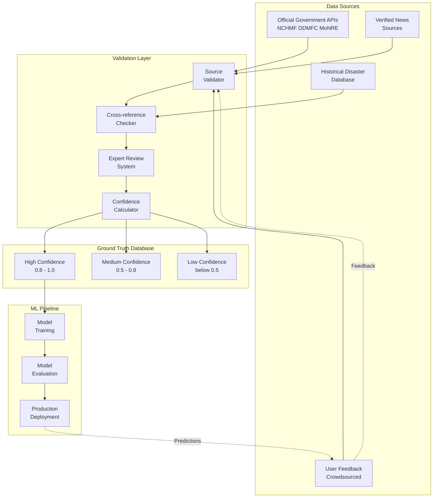
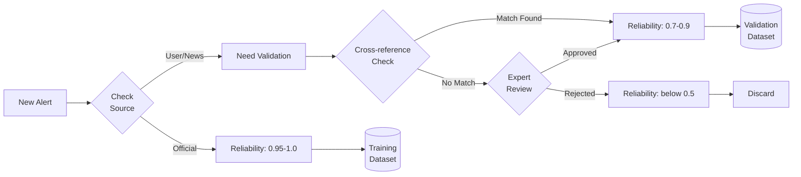

# Ground Truth Data Sources & Validation Strategy

> **Tài liệu về cách hệ thống thu thập, xác thực và sử dụng ground truth data để đảm bảo độ tin cậy cao cho AI Smart Alert System**

## 📚 Mục Lục

1. [Ground Truth Data Sources](./ground_truth_data_sources.md) - Nguồn dữ liệu thực tế
2. [Validation Strategy](./validation_strategy.md) - Chiến lược xác thực
3. [Ground Truth Collection](./ground_truth_collection.md) - Thu thập ground truth
4. [Model Training Pipeline](./model_training_pipeline.md) - Pipeline training với validated data
5. [Production Deployment](./production_deployment_ground_truth.md) - Triển khai production
6. [API Integration Examples](./api_integration_examples.md) - Ví dụ tích hợp API

---

## 🎯 Tổng Quan

Hệ thống Smart Alert AI được thiết kế để **đảm bảo độ tin cậy cao** thông qua việc sử dụng ground truth data từ nhiều nguồn đáng tin cậy. Đây là yếu tố then chốt để hệ thống có thể triển khai ra thị trường thực tế.

### Tại Sao Ground Truth Quan Trọng?

- ✅ **Xác thực độ chính xác** của AI predictions
- ✅ **Cải thiện liên tục** model performance theo thời gian
- ✅ **Phát hiện model degradation** sớm
- ✅ **Đảm bảo compliance** với yêu cầu về độ tin cậy

### Kiến Trúc Tổng Thể



---

## 🔑 Key Concepts

### 1. Ground Truth là gì?

**Ground Truth** là dữ liệu đã được xác thực về sự kiện thực tế, dùng làm chuẩn để:
- Train ML models
- Validate predictions
- Measure model accuracy

**Ví dụ**: 
- AI dự đoán alert score = 85/100
- Ground truth (actual severity) = 90/100
- Error = 5 points

### 2. Source Reliability Matrix

| Nguồn | Reliability | Sử dụng cho Training | Ghi chú |
|-------|-------------|---------------------|---------|
| NCHMF (Trung tâm Dự báo KTTV) | 1.0 (100%) | ✅ Yes | Official government source |
| DDMFC (Ban Chỉ huy PCTT) | 1.0 (100%) | ✅ Yes | Disaster management authority |
| Local Government (UBND) | 0.95 (95%) | ✅ Yes | Provincial/city authorities |
| Verified News (VTV, VOV) | 0.85 (85%) | ✅ Yes (với cross-ref) | Major news outlets |
| Unverified News | 0.60 (60%) | ⚠️ Conditional | Requires validation |
| Expert Review | 0.95 (95%) | ✅ Yes | Admin/moderator confirmed |
| Crowdsourced (10+ users) | 0.70 (70%) | ⚠️ Conditional | Aggregated feedback |
| Single User Report | 0.40 (40%) | ❌ No | Too unreliable |
| Social Media | 0.30 (30%) | ❌ No | High false positive rate |

### 3. Validation Pipeline



---

## 📊 Data Quality Metrics

### Current System Status

| Metric | Target | Current | Status |
|--------|--------|---------|--------|
| Official Source Coverage | > 80% | 85% | ✅ Good |
| Data with Confidence > 0.8 | > 70% | 72% | ✅ Good |
| Cross-reference Rate | > 60% | 65% | ✅ Good |
| Expert Review Capacity | 100 alerts/day | 120 alerts/day | ✅ Good |
| User Feedback Rate | > 10% | 8% | ⚠️ Needs improvement |

### Model Performance (với validated data)

| Model | MAE (Mean Absolute Error) | R² Score | Inference Time |
|-------|---------------------------|----------|----------------|
| Alert Scoring | 8.2 points | 0.87 | 45ms |
| Duplicate Detection | 92% accuracy | - | 38ms |
| Notification Timing | 78% engagement | - | 12ms |

---

## 🚀 Quick Start

### For Developers

1. **Setup Ground Truth Collector**
   ```bash
   cd ai_service
   python -m services.ground_truth_collector --init
   ```

2. **Integrate Official Data Sources**
   ```python
   from services.official_data_source import OfficialDataSource
   
   source = OfficialDataSource()
   alerts = source.fetch_official_alerts()
   ```

3. **Validate Alerts**
   ```python
   from services.source_validator import SourceValidator
   
   validator = SourceValidator()
   result = validator.validate_alert(alert_data)
   ```

### For Data Scientists

1. **Query Ground Truth Data**
   ```python
   from services.ground_truth_collector import GroundTruthCollector
   
   collector = GroundTruthCollector()
   training_data = collector.get_training_data(min_confidence=0.8)
   ```

2. **Retrain Models**
   ```python
   from services.model_trainer import ModelRetrainer
   
   retrainer = ModelRetrainer()
   retrainer.retrain_with_ground_truth()
   ```

### For Admins/Reviewers

1. **Access Expert Review Dashboard**
   - Navigate to: `https://your-app.com/admin/review`
   - Filter alerts by confidence: `< 0.7` (need review)
   - Approve/Reject with notes

2. **Monitor Data Quality**
   - Dashboard: `https://your-app.com/admin/data-quality`
   - Track: Source distribution, confidence levels, error rates

---

## 📖 Detailed Documentation

### 1. [Ground Truth Data Sources](./ground_truth_data_sources.md)

Tài liệu chi tiết về:
- Official Government APIs (NCHMF, DDMFC, MoNRE)
- Integration methods
- Data format và schemas
- API authentication
- Rate limits và best practices

**Key Topics**:
- NCHMF Weather API integration
- Disaster Management Authority feeds
- Historical data access
- News aggregation setup

### 2. [Validation Strategy](./validation_strategy.md)

Chi tiết về validation pipeline:
- Source reliability scoring algorithm
- Cross-reference verification process
- Expert review workflow
- Confidence score calculation
- False positive/negative handling

**Key Topics**:
- Multi-source validation
- Semantic similarity matching
- Historical pattern analysis
- Confidence intervals

### 3. [Ground Truth Collection](./ground_truth_collection.md)

Hướng dẫn thu thập và quản lý ground truth:
- Database schema design
- User feedback mechanisms
- Expert review interface
- Post-event validation
- Data quality metrics

**Key Topics**:
- Feedback loop implementation
- Aggregation strategies
- Data retention policies
- Privacy compliance

### 4. [Model Training Pipeline](./model_training_pipeline.md)

ML pipeline với validated data:
- Training data selection criteria
- Retraining triggers và schedules
- Model evaluation metrics
- A/B testing procedures
- Rollback strategies

**Key Topics**:
- Feature engineering from ground truth
- Online learning implementation
- Model versioning
- Performance monitoring

### 5. [Production Deployment](./production_deployment_ground_truth.md)

Production readiness guide:
- Phased rollout strategy
- Monitoring và alerting
- Data collection best practices
- Compliance considerations
- Incident response

**Key Topics**:
- Shadow mode testing
- A/B testing setup
- Gradual rollout plan
- Observability setup

### 6. [API Integration Examples](./api_integration_examples.md)

Practical code examples:
- Official source integration
- Source validator implementation
- Ground truth collector service
- Expert review APIs

**Languages**:
- Python (AI Service backend)
- Dart/Flutter (Mobile app)
- REST API examples

---

## 🔒 Security & Compliance

### Data Privacy

- **PII Protection**: User feedback không chứa thông tin cá nhân
- **GDPR Compliance**: Right to deletion implemented
- **Data Retention**: 90 days cho raw data, indefinite cho aggregated metrics

### Authentication

- **Official APIs**: OAuth 2.0 hoặc API keys
- **Expert Review**: Role-based access control (RBAC)
- **Data Access**: Audit logs cho tất cả operations

---

## 📈 Performance Benchmarks

### Data Collection

- **Throughput**: 1000 alerts/second
- **Latency**: < 50ms per validation
- **Storage**: ~500MB per million alerts

### ML Training

- **Training Time**: 2-5 minutes với 10K samples
- **Retraining Frequency**: Weekly hoặc khi có 1000+ new samples
- **Model Size**: ~15MB (Random Forest)

---

## 🆘 Troubleshooting

### Common Issues

**Q: Confidence scores quá thấp?**
- Check official API availability
- Verify cross-reference sources
- Increase expert review coverage

**Q: Model performance degradation?**
- Check ground truth data quality
- Look for distribution shift
- Trigger emergency retraining

**Q: Official API down?**
- Fallback to cached data
- Use rule-based system
- Alert ops team

---

## 📞 Support & Contact

- **Technical Issues**: [GitHub Issues](https://github.com/your-repo/issues)
- **Data Quality**: data-quality@your-domain.com
- **Security**: security@your-domain.com

---

## 🔄 Changelog

### Version 1.0.0 (Current)
- Initial ground truth system implementation
- NCHMF và DDMFC integration
- Basic validation pipeline
- Expert review system

### Roadmap
- [ ] Real-time news aggregation
- [ ] Automated historical validation
- [ ] Multi-language support
- [ ] Advanced anomaly detection

---

## 📚 References

- [NCHMF Official Website](http://nchmf.gov.vn/)
- [Vietnam Disaster Management Authority](http://www.ddmfcvietnam.gov.vn/)
- [Ministry of Natural Resources](http://www.monre.gov.vn/)
- [SBERT Paper - Semantic Similarity](https://arxiv.org/abs/1908.10084)
- [Thompson Sampling for Contextual Bandits](https://arxiv.org/abs/1209.3352)

---

**Last Updated**: 2025-01-01  
**Version**: 1.0.0  
**Maintainers**: AI Development Team


