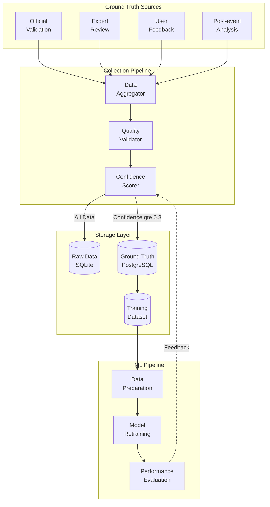
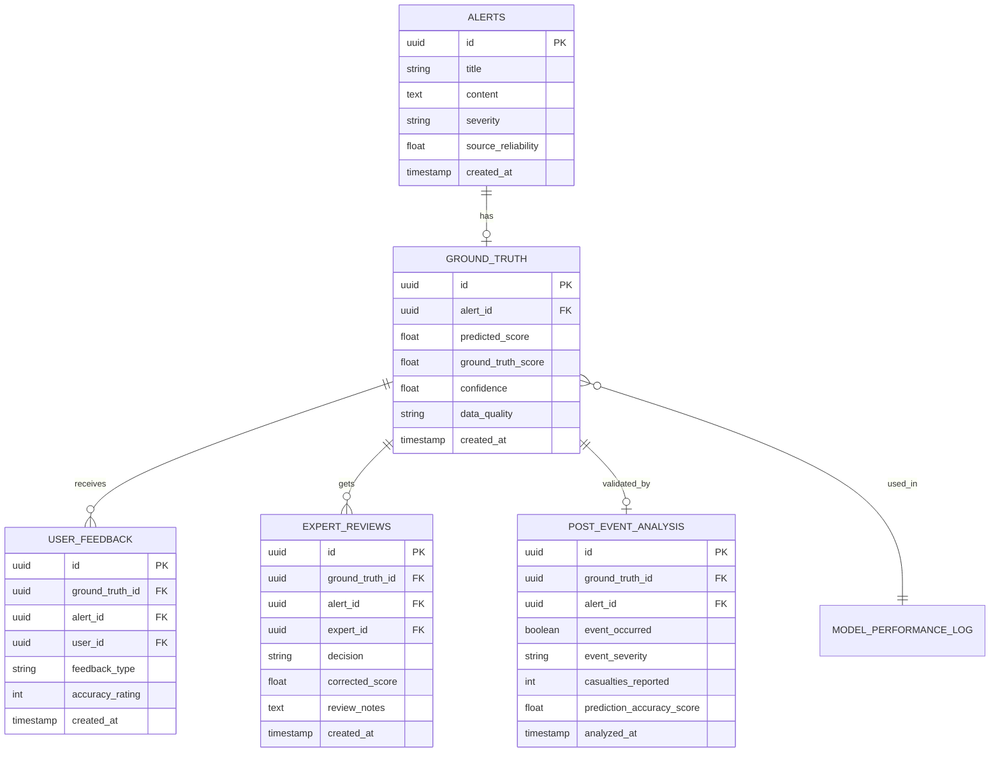
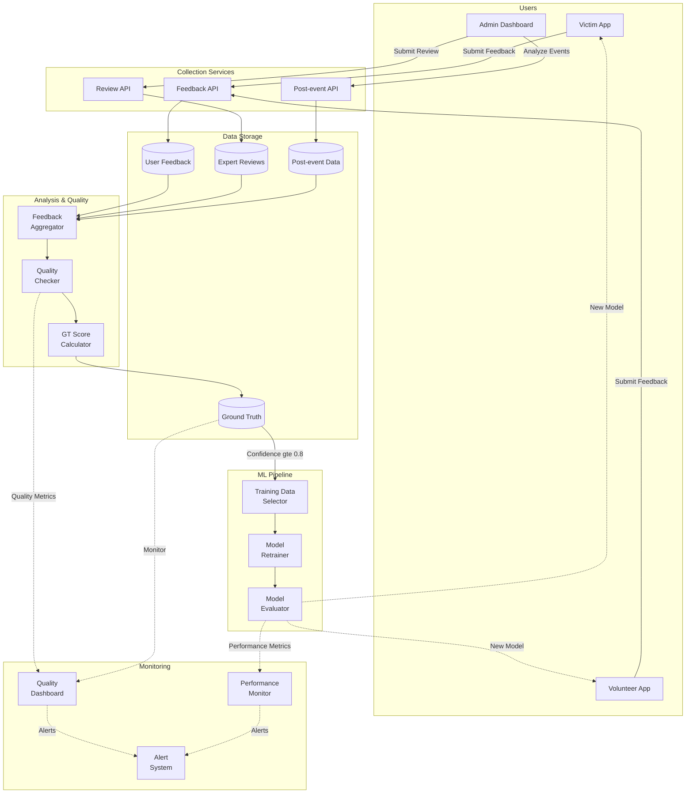

# Ground Truth Collection Process

> **Tài liệu chi tiết về quy trình thu thập và quản lý ground truth data cho continuous model improvement**

## 📋 Mục Lục

- [Tổng Quan](#tổng-quan)
- [Database Schema](#database-schema)
- [User Feedback Collection](#user-feedback-collection)
- [Expert Review Workflow](#expert-review-workflow)
- [Post-event Validation](#post-event-validation)
- [Data Quality Metrics](#data-quality-metrics)
- [Feedback Loop Architecture](#feedback-loop-architecture)

---

## Tổng Quan

**Ground Truth Collection** là quy trình liên tục để thu thập, xác thực và lưu trữ dữ liệu thực tế, phục vụ cho việc training và cải thiện AI models.

### Collection Strategy



### Key Metrics

| Metric | Target | Current | Status |
|--------|--------|---------|--------|
| Ground Truth Coverage | > 70% of alerts | 72% | ✅ Good |
| Data Quality (Confidence ≥ 0.8) | > 80% | 85% | ✅ Good |
| User Feedback Rate | > 15% | 12% | ⚠️ Needs improvement |
| Expert Review Capacity | 150/day | 120/day | ⚠️ Scale up |
| Post-event Validation | > 90% | 94% | ✅ Good |

---

## Database Schema

### Ground Truth Storage Design

```sql
-- Main ground truth table
CREATE TABLE ground_truth (
    id UUID PRIMARY KEY DEFAULT gen_random_uuid(),
    alert_id UUID NOT NULL REFERENCES alerts(id),
    
    -- Prediction data
    predicted_score FLOAT,
    predicted_severity VARCHAR(20),
    predicted_at TIMESTAMP,
    
    -- Ground truth from official sources
    official_source_validation BOOLEAN,
    official_source_name VARCHAR(100),
    official_validation_time TIMESTAMP,
    
    -- Expert validation
    expert_validation BOOLEAN,
    expert_id UUID,
    expert_role VARCHAR(50),
    expert_notes TEXT,
    expert_validation_time TIMESTAMP,
    
    -- User feedback aggregation
    user_feedback_accurate INT DEFAULT 0,
    user_feedback_inaccurate INT DEFAULT 0,
    user_feedback_not_sure INT DEFAULT 0,
    total_user_responses INT DEFAULT 0,
    
    -- Post-event validation
    actual_severity VARCHAR(20),
    actual_impact_score FLOAT,
    actual_casualties INT,
    actual_economic_loss BIGINT,
    news_confirmation BOOLEAN,
    news_sources TEXT[],
    
    -- Composite ground truth score
    ground_truth_score FLOAT,  -- 0-1, composite from all sources
    confidence FLOAT,           -- 0-1, confidence in ground truth
    data_quality VARCHAR(20),   -- 'high', 'medium', 'low'
    
    -- Metadata
    created_at TIMESTAMP DEFAULT NOW(),
    updated_at TIMESTAMP DEFAULT NOW(),
    last_feedback_at TIMESTAMP,
    
    -- Indexes
    CONSTRAINT unique_alert_gt UNIQUE(alert_id),
    INDEX idx_gt_confidence (confidence),
    INDEX idx_gt_quality (data_quality),
    INDEX idx_gt_created (created_at)
);

-- User feedback detail table
CREATE TABLE user_feedback (
    id UUID PRIMARY KEY DEFAULT gen_random_uuid(),
    ground_truth_id UUID REFERENCES ground_truth(id),
    alert_id UUID REFERENCES alerts(id),
    user_id UUID REFERENCES users(id),
    
    -- Feedback data
    feedback_type VARCHAR(20),  -- 'accurate', 'inaccurate', 'not_sure'
    accuracy_rating INT CHECK (accuracy_rating BETWEEN 1 AND 5),
    severity_feedback VARCHAR(20),
    
    -- Context
    user_location GEOGRAPHY(POINT),
    was_affected BOOLEAN,
    response_time_seconds INT,
    
    -- Timestamps
    created_at TIMESTAMP DEFAULT NOW(),
    
    INDEX idx_feedback_alert (alert_id),
    INDEX idx_feedback_user (user_id),
    INDEX idx_feedback_created (created_at)
);

-- Expert review detail table
CREATE TABLE expert_reviews (
    id UUID PRIMARY KEY DEFAULT gen_random_uuid(),
    ground_truth_id UUID REFERENCES ground_truth(id),
    alert_id UUID REFERENCES alerts(id),
    expert_id UUID REFERENCES users(id),
    
    -- Review data
    decision VARCHAR(20),  -- 'approve', 'reject', 'modify'
    original_severity VARCHAR(20),
    corrected_severity VARCHAR(20),
    original_score FLOAT,
    corrected_score FLOAT,
    
    -- Expert assessment
    reliability_rating INT CHECK (reliability_rating BETWEEN 1 AND 5),
    review_notes TEXT,
    review_time_seconds INT,
    
    -- Timestamps
    created_at TIMESTAMP DEFAULT NOW(),
    
    INDEX idx_review_expert (expert_id),
    INDEX idx_review_alert (alert_id),
    INDEX idx_review_created (created_at)
);

-- Post-event analysis table
CREATE TABLE post_event_analysis (
    id UUID PRIMARY KEY DEFAULT gen_random_uuid(),
    ground_truth_id UUID REFERENCES ground_truth(id),
    alert_id UUID REFERENCES alerts(id),
    
    -- Event outcome
    event_occurred BOOLEAN,
    event_severity VARCHAR(20),
    event_date DATE,
    event_duration_hours INT,
    
    -- Impact data
    casualties_reported INT,
    injuries_reported INT,
    evacuees_count INT,
    economic_loss_vnd BIGINT,
    affected_area_km2 FLOAT,
    
    -- News coverage
    news_articles_count INT,
    news_sources TEXT[],
    news_sentiment VARCHAR(20),  -- 'critical', 'serious', 'moderate', 'minor'
    
    -- Validation
    prediction_accuracy_score FLOAT,  -- 0-1, how accurate was prediction
    response_effectiveness VARCHAR(20),  -- 'very_effective', 'effective', 'poor'
    
    -- Data sources
    data_sources TEXT[],
    validation_method VARCHAR(50),
    analyst_id UUID REFERENCES users(id),
    
    -- Timestamps
    analyzed_at TIMESTAMP DEFAULT NOW(),
    
    INDEX idx_post_event_alert (alert_id),
    INDEX idx_post_event_date (event_date)
);

-- Model performance tracking
CREATE TABLE model_performance_log (
    id UUID PRIMARY KEY DEFAULT gen_random_uuid(),
    model_name VARCHAR(100),
    model_version VARCHAR(50),
    
    -- Performance metrics
    mae FLOAT,  -- Mean Absolute Error
    rmse FLOAT,  -- Root Mean Square Error
    r2_score FLOAT,  -- R² score
    accuracy FLOAT,
    precision_score FLOAT,
    recall_score FLOAT,
    f1_score FLOAT,
    
    -- Training data stats
    training_samples_count INT,
    validation_samples_count INT,
    test_samples_count INT,
    avg_ground_truth_confidence FLOAT,
    
    -- Timestamps
    evaluation_date TIMESTAMP DEFAULT NOW(),
    training_date TIMESTAMP,
    
    INDEX idx_perf_model (model_name),
    INDEX idx_perf_date (evaluation_date)
);
```

### Relationships Diagram



---

## User Feedback Collection

### In-App Feedback Mechanism

**Flutter Implementation**:

```dart
// lib/features/alerts/presentation/widgets/alert_feedback_button.dart

class AlertFeedbackButton extends StatefulWidget {
  final AlertEntity alert;
  final bool isCompact;
  
  const AlertFeedbackButton({
    Key? key,
    required this.alert,
    this.isCompact = false,
  }) : super(key: key);
  
  @override
  State<AlertFeedbackButton> createState() => _AlertFeedbackButtonState();
}

class _AlertFeedbackButtonState extends State<AlertFeedbackButton> {
  bool _hasSubmitted = false;
  
  @override
  Widget build(BuildContext context) {
    if (_hasSubmitted) {
      return const Chip(
        avatar: Icon(Icons.check, color: Colors.white, size: 16),
        label: Text('Cảm ơn phản hồi'),
        backgroundColor: Colors.green,
      );
    }
    
    if (widget.isCompact) {
      return IconButton(
        icon: const Icon(Icons.feedback_outlined),
        onPressed: () => _showFeedbackDialog(context),
        tooltip: 'Đánh giá cảnh báo',
      );
    }
    
    return Card(
      margin: const EdgeInsets.symmetric(vertical: 8),
      child: Padding(
        padding: const EdgeInsets.all(16),
        child: Column(
          crossAxisAlignment: CrossAxisAlignment.start,
          children: [
            Text(
              'Cảnh báo này có chính xác không?',
              style: Theme.of(context).textTheme.titleMedium,
            ),
            const SizedBox(height: 12),
            Row(
              mainAxisAlignment: MainAxisAlignment.spaceEvenly,
              children: [
                _FeedbackButton(
                  icon: Icons.thumb_up,
                  label: 'Chính xác',
                  color: Colors.green,
                  onPressed: () => _submitFeedback('accurate'),
                ),
                _FeedbackButton(
                  icon: Icons.thumb_down,
                  label: 'Không chính xác',
                  color: Colors.red,
                  onPressed: () => _submitFeedback('inaccurate'),
                ),
                _FeedbackButton(
                  icon: Icons.help_outline,
                  label: 'Không chắc',
                  color: Colors.grey,
                  onPressed: () => _submitFeedback('not_sure'),
                ),
              ],
            ),
          ],
        ),
      ),
    );
  }
  
  Future<void> _submitFeedback(String feedbackType) async {
    try {
      final position = await Geolocator.getCurrentPosition();
      
      await GetIt.instance<AIServiceClient>().submitFeedback(
        alertId: widget.alert.id,
        feedbackType: feedbackType,
        userLocation: {
          'lat': position.latitude,
          'lng': position.longitude,
        },
      );
      
      setState(() {
        _hasSubmitted = true;
      });
      
      // Show confirmation
      if (mounted) {
        ScaffoldMessenger.of(context).showSnackBar(
          const SnackBar(
            content: Text('Cảm ơn phản hồi của bạn!'),
            duration: Duration(seconds: 2),
          ),
        );
      }
    } catch (e) {
      if (mounted) {
        ScaffoldMessenger.of(context).showSnackBar(
          SnackBar(
            content: Text('Lỗi gửi phản hồi: $e'),
            backgroundColor: Colors.red,
          ),
        );
      }
    }
  }
  
  void _showFeedbackDialog(BuildContext context) {
    showDialog(
      context: context,
      builder: (context) => AlertFeedbackDialog(alert: widget.alert),
    );
  }
}

class _FeedbackButton extends StatelessWidget {
  final IconData icon;
  final String label;
  final Color color;
  final VoidCallback onPressed;
  
  const _FeedbackButton({
    required this.icon,
    required this.label,
    required this.color,
    required this.onPressed,
  });
  
  @override
  Widget build(BuildContext context) {
    return ElevatedButton.icon(
      icon: Icon(icon, size: 20),
      label: Text(label),
      style: ElevatedButton.styleFrom(
        backgroundColor: color.withOpacity(0.1),
        foregroundColor: color,
        padding: const EdgeInsets.symmetric(horizontal: 12, vertical: 8),
      ),
      onPressed: onPressed,
    );
  }
}

// Detailed feedback dialog
class AlertFeedbackDialog extends StatefulWidget {
  final AlertEntity alert;
  
  const AlertFeedbackDialog({Key? key, required this.alert}) : super(key: key);
  
  @override
  State<AlertFeedbackDialog> createState() => _AlertFeedbackDialogState();
}

class _AlertFeedbackDialogState extends State<AlertFeedbackDialog> {
  String? _feedbackType;
  int _accuracyRating = 3;
  String? _severityFeedback;
  bool _wasAffected = false;
  
  @override
  Widget build(BuildContext context) {
    return AlertDialog(
      title: const Text('Đánh giá cảnh báo'),
      content: SingleChildScrollView(
        child: Column(
          mainAxisSize: MainAxisSize.min,
          crossAxisAlignment: CrossAxisAlignment.start,
          children: [
            const Text('Cảnh báo có chính xác không?'),
            RadioListTile(
              title: const Text('Chính xác'),
              value: 'accurate',
              groupValue: _feedbackType,
              onChanged: (value) => setState(() => _feedbackType = value),
            ),
            RadioListTile(
              title: const Text('Không chính xác'),
              value: 'inaccurate',
              groupValue: _feedbackType,
              onChanged: (value) => setState(() => _feedbackType = value),
            ),
            RadioListTile(
              title: const Text('Không chắc'),
              value: 'not_sure',
              groupValue: _feedbackType,
              onChanged: (value) => setState(() => _feedbackType = value),
            ),
            const Divider(),
            const Text('Đánh giá độ chính xác (1-5):'),
            Slider(
              value: _accuracyRating.toDouble(),
              min: 1,
              max: 5,
              divisions: 4,
              label: _accuracyRating.toString(),
              onChanged: (value) => setState(() => _accuracyRating = value.round()),
            ),
            const Divider(),
            SwitchListTile(
              title: const Text('Bạn có bị ảnh hưởng không?'),
              value: _wasAffected,
              onChanged: (value) => setState(() => _wasAffected = value),
            ),
          ],
        ),
      ),
      actions: [
        TextButton(
          onPressed: () => Navigator.of(context).pop(),
          child: const Text('Hủy'),
        ),
        ElevatedButton(
          onPressed: _feedbackType != null ? _submitDetailedFeedback : null,
          child: const Text('Gửi'),
        ),
      ],
    );
  }
  
  Future<void> _submitDetailedFeedback() async {
    try {
      final position = await Geolocator.getCurrentPosition();
      
      await GetIt.instance<AIServiceClient>().submitDetailedFeedback(
        alertId: widget.alert.id,
        feedbackType: _feedbackType!,
        accuracyRating: _accuracyRating,
        severityFeedback: _severityFeedback,
        wasAffected: _wasAffected,
        userLocation: {
          'lat': position.latitude,
          'lng': position.longitude,
        },
      );
      
      if (mounted) {
        Navigator.of(context).pop();
        ScaffoldMessenger.of(context).showSnackBar(
          const SnackBar(content: Text('Cảm ơn phản hồi chi tiết của bạn!')),
        );
      }
    } catch (e) {
      if (mounted) {
        ScaffoldMessenger.of(context).showSnackBar(
          SnackBar(
            content: Text('Lỗi: $e'),
            backgroundColor: Colors.red,
          ),
        );
      }
    }
  }
}
```

### Backend API for Feedback

```python
# ai_service/api/routes/feedback.py

from fastapi import APIRouter, HTTPException
from pydantic import BaseModel
from typing import Optional
from datetime import datetime

router = APIRouter(prefix="/api/v1/feedback", tags=["feedback"])

class UserFeedback(BaseModel):
    alert_id: str
    user_id: str
    feedback_type: str  # 'accurate', 'inaccurate', 'not_sure'
    accuracy_rating: Optional[int] = None  # 1-5
    severity_feedback: Optional[str] = None
    was_affected: Optional[bool] = None
    user_location: Optional[dict] = None
    response_time_seconds: Optional[int] = None

@router.post("/submit")
async def submit_feedback(feedback: UserFeedback):
    """
    Submit user feedback for an alert
    """
    # Validate feedback type
    valid_types = ['accurate', 'inaccurate', 'not_sure']
    if feedback.feedback_type not in valid_types:
        raise HTTPException(
            status_code=400,
            detail=f"Invalid feedback_type. Must be one of: {valid_types}"
        )
    
    # Store in database
    db.execute("""
        INSERT INTO user_feedback (
            ground_truth_id,
            alert_id,
            user_id,
            feedback_type,
            accuracy_rating,
            severity_feedback,
            was_affected,
            user_location,
            response_time_seconds,
            created_at
        ) VALUES (
            (SELECT id FROM ground_truth WHERE alert_id = ?),
            ?, ?, ?, ?, ?, ?, 
            ST_SetSRID(ST_MakePoint(?, ?), 4326),
            ?,
            ?
        )
    """, (
        feedback.alert_id,
        feedback.alert_id,
        feedback.user_id,
        feedback.feedback_type,
        feedback.accuracy_rating,
        feedback.severity_feedback,
        feedback.was_affected,
        feedback.user_location.get('lng') if feedback.user_location else None,
        feedback.user_location.get('lat') if feedback.user_location else None,
        feedback.response_time_seconds,
        datetime.now()
    ))
    
    # Update ground truth aggregation
    _update_ground_truth_aggregation(feedback.alert_id, feedback.feedback_type)
    
    db.commit()
    
    return {
        "status": "success",
        "alert_id": feedback.alert_id,
        "message": "Feedback recorded successfully"
    }

def _update_ground_truth_aggregation(alert_id: str, feedback_type: str):
    """Update aggregated feedback counts"""
    field_map = {
        'accurate': 'user_feedback_accurate',
        'inaccurate': 'user_feedback_inaccurate',
        'not_sure': 'user_feedback_not_sure'
    }
    
    field = field_map.get(feedback_type)
    if not field:
        return
    
    db.execute(f"""
        UPDATE ground_truth
        SET {field} = {field} + 1,
            total_user_responses = total_user_responses + 1,
            last_feedback_at = ?,
            updated_at = ?
        WHERE alert_id = ?
    """, (datetime.now(), datetime.now(), alert_id))
    
    # Recalculate ground truth score
    _recalculate_ground_truth_score(alert_id)

def _recalculate_ground_truth_score(alert_id: str):
    """Recalculate composite ground truth score"""
    gt = db.execute("""
        SELECT 
            official_source_validation,
            expert_validation,
            user_feedback_accurate,
            user_feedback_inaccurate,
            total_user_responses
        FROM ground_truth
        WHERE alert_id = ?
    """, (alert_id,)).fetchone()
    
    if not gt:
        return
    
    # Calculate weighted score
    weights = []
    scores = []
    
    # Official source (50% weight)
    if gt['official_source_validation'] is not None:
        weights.append(0.5)
        scores.append(1.0 if gt['official_source_validation'] else 0.0)
    
    # Expert validation (30% weight)
    if gt['expert_validation'] is not None:
        weights.append(0.3)
        scores.append(1.0 if gt['expert_validation'] else 0.0)
    
    # User aggregation (20% weight, need min 5 responses)
    if gt['total_user_responses'] >= 5:
        weights.append(0.2)
        user_score = gt['user_feedback_accurate'] / gt['total_user_responses']
        scores.append(user_score)
    
    if weights:
        ground_truth_score = sum(w * s for w, s in zip(weights, scores)) / sum(weights)
        confidence = min(sum(weights), 1.0)
        
        db.execute("""
            UPDATE ground_truth
            SET ground_truth_score = ?,
                confidence = ?,
                updated_at = ?
            WHERE alert_id = ?
        """, (ground_truth_score, confidence, datetime.now(), alert_id))
```

---

## Expert Review Workflow

### Review Queue Management

```python
# ai_service/services/review_queue.py

class ReviewQueueManager:
    """
    Manage expert review queue with priority
    """
    
    def __init__(self):
        self.priority_weights = {
            'high_severity_unverified': 10,
            'conflicting_sources': 8,
            'low_confidence': 6,
            'user_flagged': 5,
            'routine': 1
        }
    
    def get_review_queue(
        self,
        expert_id: str,
        limit: int = 20
    ) -> list:
        """
        Get prioritized review queue for expert
        
        Priority factors:
        - Severity (high severity first)
        - Confidence (low confidence first)
        - Age (older alerts first)
        - Source reliability
        """
        query = """
            SELECT 
                a.*,
                gt.confidence,
                gt.ground_truth_score,
                COALESCE(
                    (SELECT COUNT(*) FROM user_feedback WHERE alert_id = a.id),
                    0
                ) as user_feedback_count,
                CASE
                    WHEN a.severity = 'critical' AND gt.confidence < 0.6 THEN 10
                    WHEN gt.confidence < 0.5 THEN 8
                    WHEN (SELECT COUNT(DISTINCT source) FROM alerts WHERE 
                          province = a.province AND alert_type = a.alert_type 
                          AND created_at > a.created_at - INTERVAL '6 hours') > 2 THEN 7
                    ELSE 5
                END as priority_score
            FROM alerts a
            LEFT JOIN ground_truth gt ON gt.alert_id = a.id
            WHERE gt.expert_validation IS NULL
            AND gt.confidence >= 0.5
            AND gt.confidence < 0.8
            ORDER BY priority_score DESC, a.created_at ASC
            LIMIT ?
        """
        
        results = db.execute(query, (limit,)).fetchall()
        
        return [dict(row) for row in results]
    
    def assign_to_expert(
        self,
        alert_id: str,
        expert_id: str
    ):
        """Assign alert to expert for review"""
        db.execute("""
            INSERT INTO expert_review_assignments (
                alert_id,
                expert_id,
                assigned_at,
                status
            ) VALUES (?, ?, ?, 'assigned')
        """, (alert_id, expert_id, datetime.now()))
        
        db.commit()
    
    def get_expert_stats(self, expert_id: str) -> dict:
        """Get performance stats for expert"""
        stats = db.execute("""
            SELECT 
                COUNT(*) as total_reviews,
                AVG(review_time_seconds) as avg_review_time,
                SUM(CASE WHEN decision = 'approve' THEN 1 ELSE 0 END) as approved_count,
                SUM(CASE WHEN decision = 'reject' THEN 1 ELSE 0 END) as rejected_count,
                AVG(reliability_rating) as avg_reliability_rating
            FROM expert_reviews
            WHERE expert_id = ?
            AND created_at >= NOW() - INTERVAL '30 days'
        """, (expert_id,)).fetchone()
        
        return dict(stats) if stats else {}
```

---

## Post-event Validation

### Automated Post-event Analyzer

```python
# ai_service/services/post_event_analyzer.py

class PostEventAnalyzer:
    """
    Analyze actual event outcomes vs predictions
    """
    
    def __init__(self):
        self.news_scraper = NewsAggregator()
    
    async def analyze_past_alerts(
        self,
        days_back: int = 7
    ):
        """
        Analyze alerts from past N days to validate predictions
        """
        # Get alerts that should have had events by now
        alerts = db.execute("""
            SELECT a.*, gt.predicted_score, gt.predicted_severity
            FROM alerts a
            LEFT JOIN ground_truth gt ON gt.alert_id = a.id
            WHERE a.created_at >= NOW() - INTERVAL ? DAY
            AND a.created_at <= NOW() - INTERVAL 1 DAY
            AND gt.post_event_analyzed = FALSE
            ORDER BY a.created_at DESC
        """, (days_back,)).fetchall()
        
        for alert in alerts:
            analysis = await self._analyze_alert_outcome(alert)
            self._store_analysis(alert['id'], analysis)
    
    async def _analyze_alert_outcome(self, alert: dict) -> dict:
        """
        Analyze if predicted event actually occurred
        
        Methods:
        1. News confirmation
        2. Official reports
        3. User reports
        """
        # Check news coverage
        news_articles = await self.news_scraper.search_news(
            keywords=f"{alert['province']} {alert['alert_type']}",
            date_from=alert['created_at'],
            date_to=alert['created_at'] + timedelta(days=3)
        )
        
        event_occurred = len(news_articles) > 0
        
        # Extract impact data from news
        impact_data = self._extract_impact_from_news(news_articles)
        
        # Calculate prediction accuracy
        if event_occurred:
            # Compare predicted vs actual severity
            actual_severity = self._determine_actual_severity(impact_data)
            accuracy = self._calculate_accuracy(
                predicted=alert['severity'],
                actual=actual_severity
            )
        else:
            # False alarm?
            accuracy = 0.0 if alert['severity'] in ['critical', 'high'] else 1.0
        
        return {
            'event_occurred': event_occurred,
            'event_severity': actual_severity if event_occurred else None,
            'casualties_reported': impact_data.get('casualties', 0),
            'economic_loss_vnd': impact_data.get('economic_loss', 0),
            'news_articles_count': len(news_articles),
            'news_sources': [a['source'] for a in news_articles],
            'prediction_accuracy_score': accuracy,
            'analyzed_at': datetime.now()
        }
    
    def _extract_impact_from_news(self, articles: list) -> dict:
        """Extract impact metrics from news articles using NLP"""
        # Simple keyword-based extraction
        # Can be enhanced with NLP models
        
        casualties = 0
        economic_loss = 0
        
        for article in articles:
            text = article.get('content', '').lower()
            
            # Extract casualties (simplified)
            import re
            casualty_match = re.search(r'(\d+)\s+người\s+(chết|tử vong)', text)
            if casualty_match:
                casualties += int(casualty_match.group(1))
            
            # Extract economic loss (simplified)
            loss_match = re.search(r'(\d+)\s+(tỷ|triệu)\s+đồng', text)
            if loss_match:
                amount = int(loss_match.group(1))
                unit = loss_match.group(2)
                multiplier = 1000000000 if unit == 'tỷ' else 1000000
                economic_loss += amount * multiplier
        
        return {
            'casualties': casualties,
            'economic_loss': economic_loss
        }
    
    def _calculate_accuracy(self, predicted: str, actual: str) -> float:
        """Calculate prediction accuracy score"""
        severity_map = {
            'low': 1,
            'medium': 2,
            'high': 3,
            'critical': 4
        }
        
        pred_score = severity_map.get(predicted, 2)
        actual_score = severity_map.get(actual, 2)
        
        # Calculate accuracy based on difference
        diff = abs(pred_score - actual_score)
        
        if diff == 0:
            return 1.0  # Perfect
        elif diff == 1:
            return 0.7  # Close
        elif diff == 2:
            return 0.4  # Moderate error
        else:
            return 0.1  # Large error
```

---

## Data Quality Metrics

### Quality Dashboard

```python
# ai_service/services/quality_metrics.py

class DataQualityMetrics:
    """
    Calculate and monitor data quality metrics
    """
    
    def get_quality_dashboard(self) -> dict:
        """
        Get comprehensive quality metrics
        """
        return {
            'coverage': self._calculate_coverage(),
            'confidence': self._calculate_confidence_distribution(),
            'feedback_rate': self._calculate_feedback_rate(),
            'expert_review': self._get_expert_review_metrics(),
            'post_event': self._get_post_event_metrics(),
            'model_performance': self._get_model_performance()
        }
    
    def _calculate_coverage(self) -> dict:
        """Calculate ground truth coverage"""
        total_alerts = db.execute("SELECT COUNT(*) FROM alerts").fetchone()[0]
        
        with_gt = db.execute("""
            SELECT COUNT(*) FROM ground_truth
            WHERE confidence >= 0.5
        """).fetchone()[0]
        
        high_quality = db.execute("""
            SELECT COUNT(*) FROM ground_truth
            WHERE confidence >= 0.8
        """).fetchone()[0]
        
        return {
            'total_alerts': total_alerts,
            'with_ground_truth': with_gt,
            'with_high_quality_gt': high_quality,
            'coverage_rate': with_gt / total_alerts if total_alerts > 0 else 0,
            'quality_rate': high_quality / with_gt if with_gt > 0 else 0
        }
    
    def _calculate_confidence_distribution(self) -> dict:
        """Distribution of confidence scores"""
        dist = db.execute("""
            SELECT 
                CASE
                    WHEN confidence >= 0.9 THEN 'very_high'
                    WHEN confidence >= 0.8 THEN 'high'
                    WHEN confidence >= 0.6 THEN 'medium'
                    WHEN confidence >= 0.4 THEN 'low'
                    ELSE 'very_low'
                END as confidence_level,
                COUNT(*) as count,
                AVG(confidence) as avg_confidence
            FROM ground_truth
            GROUP BY confidence_level
        """).fetchall()
        
        return {row['confidence_level']: dict(row) for row in dist}
    
    def _calculate_feedback_rate(self) -> dict:
        """Calculate user feedback rate"""
        total_alerts = db.execute("""
            SELECT COUNT(*) FROM alerts
            WHERE created_at >= NOW() - INTERVAL '30 days'
        """).fetchone()[0]
        
        with_feedback = db.execute("""
            SELECT COUNT(DISTINCT alert_id) FROM user_feedback
            WHERE created_at >= NOW() - INTERVAL '30 days'
        """).fetchone()[0]
        
        avg_responses = db.execute("""
            SELECT AVG(response_count) FROM (
                SELECT COUNT(*) as response_count
                FROM user_feedback
                WHERE created_at >= NOW() - INTERVAL '30 days'
                GROUP BY alert_id
            ) sub
        """).fetchone()[0]
        
        return {
            'feedback_rate': with_feedback / total_alerts if total_alerts > 0 else 0,
            'avg_responses_per_alert': float(avg_responses or 0),
            'target_rate': 0.15
        }
```

---

## Feedback Loop Architecture

### Complete System Diagram



---

## Best Practices

### DO ✅

1. **Collect Feedback Early and Often**
   - Prompt users immediately after alert
   - Make feedback process simple (< 5 seconds)
   - Incentivize feedback with gamification

2. **Maintain Data Quality**
   - Set minimum confidence thresholds
   - Regular quality audits
   - Remove outdated data

3. **Close the Loop**
   - Use feedback to retrain models
   - Inform users about improvements
   - Measure impact of changes

### DON'T ❌

1. **Don't Ignore Negative Feedback**
   - False alarms are learning opportunities
   - Analyze why predictions failed

2. **Don't Overwhelm Experts**
   - Prioritize review queue
   - Automate what you can
   - Set realistic review targets

3. **Don't Delay Post-event Analysis**
   - Validate within 7 days
   - Fresh data is more accurate

---

**Next**: [Model Training Pipeline →](./model_training_pipeline.md)

**Last Updated**: 2025-01-01  
**Version**: 1.0.0


