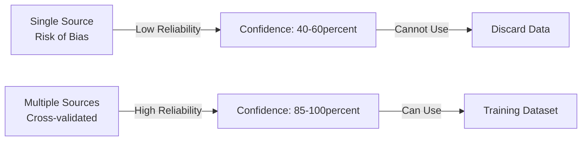
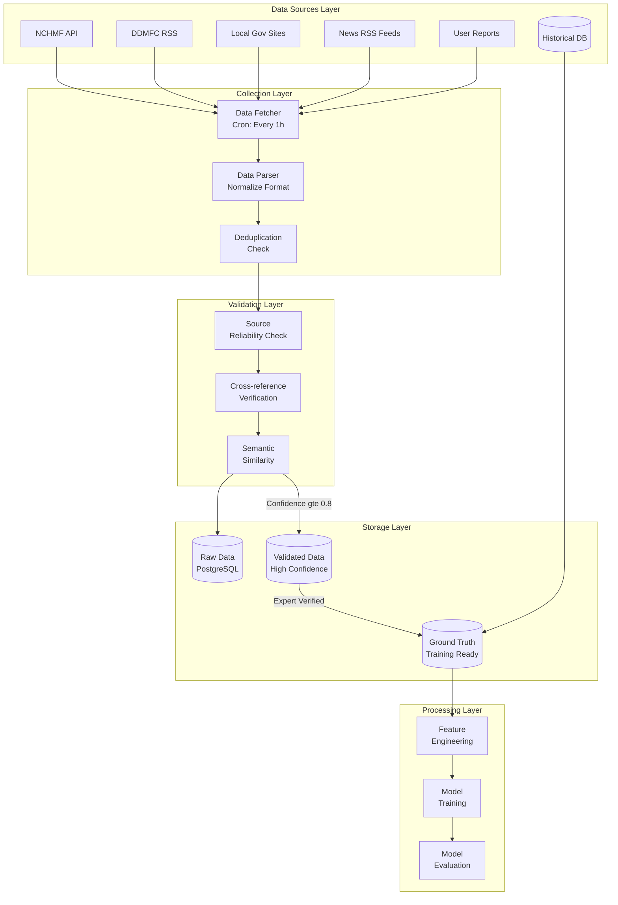

# Ground Truth Data Sources

> **Tài liệu chi tiết về các nguồn dữ liệu thực tế (ground truth) cho hệ thống Smart Alert AI**

## 📋 Mục Lục

- [Tổng Quan](#tổng-quan)
- [Official Government Sources](#official-government-sources)
- [Historical Disaster Data](#historical-disaster-data)
- [Cross-referenced News Sources](#cross-referenced-news-sources)
- [Crowdsourced User Reports](#crowdsourced-user-reports)
- [Source Reliability Matrix](#source-reliability-matrix)
- [Integration Architecture](#integration-architecture)
- [API Documentation](#api-documentation)

---

## Tổng Quan

**Ground Truth Data** là dữ liệu đã được xác thực về các sự kiện thực tế, đóng vai trò là "chân lý" để:
- Train và validate AI models
- Đo lường độ chính xác của predictions
- Cải thiện liên tục system performance

### Tại Sao Cần Nhiều Nguồn?



**Lợi ích của Multi-source Approach**:
- ✅ Giảm false positives/negatives
- ✅ Tăng độ tin cậy tổng thể
- ✅ Phát hiện anomalies và errors
- ✅ Redundancy khi một nguồn fail

---

## Official Government Sources

### 1. NCHMF - Trung Tâm Dự Báo Khí Tượng Thủy Văn Quốc Gia

**Website**: [http://nchmf.gov.vn/](http://nchmf.gov.vn/)

**Loại dữ liệu**:
- Weather warnings (cảnh báo thời tiết)
- Storm tracking (theo dõi bão)
- Flood predictions (dự báo lũ lụt)
- Temperature & rainfall data

**Reliability**: ⭐⭐⭐⭐⭐ (1.0 - 100%)

**API Access**:
```python
# ai_service/services/official_data_source.py

import requests
from datetime import datetime
from typing import List, Dict

class NCHMFDataSource:
    """
    Fetch weather and disaster warnings from NCHMF
    """
    BASE_URL = "http://nchmf.gov.vn/KttvsWeb"
    
    def fetch_warnings(self) -> List[Dict]:
        """
        Lấy cảnh báo thời tiết mới nhất
        
        Returns:
            List of warnings with structure:
            {
                'id': str,
                'warning_text': str,
                'level': int (1-5),
                'area': str,
                'valid_from': datetime,
                'valid_to': datetime,
                'issued_at': datetime
            }
        """
        try:
            # Note: NCHMF có thể không có official REST API
            # Phương án thay thế: Web scraping hoặc RSS feed
            
            response = requests.get(
                f"{self.BASE_URL}/vi-VN/1/index.html",
                timeout=30
            )
            
            if response.status_code == 200:
                warnings = self._parse_html(response.text)
                return self._normalize_warnings(warnings)
            
            return []
            
        except Exception as e:
            print(f"Error fetching NCHMF data: {e}")
            return []
    
    def _parse_html(self, html: str) -> List[Dict]:
        """Parse HTML to extract warnings"""
        from bs4 import BeautifulSoup
        
        soup = BeautifulSoup(html, 'html.parser')
        warnings = []
        
        # Tìm các phần tử chứa cảnh báo
        warning_elements = soup.select('.warning-item')
        
        for element in warning_elements:
            warnings.append({
                'raw_text': element.get_text(strip=True),
                'level': self._extract_level(element),
                'area': self._extract_area(element),
                'issued_at': datetime.now()
            })
        
        return warnings
    
    def _normalize_warnings(self, warnings: List[Dict]) -> List[Dict]:
        """Chuẩn hóa format cho system"""
        normalized = []
        
        for warning in warnings:
            normalized.append({
                'source': 'NCHMF',
                'source_reliability': 1.0,
                'content': warning['raw_text'],
                'severity': self._map_level_to_severity(warning['level']),
                'province': warning['area'],
                'verified': True,
                'official_id': f"NCHMF_{warning['issued_at'].timestamp()}",
                'metadata': {
                    'original_level': warning['level'],
                    'fetched_at': datetime.now().isoformat()
                }
            })
        
        return normalized
```

**Data Update Frequency**: Mỗi 3-6 giờ

**Coverage**: Toàn quốc (63 tỉnh/thành phố)

---

### 2. DDMFC - Ban Chỉ Huy Phòng Chống Thiên Tai

**Website**: [http://www.ddmfcvietnam.gov.vn/](http://www.ddmfcvietnam.gov.vn/)

**Loại dữ liệu**:
- Disaster warnings (cảnh báo thiên tai)
- Evacuation orders (lệnh sơ tán)
- Emergency bulletins (bản tin khẩn cấp)
- Post-disaster reports (báo cáo sau thiên tai)

**Reliability**: ⭐⭐⭐⭐⭐ (1.0 - 100%)

**RSS Feed Integration**:
```python
import feedparser
from datetime import datetime

class DDMFCDataSource:
    """
    Fetch disaster alerts from DDMFC RSS feeds
    """
    RSS_FEED = "http://www.ddmfcvietnam.gov.vn/rss"
    
    def fetch_alerts(self) -> List[Dict]:
        """
        Lấy cảnh báo từ RSS feed
        """
        try:
            feed = feedparser.parse(self.RSS_FEED)
            alerts = []
            
            for entry in feed.entries:
                alerts.append({
                    'source': 'DDMFC',
                    'source_reliability': 1.0,
                    'title': entry.title,
                    'content': entry.summary,
                    'link': entry.link,
                    'published': datetime(*entry.published_parsed[:6]),
                    'verified': True,
                    'official_id': f"DDMFC_{entry.id}"
                })
            
            return alerts
            
        except Exception as e:
            print(f"Error fetching DDMFC RSS: {e}")
            return []
```

---

### 3. Local Government Sources (UBND Tỉnh/Thành)

**Coverage**: Provincial và district level

**Loại dữ liệu**:
- Local disaster announcements
- Road closures
- School/office closures
- Local evacuation plans

**Reliability**: ⭐⭐⭐⭐½ (0.95 - 95%)

**Example: Ho Chi Minh City**:
```python
class LocalGovernmentSource:
    """
    Scrape local government websites for disaster alerts
    """
    
    SOURCES = {
        'HCM': 'https://www.hochiminhcity.gov.vn/',
        'HaNoi': 'https://hanoi.gov.vn/',
        'DaNang': 'https://danang.gov.vn/',
        # Add more provinces...
    }
    
    def fetch_province_alerts(self, province_code: str) -> List[Dict]:
        """
        Lấy cảnh báo từ website UBND tỉnh
        """
        if province_code not in self.SOURCES:
            return []
        
        url = self.SOURCES[province_code]
        
        try:
            response = requests.get(f"{url}/disaster-alerts", timeout=30)
            alerts = self._parse_provincial_page(response.text, province_code)
            
            return [{
                'source': f'LOCAL_GOV_{province_code}',
                'source_reliability': 0.95,
                'province': province_code,
                'verified': True,
                **alert
            } for alert in alerts]
            
        except Exception as e:
            print(f"Error fetching {province_code} data: {e}")
            return []
```

---

### 4. Ministry of Natural Resources and Environment

**Website**: [http://www.monre.gov.vn/](http://www.monre.gov.vn/)

**Loại dữ liệu**:
- Environmental hazards
- Sea level monitoring
- Climate change impacts
- Long-term disaster risk assessments

**Reliability**: ⭐⭐⭐⭐⭐ (1.0 - 100%)

---

## Historical Disaster Data

### Vietnam Disaster Database

**Purpose**: Training models với historical patterns

**Data Sources**:
1. **EM-DAT** (Emergency Events Database)
   - International disaster database
   - Coverage: 1900 - present
   - URL: https://www.emdat.be/

2. **Ministry Archives**
   - Historical government records
   - Detailed damage assessments
   - Casualty reports

3. **Academic Research**
   - Published papers on Vietnamese disasters
   - Climate studies
   - Risk assessments

**Example Data Structure**:
```python
{
    'event_id': 'VN_FLOOD_2020_10',
    'event_type': 'flood',
    'date': '2020-10-15',
    'provinces_affected': ['Quang Binh', 'Quang Tri', 'Thua Thien Hue'],
    'severity': 'critical',
    'casualties': 102,
    'economic_loss_usd': 1200000000,
    'affected_population': 500000,
    'warning_issued': True,
    'warning_lead_time_hours': 24,
    'sources': ['NCHMF', 'DDMFC', 'News'],
    'verified': True
}
```

**Usage**:
```python
class HistoricalDataSource:
    """
    Access historical disaster data for training
    """
    
    def get_seasonal_patterns(self, province: str, month: int) -> Dict:
        """
        Get historical probability of disasters by province and month
        
        Returns:
            {
                'flood_probability': 0.0-1.0,
                'storm_probability': 0.0-1.0,
                'drought_probability': 0.0-1.0,
                'avg_severity': 1-5
            }
        """
        # Query historical database
        query = f"""
            SELECT 
                event_type,
                COUNT(*) as occurrences,
                AVG(severity_score) as avg_severity
            FROM historical_disasters
            WHERE province = '{province}'
            AND MONTH(date) = {month}
            AND date >= DATE_SUB(NOW(), INTERVAL 20 YEAR)
            GROUP BY event_type
        """
        
        results = self.db.execute(query)
        
        return self._calculate_probabilities(results)
```

---

## Cross-referenced News Sources

### Verified News Outlets

**Tier 1 (Reliability: 0.85-0.90)**:
- VTV (Vietnam Television)
- VOV (Voice of Vietnam)
- VNA (Vietnam News Agency)
- Tuoi Tre Online
- VnExpress

**Integration**:
```python
class NewsAggregator:
    """
    Aggregate disaster news from verified sources
    """
    
    TRUSTED_SOURCES = {
        'VTV': {
            'url': 'https://vtv.vn/thien-tai.rss',
            'reliability': 0.90
        },
        'VOV': {
            'url': 'https://vov.vn/rss/thoi-su.rss',
            'reliability': 0.85
        },
        'VnExpress': {
            'url': 'https://vnexpress.net/rss/thoi-su.rss',
            'reliability': 0.85
        }
    }
    
    def fetch_disaster_news(self, hours_back: int = 24) -> List[Dict]:
        """
        Fetch disaster-related news from last N hours
        """
        all_news = []
        
        for source_name, config in self.TRUSTED_SOURCES.items():
            try:
                feed = feedparser.parse(config['url'])
                
                for entry in feed.entries:
                    # Filter disaster-related keywords
                    if self._is_disaster_related(entry.title, entry.summary):
                        all_news.append({
                            'source': f'NEWS_{source_name}',
                            'source_reliability': config['reliability'],
                            'title': entry.title,
                            'content': entry.summary,
                            'url': entry.link,
                            'published': datetime(*entry.published_parsed[:6]),
                            'verified': False,  # Cần cross-reference
                            'keywords': self._extract_keywords(entry.title + entry.summary)
                        })
                
            except Exception as e:
                print(f"Error fetching {source_name}: {e}")
        
        return all_news
    
    def _is_disaster_related(self, title: str, content: str) -> bool:
        """
        Check if news is disaster-related
        """
        keywords = [
            'lũ lụt', 'bão', 'thiên tai', 'sơ tán', 'cứu hộ',
            'mưa lớn', 'ngập lụt', 'sạt lở', 'động đất', 'hạn hán'
        ]
        
        text = (title + " " + content).lower()
        return any(keyword in text for keyword in keywords)
```

---

## Crowdsourced User Reports

### User Feedback System

**Purpose**: Collect real-time reports from affected users

**Reliability**: ⭐⭐ (0.40 individually, 0.70+ when aggregated)

**Collection Mechanism**:
```dart
// lib/features/alerts/presentation/widgets/report_alert_widget.dart

class ReportAlertWidget extends StatefulWidget {
  @override
  _ReportAlertWidgetState createState() => _ReportAlertWidgetState();
}

class _ReportAlertWidgetState extends State<ReportAlertWidget> {
  String? selectedAlertType;
  String? severity;
  String? description;
  Position? currentLocation;
  
  Future<void> submitReport() async {
    // Get current location
    currentLocation = await Geolocator.getCurrentPosition();
    
    final report = {
      'source': 'USER_REPORT',
      'source_reliability': 0.40,  // Single user is low reliability
      'user_id': FirebaseAuth.instance.currentUser?.uid,
      'alert_type': selectedAlertType,
      'severity': severity,
      'description': description,
      'location': {
        'lat': currentLocation?.latitude,
        'lng': currentLocation?.longitude,
      },
      'timestamp': DateTime.now().toIso8601String(),
      'verified': false,
      'requires_validation': true,
    };
    
    // Send to backend for validation
    await GetIt.instance<AIServiceClient>().submitUserReport(report);
    
    // Show confirmation
    ScaffoldMessenger.of(context).showSnackBar(
      const SnackBar(
        content: Text('Cảm ơn báo cáo của bạn. Chúng tôi sẽ xác thực thông tin.'),
      ),
    );
  }
  
  @override
  Widget build(BuildContext context) {
    return Column(
      children: [
        DropdownButton<String>(
          hint: const Text('Loại thiên tai'),
          value: selectedAlertType,
          items: [
            'Lũ lụt', 'Bão', 'Sạt lở đất', 'Ngập nước', 'Khác'
          ].map((type) => DropdownMenuItem(value: type, child: Text(type))).toList(),
          onChanged: (value) => setState(() => selectedAlertType = value),
        ),
        DropdownButton<String>(
          hint: const Text('Mức độ'),
          value: severity,
          items: [
            'Thấp', 'Trung bình', 'Cao', 'Nghiêm trọng'
          ].map((s) => DropdownMenuItem(value: s, child: Text(s))).toList(),
          onChanged: (value) => setState(() => severity = value),
        ),
        TextField(
          decoration: const InputDecoration(
            labelText: 'Mô tả tình hình',
            hintText: 'Vui lòng mô tả chi tiết...',
          ),
          maxLines: 4,
          onChanged: (value) => description = value,
        ),
        ElevatedButton(
          onPressed: submitReport,
          child: const Text('Gửi báo cáo'),
        ),
      ],
    );
  }
}
```

**Aggregation Strategy**:
```python
# ai_service/services/crowdsource_aggregator.py

class CrowdsourceAggregator:
    """
    Aggregate and validate crowdsourced reports
    """
    
    def aggregate_reports(
        self,
        province: str,
        time_window_hours: int = 6
    ) -> List[Dict]:
        """
        Aggregate multiple user reports into verified alerts
        
        Criteria for verification:
        - 10+ reports about same incident
        - Similar location (within 5km)
        - Similar severity levels
        - Within 6-hour time window
        """
        # Get all reports in time window
        reports = self._get_recent_reports(province, time_window_hours)
        
        # Cluster by location and content similarity
        clusters = self._cluster_reports(reports)
        
        verified_alerts = []
        
        for cluster in clusters:
            if len(cluster) >= 10:  # Minimum 10 reports
                # Calculate consensus
                consensus = self._calculate_consensus(cluster)
                
                if consensus['agreement_rate'] >= 0.80:  # 80% agreement
                    verified_alerts.append({
                        'source': 'CROWDSOURCED_VERIFIED',
                        'source_reliability': 0.70 + (len(cluster) * 0.01),  # Max 0.85
                        'alert_type': consensus['alert_type'],
                        'severity': consensus['severity'],
                        'location': consensus['center_location'],
                        'description': consensus['common_description'],
                        'num_reports': len(cluster),
                        'verified': True,
                        'metadata': {
                            'report_ids': [r['id'] for r in cluster],
                            'agreement_rate': consensus['agreement_rate']
                        }
                    })
        
        return verified_alerts
```

---

## Source Reliability Matrix

### Comprehensive Scoring Table

| Source Type | Base Reliability | Confidence Interval | Training Use | Notes |
|-------------|-----------------|---------------------|--------------|-------|
| **Official Government** |
| NCHMF | 1.00 | ±0.02 | ✅ Primary | Weather authority |
| DDMFC | 1.00 | ±0.02 | ✅ Primary | Disaster management |
| Local Gov (UBND) | 0.95 | ±0.03 | ✅ Primary | Provincial authority |
| MoNRE | 1.00 | ±0.02 | ✅ Primary | Environmental ministry |
| **News Media** |
| VTV | 0.90 | ±0.05 | ✅ Secondary | National TV |
| VOV | 0.85 | ±0.05 | ✅ Secondary | National radio |
| VNA | 0.90 | ±0.05 | ✅ Secondary | National news agency |
| Major newspapers | 0.85 | ±0.07 | ⚠️ Conditional | Requires cross-ref |
| Online news | 0.60 | ±0.10 | ⚠️ Conditional | High variance |
| **Academic/Research** |
| Published papers | 0.90 | ±0.05 | ✅ Secondary | Peer-reviewed only |
| Research institutes | 0.85 | ±0.07 | ✅ Secondary | Established orgs |
| **Crowdsourced** |
| 20+ aggregated reports | 0.75 | ±0.10 | ⚠️ Conditional | Strong consensus |
| 10-20 reports | 0.70 | ±0.12 | ⚠️ Conditional | Moderate consensus |
| Single expert user | 0.50 | ±0.15 | ❌ No | Too unreliable |
| Single regular user | 0.40 | ±0.20 | ❌ No | Too unreliable |
| **Social Media** |
| Verified accounts | 0.50 | ±0.20 | ❌ No | High false positive |
| Unverified | 0.30 | ±0.25 | ❌ No | Very unreliable |

### Reliability Adjustment Factors

**Increase reliability when**:
- ✅ Multiple independent sources confirm (+0.10)
- ✅ Expert review approves (+0.10)
- ✅ Historical pattern matches (+0.05)
- ✅ Official source cross-reference (+0.15)

**Decrease reliability when**:
- ⚠️ Conflicting information from other sources (-0.15)
- ⚠️ No cross-references available (-0.05)
- ⚠️ Outside normal patterns (-0.10)
- ⚠️ Source has error history (-0.20)

---

## Integration Architecture

### Complete Data Flow



### System Components

**1. Data Fetcher (Scheduler)**
```python
# ai_service/services/data_fetcher.py

from apscheduler.schedulers.background import BackgroundScheduler

class DataFetcher:
    def __init__(self):
        self.scheduler = BackgroundScheduler()
        self.sources = [
            NCHMFDataSource(),
            DDMFCDataSource(),
            LocalGovernmentSource(),
            NewsAggregator()
        ]
    
    def start(self):
        """Start scheduled data fetching"""
        # Fetch every hour
        self.scheduler.add_job(
            self.fetch_all_sources,
            'interval',
            hours=1,
            id='fetch_official_data'
        )
        
        # Fetch news every 30 minutes
        self.scheduler.add_job(
            self.fetch_news,
            'interval',
            minutes=30,
            id='fetch_news'
        )
        
        self.scheduler.start()
    
    def fetch_all_sources(self):
        """Fetch from all official sources"""
        for source in self.sources:
            try:
                data = source.fetch_alerts()
                self._process_and_store(data)
            except Exception as e:
                print(f"Error fetching from {source.__class__.__name__}: {e}")
```

---

## API Documentation

### Endpoints for Data Access

**Base URL**: `https://your-api.com/api/v1`

#### 1. Get Official Alerts

```
GET /ground-truth/official-alerts
```

**Query Parameters**:
- `source`: Filter by source (NCHMF, DDMFC, etc.)
- `province`: Filter by province
- `from_date`: Start date (ISO 8601)
- `to_date`: End date (ISO 8601)
- `min_reliability`: Minimum reliability score (0.0-1.0)

**Response**:
```json
{
  "total": 45,
  "alerts": [
    {
      "id": "NCHMF_1234567890",
      "source": "NCHMF",
      "source_reliability": 1.0,
      "content": "Cảnh báo lũ lụt nghiêm trọng tại...",
      "severity": "critical",
      "province": "Quang Binh",
      "issued_at": "2024-01-15T08:00:00Z",
      "verified": true,
      "metadata": {
        "original_level": 5,
        "cross_references": ["DDMFC_987654321", "NEWS_VTV_456"]
      }
    }
  ]
}
```

#### 2. Submit User Report

```
POST /ground-truth/user-report
```

**Request Body**:
```json
{
  "alert_type": "flood",
  "severity": "high",
  "description": "Nước đang dâng cao tại đường...",
  "location": {
    "lat": 16.0544,
    "lng": 108.2022
  },
  "timestamp": "2024-01-15T10:30:00Z",
  "user_id": "user_abc123"
}
```

**Response**:
```json
{
  "report_id": "REPORT_xyz789",
  "status": "pending_validation",
  "message": "Cảm ơn báo cáo. Chúng tôi sẽ xác thực trong vòng 30 phút."
}
```

---

## Best Practices

### 1. Data Collection

✅ **DO**:
- Fetch data at regular intervals (hourly for official, 30min for news)
- Store raw data before processing
- Log all fetch attempts (success and failures)
- Implement retry logic với exponential backoff

❌ **DON'T**:
- Don't hammer APIs too frequently
- Don't discard data without validation
- Don't ignore fetch errors silently

### 2. Data Quality

✅ **DO**:
- Always tag source và reliability score
- Cross-reference với multiple sources
- Validate data format before storage
- Track data lineage (where it came from)

❌ **DON'T**:
- Don't mix unverified với verified data
- Don't assume single source is 100% correct
- Don't ignore outliers without investigation

### 3. Privacy & Compliance

✅ **DO**:
- Anonymize user reports
- Get consent for data collection
- Implement data retention policies
- Provide data deletion mechanism

❌ **DON'T**:
- Don't store unnecessary PII
- Don't share user data without consent
- Don't keep data indefinitely

---

## Troubleshooting

### Common Issues

**Q: Official API is down, what to do?**
- Fall back to cached data
- Use alternate sources (news, historical)
- Alert ops team
- Display warning to users về limited data

**Q: How to handle conflicting data from multiple sources?**
- Use source reliability scores
- Prefer official sources over news
- Look for majority consensus
- Flag for expert review

**Q: User reports seem unreliable, should we ignore them?**
- Don't ignore completely
- Use aggregation (10+ reports)
- Look for patterns
- Can be useful for rapid response

---

## References

- [NCHMF Website](http://nchmf.gov.vn/)
- [Vietnam Disaster Management Authority](http://www.ddmfcvietnam.gov.vn/)
- [EM-DAT Disaster Database](https://www.emdat.be/)
- [MoNRE](http://www.monre.gov.vn/)

---

**Next**: [Validation Strategy →](./validation_strategy.md)

**Last Updated**: 2025-01-01  
**Version**: 1.0.0


