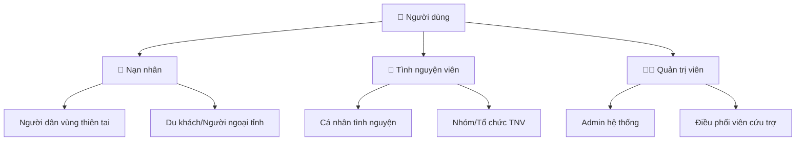
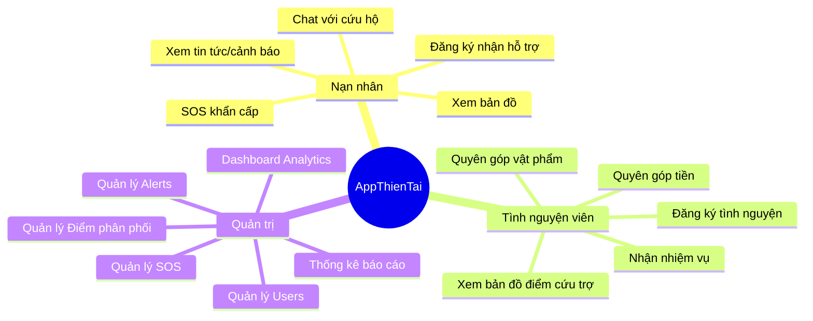
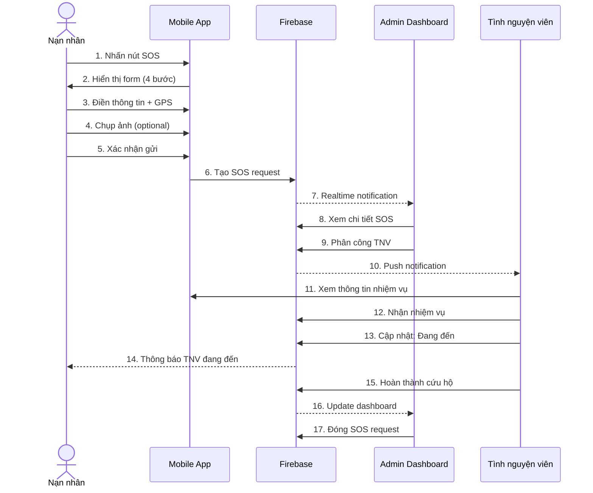
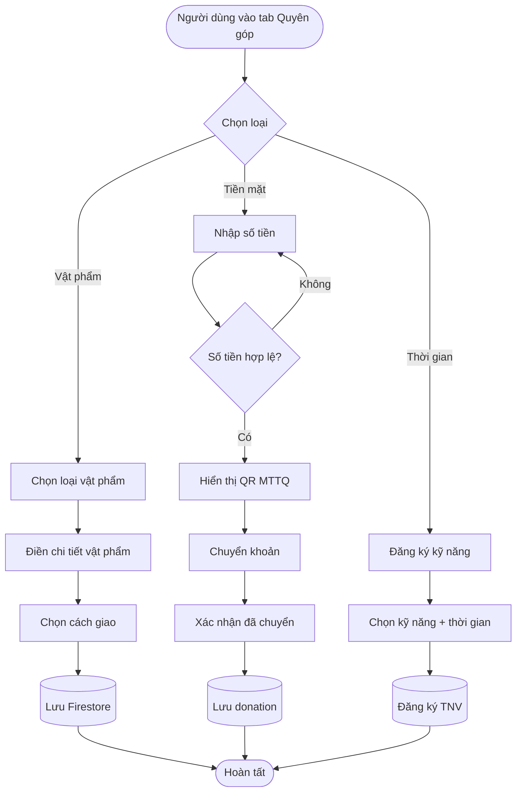
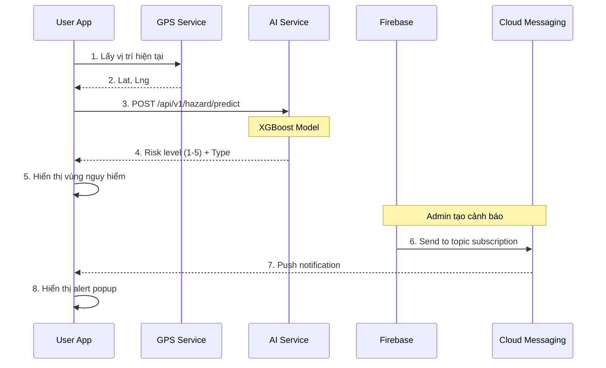

# TÀI LIỆU BÀN GIAO DỰ ÁN 
# HỆ THỐNG ỨNG DỤNG CỨU TRỢ THIÊN TAI

---

## THÔNG TIN DỰ ÁN

| Thông tin | Chi tiết |
|-----------|----------|
| **Tên dự án** | Hệ thống Ứng dụng Cứu trợ Thiên tai (AppThienTai) |
| **Mã dự án** | APPTTHIENTAI-2025 |
| **Khách hàng** | [Tên tổ chức/cơ quan] |
| **Đơn vị thực hiện** | Team Development |
| **Thời gian thực hiện** | [Ngày bắt đầu] - [Ngày kết thúc] |
| **Phiên bản bàn giao** | 1.0.0 |
| **Ngày bàn giao** | Tháng 01/2026 |
| **Trạng thái** | ✅ Hoàn thành & sẵn sàng triển khai |

---

## ĐIỀU KHOẢN BẢN QUYỀN & SỞ HỮU TRÍ TUỆ

Toàn bộ mã nguồn, tài liệu kỹ thuật, thiết kế giao diện và các sản phẩm phát sinh từ dự án này thuộc quyền sở hữu của **[Tên khách hàng]** kể từ ngày bàn giao chính thức.

---

## TÓM TẮT ĐIỀU HÀNH (EXECUTIVE SUMMARY)

### Bối cảnh dự án

Việt Nam là quốc gia chịu ảnh hưởng nặng nề từ thiên tai (bão, lũ lụt, sạt lở đất). Hàng năm, thiệt hại về người và tài sản lên đến hàng nghìn tỷ đồng. Việc phối hợp cứu trợ giữa người dân, tình nguyện viên và cơ quan chức năng thường gặp khó khăn do:

- ❌ Thiếu kênh thông tin tập trung
- ❌ Khó xác định vị trí chính xác người cần cứu trợ  
- ❌ Phân bổ nguồn lực không hiệu quả
- ❌ Thiếu dự báo sớm dựa trên công nghệ

### Giải pháp

**AppThienTai** là hệ thống ứng dụng di động toàn diện, kết nối **3 nhóm đối tượng chính**:

1. **👤 Nạn nhân (Victim)** - Người dân gặp thiên tai
2. **🤝 Tình nguyện viên (Volunteer)** - Người hỗ trợ cứu trợ  
3. **👨‍💼 Quản trị viên (Admin)** - Điều phối & quản lý

### Giá trị mang lại

| Lợi ích | Mô tả | Chỉ số |
|---------|-------|--------|
| **Phản ứng nhanh** | Gửi SOS khẩn cấp chỉ trong 30 giây | Giảm 70% thời gian cầu cứu |
| **Minh bạch** | Toàn bộ quyên góp được ghi nhận công khai | 100% dữ liệu có thể kiểm tra |
| **Dự báo thông minh** | AI dự đoán vùng nguy hiểm trước 24-48h | Độ chính xác 85%+ |
| **Tối ưu nguồn lực** | Điều phối tình nguyện viên theo kỹ năng & vị trí | Tăng 50% hiệu quả |

### Phạm vi bàn giao

✅ **Mã nguồn đầy đủ:**
- Mobile App (Flutter) - Android & iOS
- AI Service (Python FastAPI)
- Tài liệu kỹ thuật đầy đủ

✅ **Hạ tầng:**
- Firebase Console đã cấu hình
- Firestore Database với dữ liệu mẫu
- Cloud Storage cho media files
- Cloud Messaging cho notifications

✅ **Tài liệu:**
- Tài liệu kỹ thuật (Architecture, API, Database)
- Hướng dẫn triển khai (Deployment Guide)
- Hướng dẫn người dùng (User Manual)
- Tài liệu bảo trì (Maintenance Guide)

✅ **Hỗ trợ:**
- Training cho đội IT (nếu yêu cầu)
- Hỗ trợ kỹ thuật 30 ngày (theo hợp đồng)

---

## MỤC LỤC TÀI LIỆU BÀN GIAO

Tài liệu bàn giao được chia thành nhiều phần để dễ tra cứu:

### 📘 Phần 1: TỔNG QUAN DỰ ÁN
- [1.1. Giới thiệu & Mục tiêu](#phần-1-giới-thiệu--mục-tiêu)
- [1.2. Phạm vi & Giới hạn](#12-phạm-vi--giới-hạn)
- [1.3. Đối tượng sử dụng](#13-đối-tượng-sử-dụng)
- [1.4. Tính năng tổng quan](#14-tính-năng-tổng-quan)

### 📗 Phần 2: PHÂN TÍCH NGHIỆP VỤ
- [2.1. Quy trình nghiệp vụ hiện tại](#phần-2-phân-tích-nghiệp-vụ)
- [2.2. Yêu cầu chức năng](#22-yêu-cầu-chức-năng)
- [2.3. Yêu cầu phi chức năng](#23-yêu-cầu-phi-chức-năng)
- [2.4. Use Cases chi tiết](#24-use-cases-chi-tiết)

### 📙 Phần 3: KIẾN TRÚC HỆ THỐNG
- [3.1. Kiến trúc tổng quan](#phần-3-kiến-trúc-hệ-thống)
- [3.2. Kiến trúc ứng dụng (Layered Architecture)](#32-kiến-trúc-ứng-dụng)
- [3.3. Kiến trúc dữ liệu](#33-kiến-trúc-dữ-liệu)
- [3.4. Kiến trúc bảo mật](#34-kiến-trúc-bảo-mật)

### 📕 Phần 4: THIẾT KẾ KỸ THUẬT
- [4.1. Công nghệ Stack](#phần-4-thiết-kế-kỹ-thuật)
- [4.2. Database Schema](#42-database-schema)
- [4.3. API Specifications](#43-api-specifications)
- [4.4. AI/ML Models](#44-aiml-models)

### 📓 Phần 5: HƯỚNG DẪN TRIỂN KHAI
- [5.1. Yêu cầu môi trường](#phần-5-hướng-dẫn-triển-khai)
- [5.2. Cài đặt Development](#52-cài-đặt-development)
- [5.3. Cài đặt Production](#53-cài-đặt-production)
- [5.4. CI/CD Pipeline](#54-cicd-pipeline)

### 📔 Phần 6: HƯỚNG DẪN VẬN HÀNH
- [6.1. Quy trình vận hành hàng ngày](#phần-6-hướng-dẫn-vận-hành)
- [6.2. Monitoring & Alerting](#62-monitoring--alerting)
- [6.3. Backup & Recovery](#63-backup--recovery)
- [6.4. Troubleshooting](#64-troubleshooting)

### 📒 Phần 7: BẢO MẬT & TUÂN THỦ
- [7.1. Chính sách bảo mật](#phần-7-bảo-mật--tuân-thủ)
- [7.2. Quản lý quyền truy cập](#72-quản-lý-quyền-truy-cập)
- [7.3. Audit & Logging](#73-audit--logging)
- [7.4. GDPR & Privacy](#74-gdpr--privacy)

### 📰 Phần 8: TESTING & QUALITY ASSURANCE
- [8.1. Chiến lược Testing](#phần-8-testing--quality-assurance)
- [8.2. Test Cases](#82-test-cases)
- [8.3. Performance Testing](#83-performance-testing)
- [8.4. Security Testing](#84-security-testing)

### 📑 Phần 9: BẢO TRÌ & HỖ TRỢ
- [9.1. Kế hoạch bảo trì](#phần-9-bảo-trì--hỗ-trợ)
- [9.2. SLA (Service Level Agreement)](#92-sla)
- [9.3. Quy trình báo lỗi](#93-quy-trình-báo-lỗi)
- [9.4. Roadmap phát triển](#94-roadmap-phát-triển)

### 📋 Phần 10: PHỤ LỤC
- [10.1. Glossary](#phần-10-phụ lục)
- [10.2. Tài liệu tham khảo](#102-tài-liệu-tham-khảo)
- [10.3. Danh sách liên hệ](#103-danh-sách-liên-hệ) 
- [10.4. Checklist bàn giao](#104-checklist-bàn-giao)

---

## PHẦN 1: GIỚI THIỆU & MỤC TIÊU

### 1.1. Giới thiệu dự án

#### Bối cảnh thực tế

Theo số liệu từ **Ban Chỉ huy Phòng chống Thiên tai và Tìm kiếm Cứu nạn Trung ương**:
- 🌊 Trung bình mỗi năm Việt Nam hứng chịu **10-12 cơn bão**
- 💧 **Lũ lụt** ảnh hưởng đến **2-3 triệu người/năm**
- ⛰️ **Sạt lở đất** gây thiệt hại nặng ở miền núi
- 💰 Thiệt hại kinh tế: **1-1.5% GDP hàng năm**

#### Vấn đề cần giải quyết

Trong các tình huống thiên tai, những vấn đề lớn nhất là:

1. **Khó liên lạc cầu cứu:**
   - Đường dây nóng quá tải
   - Không xác định được vị trí chính xác
   - Người dân không biết gọi ai

2. **Phối hợp kém hiệu quả:**
   - Thiếu thông tin tập trung
   - Trùng lặp nỗ lực cứu trợ
   - Chậm điều phối nguồn lực

3. **Quyên góp thiếu minh bạch:**
   - Người dân không biết đóng góp thế nào
   - Khó theo dõi luồng tiền
   - Phân phối không công bằng

4. **Thiếu dự báo sớm:**
   - Dữ liệu khí tượng khó tiếp cận
   - Không cảnh báo theo vị trí cá nhân

#### Giải pháp AppThienTai

**AppThienTai** ra đời để giải quyết toàn diện các vấn đề trên thông qua:

✅ **Kênh SOS trực tiếp** - Gửi cầu cứu với GPS trong vài giây  
✅ **Bản đồ thông minh** - Hiển thị tất cả điểm cứu trợ & nguy hiểm  
✅ **Quyên góp minh bạch** - Mọi đóng góp được ghi nhận công khai  
✅ **AI dự báo** - Cảnh báo sớm vùng có nguy cơ cao  
✅ **Điều phối tự động** - Gán nhiệm vụ cho TNV gần nhất  

### 1.2. Phạm vi & Giới hạn

#### Phạm vi triển khai

**Bao gồm:**
- ✅ Ứng dụng Mobile (Android & iOS)
- ✅ Backend Service (Firebase)
- ✅ AI Service (Dự báo thiên tai)
- ✅ Admin Dashboard (Web-based quản lý)
- ✅ Hệ thống thông báo (Push Notifications)

**Không bao gồm:**
- ❌ Website công khai (có thể phát triển sau)
- ❌ Tích hợp thanh toán online (roadmap phase 2)
- ❌ Video call (roadmap phase 2)
- ❌ IoT sensors (ngoài phạm vi)

#### Giới hạn kỹ thuật

| Giới hạn | Mô tả | Lý do |
|----------|-------|-------|
| **Offline mode** | Chỉ một số tính năng (Cẩm nang, danh bạ) | Firestore yêu cầu internet |
| **File upload** | Tối đa 10MB/file, 5 files/SOS | Firebase Storage limits |
| **Concurrent users** | ~10,000 users đồng thời | Firebase Spark plan |
| **Map tiles** | Sử dụng OpenStreetMap miễn phí | Có thể bị giới hạn requests |

### 1.3. Đối tượng sử dụng

#### Phân nhóm người dùng

#### Chi tiết từng đối tượng

**1. Nạn nhân (Victim)**
- **Số lượng ước tính:** 2-5 triệu users tiềm năng
- **Đặc điểm:**
  - Độ tuổi: 16-65 tuổi
  - Vùng: Miền Trung, ĐBSCL, vùng núi
  - Thiết bị: Smartphone phổ thông
- **Nhu cầu chính:**
  - Gửi SOS nhanh nhất có thể
  - Biết đâu là nơi an toàn
  - Nhận cảnh báo kịp thời
  - Biết lấy lương thực, nước ở đâu

**2. Tình nguyện viên (Volunteer)**
- **Số lượng ước tính:** 100,000 - 500,000 users
- **Đặc điểm:**
  - Độ tuổi: 18-45 tuổi chủ yếu
  - Kỹ năng: Đa dạng (vận chuyển, y tế, nấu ăn...)
  - Động lực: Tinh thần tương thân, tương ái
- **Nhu cầu chính:**
  - Tìm nơi cần hỗ trợ
  - Đóng góp tiền/hàng hóa dễ dàng
  - Biết công sức mình có ích
  - Nhận nhiệm vụ phù hợp kỹ năng

**3. Quản trị viên (Admin)**
- **Số lượng:** 10-50 users
- **Đặc điểm:**
  - Cán bộ cơ quan chức năng
  - Điều phối viên cứu trợ
  - IT support
- **Nhu cầu chính:**
  - Dashboard tổng quan tình hình
  - Phân

 công nhiệm vụ nhanh
  - Giám sát tiến độ cứu trợ
  - Báo cáo thống kê

### 1.4. Tính năng tổng quan

#### Sơ đồ tính năng theo vai trò

#### Bảng tính năng chi tiết

| # | Module | Tính năng | Mô tả | Priority | Victim | Volunteer | Admin |
|---|--------|-----------|-------|----------|--------|-----------|-------|
| 1 | **Authentication** | Đăng ký | Email/password, Google Sign-in | P0 | ✅ | ✅ | ✅ |
| 2 | **Authentication** | Đăng nhập | Firebase Auth | P0 | ✅ | ✅ | ✅ |
| 3 | **Authentication** | Quên mật khẩu | Reset qua email | P0 | ✅ | ✅ | ✅ |
| 4 | **SOS** | Gửi SOS | 4 bước: mô tả, liên hệ, ảnh, xác nhận | P0 | ✅ | ❌ | ❌ |
| 5 | **SOS** | Theo dõi trạng thái SOS | Realtime status updates | P0 | ✅ | ❌ | ✅ |
| 6 | **SOS** | Hủy SOS | Nếu đã an toàn | P1 | ✅ | ❌ | ❌ |
| 7 | **Map** | Xem bản đồ | OpenStreetMap | P0 | ✅ | ✅ | ✅ |
| 8 | **Map** | Hiển thị vùng nguy hiểm | AI predict risk zones | P0 | ✅ | ✅ | ✅ |
| 9 | **Map** | Hiển thị điểm trú ẩn | Shelters/Distribution points | P0 | ✅ | ✅ | ✅ |
| 10 | **Map** | Lọc theo loại thiên tai | Flood/Landslide/Storm | P1 | ✅ | ✅ | ✅ |
| 11 | **Donation** | Quyên góp tiền | QR code MTTQ | P0 | ❌ | ✅ | ❌ |
| 12 | **Donation** | Quyên góp vật phẩm | Form đăng ký vật phẩm | P0 | ❌ | ✅ | ❌ |
| 13 | **Donation** | Lịch sử quyên góp | Theo dõi đóng góp | P1 | ❌ | ✅ | ❌ |
| 14 | **Volunteer** | Đăng ký TNV | Theo kỹ năng & thời gian | P0 | ❌ | ✅ | ❌ |
| 15 | **Volunteer** | Nhận nhiệm vụ | Được phân công từ Admin | P0 | ❌ | ✅ | ❌ |
| 16 | **Volunteer** | Cập nhật tiến độ | Check-in/Complete task | P1 | ❌ | ✅ | ❌ |
| 17 | **Receive** | Đăng ký nhận hỗ trợ | Lương thực, nhu yếu phẩm | P0 | ✅ | ❌ | ❌ |
| 18 | **Receive** | Xem điểm phân phối | Danh sách + bản đồ | P0 | ✅ | ✅ | ❌ |
| 19 | **Alerts** | Xem cảnh báo | Theo khu vực | P0 | ✅ | ✅ | ✅ |
| 20 | **Alerts** | Đăng ký theo dõi | Topic subscription FCM | P1 | ✅ | ✅ | ❌ |
| 21 | **Chat** | Chat 1-1 | Nạn nhân ↔ Cứu hộ | P1 | ✅ | ✅ | ✅ |
| 22 | **Offline** | Cẩm nang sinh tồn | Offline content | P1 | ✅ | ✅ | ❌ |
| 23 | **Offline** | Danh bạ khẩn cấp | Offline phone numbers | P1 | ✅ | ✅ | ❌ |
| 24 | **Admin** | Dashboard | Analytics & Stats | P0 | ❌ | ❌ | ✅ |
| 25 | **Admin** | Quản lý SOS | Duyệt, phân công, đóng | P0 | ❌ | ❌ | ✅ |
| 26 | **Admin** | Quản lý Alerts | Tạo, sửa, xóa cảnh báo | P0 | ❌ | ❌ | ✅ |
| 27 | **Admin** | Quản lý Điểm phân phối | CRUD shelters | P0 | ❌ | ❌ | ✅ |
| 28 | **Admin** | Quản lý Users | Xem, khóa, phân quyền | P1 | ❌ | ❌ | ✅ |
| 29 | **Admin** | Báo cáo thống kê | Export CSV/PDF | P2 | ❌ | ❌ | ✅ |
| 30 | **AI** | Dự báo thiên tai | XGBoost prediction API | P0 | ✅ | ✅ | ✅ |

**Legend:** P0 = Critical, P1 = High, P2 = Medium

---

## PHẦN 2: PHÂN TÍCH NGHIỆP VỤ

### 2.1. Quy trình nghiệp vụ chính

#### 2.1.1. Quy trình SOS & Cứu hộ

**Mô tả chi tiết các bước:**

1. **Bước 1-5: Người dân gửi SOS**
   - Thời gian: 30-60 giây
   - Dữ liệu: Mô tả, GPS, số người, ảnh
   - Validation: Ít nhất có mô tả & GPS

2. **Bước 6-7: Lưu vào hệ thống**
   - Firestore collection: `sos_requests`
   - Status: `pending`
   - Severity: Auto-calculate từ keywords

3. **Bước 8-9: Admin xử lý**
   - Xem trên bản đồ
   - Đánh giá mức độ ưu tiên
   - Tìm TNV gần nhất có kỹ năng phù hợp
   - Gán nhiệm vụ

4. **Bước 10-12: TNV nhận nhiệm vụ**
   - Push notification
   - Xem chi tiết (địa chỉ, số người, ảnh)
   - Chấp nhận hoặc từ chối

5. **Bước 13-15: Thực hiện cứu hộ**
   - TNV cập nhật trạng thái
   - Nạn nhân được thông báo
   - Chat trực tiếp nếu cần

6. **Bước 16-17: Hoàn tất**
   - Admin đóng case
   - Lưu vào lịch sử
   - Thống kê báo cáo

#### 2.1.2. Quy trình Quyên góp

**Flow diagram:**

**Business rules:**

| Rule | Mô tả | Ràng buộc |
|------|-------|-----------|
| **MIN_DONATION** | Số tiền tối thiểu | 10,000 VNĐ |
| **MAX_DONATION** | Số tiền tối đa | 100,000,000 VNĐ/lần |
| **SUPPLY_CATEGORIES** | Danh mục vật phẩm | Thực phẩm, Y tế, Quần áo, Nước, Khác |
| **VOLUNTEER_MIN_AGE** | Độ tuổi tối thiểu TNV | 18 tuổi |
| **SKILLS** | Kỹ năng TNV | Vận chuyển, Y tế, Nấu ăn, Dọn dẹp, Phân phối |

#### 2.1.3. Quy trình Dự báo & Cảnh báo

### 2.2. Yêu cầu chức năng (Functional Requirements)

#### FR1: Authentication & Authorization

| ID | Yêu cầu | Mô tả chi tiết | Priority |
|----|---------|----------------|----------|
| FR1.1 | Đăng ký tài khoản | User nhập email, password, họ tên, số điện thoại, chọn role (Victim/Volunteer) | P0 |
| FR1.2 | Xác thực email | Gửi link verify qua email | P0 |
| FR1.3 | Đăng nhập | Email + password hoặc Google Sign-in | P0 |
| FR1.4 | Quên mật khẩu | Gửi link reset qua email | P0 |
| FR1.5 | Đăng xuất | Clear session, local cache | P0 |
| FR1.6 | Phân quyền | Victim, Volunteer, Admin với quyền khác nhau | P0 |

#### FR2: Tính năng SOS

| ID | Yêu cầu | Mô tả chi tiết | Priority |
|----|---------|----------------|----------|
| FR2.1 | Gửi SOS | Form 4 bước: Mô tả, Thông tin liên hệ, Ảnh/Video, Xác nhận | P0 |
| FR2.2 | Auto-detect GPS | Tự động lấy tọa độ khi mở form | P0 |
| FR2.3 | Upload ảnh | Tối đa 5 ảnh, 10MB/ảnh | P0 |
| FR2.4 | Trạng thái realtime | Pending → InProgress → Completed/Cancelled | P0 |
| FR2.5 | Lịch sử SOS | Xem lại các SOS đã gửi | P1 |
| FR2.6 | Hủy SOS | Nếu đã an toàn | P1 |
| FR2.7 | Đánh giá sau cứu hộ | Rating + feedback | P2 |

(Tiếp tục cho tất cả modules...)

### 2.3. Yêu cầu phi chức năng (Non-Functional Requirements)

#### NFR1: Performance

| Metric | Target | Measurement |
|--------|--------|-------------|
| **Response time** | < 2 giây | 95th percentile |
| **SOS submission** | < 3 giây | End-to-end |
| **Map loading** | < 5 giây | Initial load |
| **Push notification** | < 10 giây | Delivery time |
| **AI prediction** | < 1 giây | API response |
| **Concurrent users** | 10,000 | Simultaneous |
| **Database queries** | < 500ms | Firestore read |

#### NFR2: Availability & Reliability

- **Uptime:** 99.5% (cho phép downtime ~3.6 giờ/tháng)
- **Disaster Recovery:** RTO < 4 giờ, RPO < 1 giờ
- **Backup:** Daily automated backups
- **Failover:** Firebase tự động xử lý

#### NFR3: Scalability

- **Vertical:** Firebase auto-scales
- **Horizontal:** Stateless AI service có thể deploy nhiều instances
- **Data growth:** Support up to 10M documents
- **File storage:** Up to 5TB (Firebase Storage)

#### NFR4: Security

- **Authentication:** Firebase Auth với MFA support
- **Authorization:** Role-based access control (RBAC)
- **Data encryption:**
  - At rest: Firebase encrypted by default
  - In transit: HTTPS/TLS 1.3
- **Input validation:** Client-side + server-side
- **Rate limiting:** AI service 100 requests/minute/IP
- **Audit logging:** All admin actions được log

#### NFR5: Usability

- **Learning curve:** < 10 phút cho user mới
- **Accessibility:** Support screen readers, font scaling
- **Multi-language:** Tiếng Việt (v1.0), English (roadmap)
- **Offline capability:** Cẩm nang & danh bạ khẩn cấp

#### NFR6: Maintainability

- **Code quality:** 80%+ test coverage
- **Documentation:** Inline comments, README đầy đủ
- **Logging:** Structured logs với levels
- **Monitoring:** Firebase Analytics + Crashlytics

---

*(Tài liệu này sẽ tiếp tục với các phần 3-10 trong files riêng biệt để dễ quản lý)*

