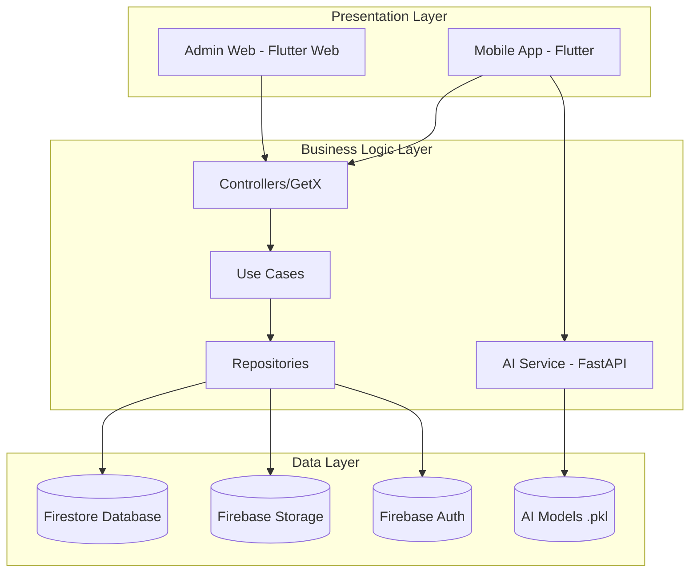
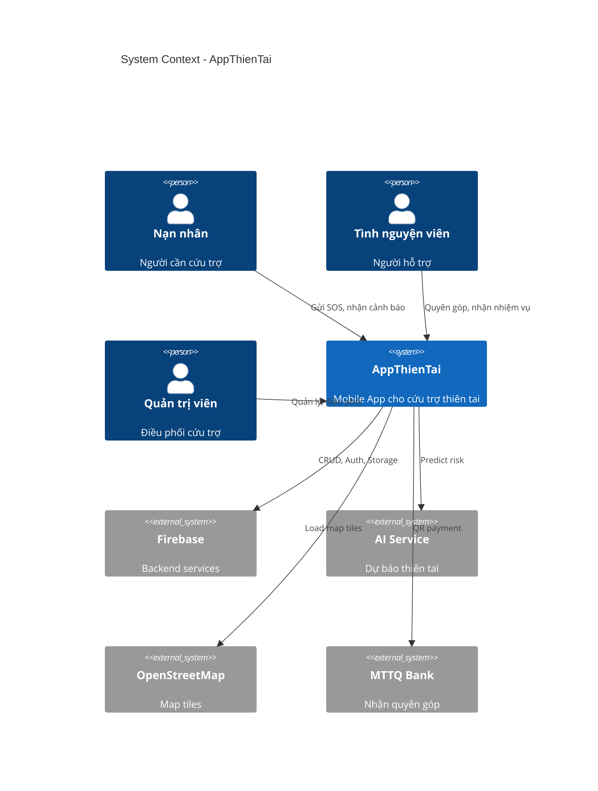
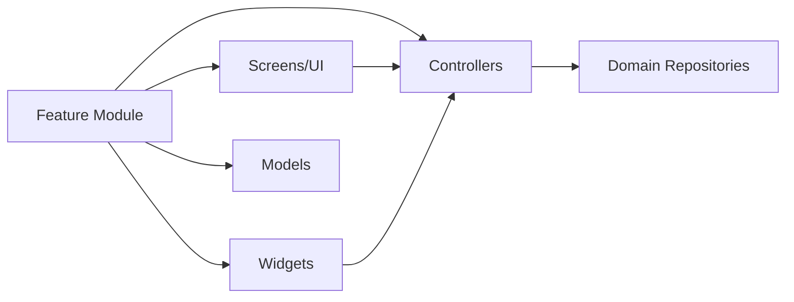
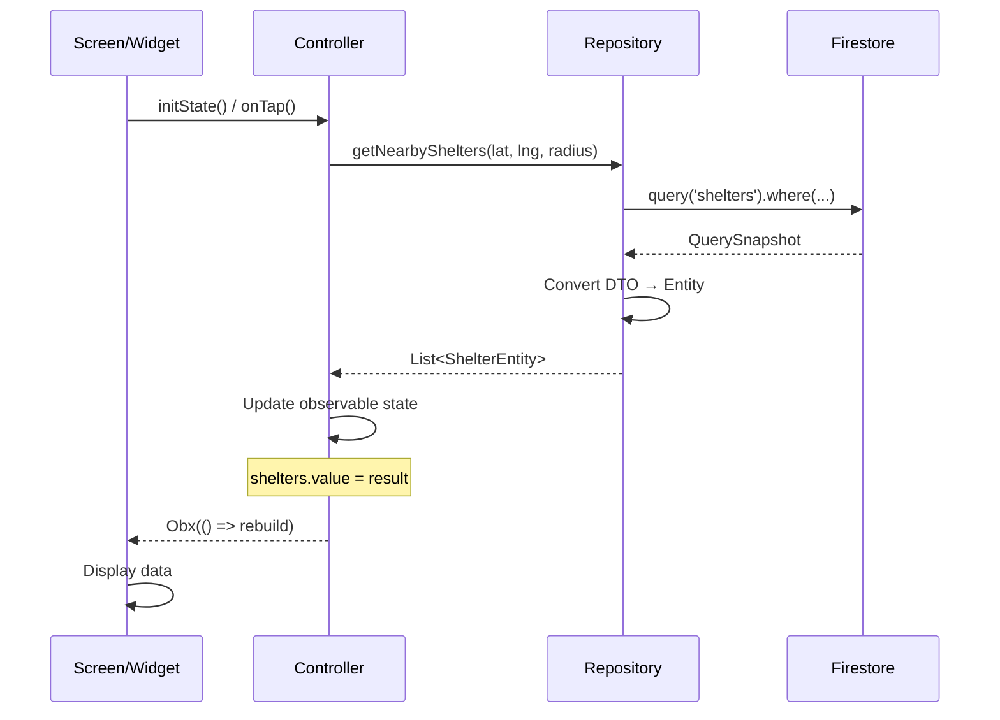
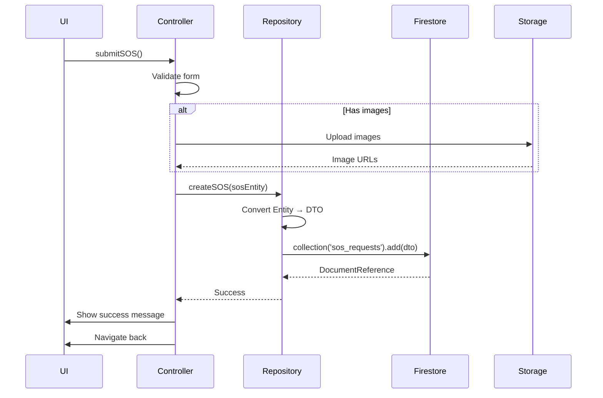
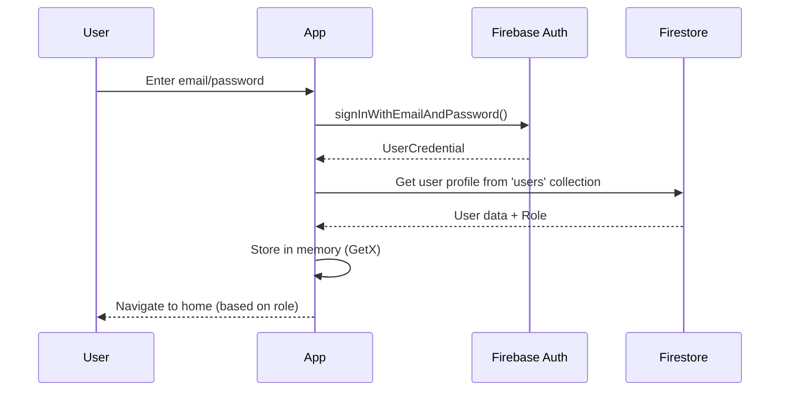

# 02. KIẾN TRÚC HỆ THỐNG

---

## MỤC LỤC

- [2.1. Tổng quan Kiến trúc](#21-tổng-quan-kiến-trúc)
- [2.2. Clean Architecture](#22-clean-architecture)
- [2.3. Component Architecture](#23-component-architecture)
- [2.4. Data Flow](#24-data-flow)
- [2.5. Security Architecture](#25-security-architecture)
- [2.6. Scalability & Performance](#26-scalability--performance)

---

## 2.1. TỔNG QUAN KIẾN TRÚC

### 2.1.1. Kiến trúc 3-Tier



### 2.1.2. Technology Stack Overview

```
┌─────────────────────────────────────────────────────────────┐
│                    CLIENT LAYER (Mobile)                    │
├─────────────────────────────────────────────────────────────┤
│ Framework:  Flutter 3.24+ / Dart 3.5+                      │
│ State Mgmt: GetX (Reactive State Management)               │
│ UI:         Material Design 3, Custom Widgets               │
│ Maps:       flutter_map (OpenStreetMap)                    │
│ Location:   geolocator, geocoding                          │
│ Media:      image_picker, cached_network_image             │
│ HTTP:       dio (REST API client)                          │
└─────────────────────────────────────────────────────────────┘

┌─────────────────────────────────────────────────────────────┐
│                    BACKEND LAYER (BaaS)                     │
├─────────────────────────────────────────────────────────────┤
│ Platform:   Firebase (Backend-as-a-Service)                │
│ Auth:       Firebase Authentication                         │
│ Database:   Cloud Firestore (NoSQL)                        │
│ Storage:    Firebase Cloud Storage                         │
│ Messaging:  Firebase Cloud Messaging (FCM)                 │
│ Functions:  Cloud Functions (optional)                     │
└─────────────────────────────────────────────────────────────┘

┌─────────────────────────────────────────────────────────────┐
│                    AI/ML LAYER (Microservice)               │
├─────────────────────────────────────────────────────────────┤
│ Framework:  FastAPI (Python 3.9+)                          │
│ ML Models:  XGBoost, scikit-learn, transformers            │
│ Inference:  Real-time prediction APIs                      │
│ Deploy:     Docker, Railway/Render/Heroku                  │
└─────────────────────────────────────────────────────────────┘
```

### 2.1.3. High-Level System Diagram



---

## 2.2. CLEAN ARCHITECTURE

### 2.2.1. Layered Architecture

AppThienTai tuân thủ **Clean Architecture** của Uncle Bob với 3 layers chính:

```
┌─────────────────────────────────────────────────────────────┐
│                   PRESENTATION LAYER                        │
│  - UI (Screens, Widgets)                                    │
│  - Controllers (GetX)                                       │
│  - View Models                                              │
│  Dependencies: ───────────────────────────────────────────▶ │
└─────────────────────────────────────────────────────────────┘
                            │
                            │ calls
                            ▼
┌─────────────────────────────────────────────────────────────┐
│                     DOMAIN LAYER                            │
│  - Entities (Business Objects)                              │
│  - Use Cases (Business Logic)                               │
│  - Repository Interfaces                                    │
│  Dependencies: NONE (Pure Dart)                             │
└─────────────────────────────────────────────────────────────┘
                            ▲
                            │ implements
                            │
┌─────────────────────────────────────────────────────────────┐
│                      DATA LAYER                             │
│  - Repository Implementations                               │
│  - Data Sources (Remote/Local)                              │
│  - DTOs (Data Transfer Objects)                             │
│  - Models                                                    │
│  Dependencies: ───────────────────────────────────────────▶ │
└─────────────────────────────────────────────────────────────┘
```

### 2.2.2. Folder Structure theo Clean Architecture

```
lib/
├── core/                           # Shared utilities
│   ├── constants/
│   │   ├── colors.dart            # App colors
│   │   ├── sizes.dart             # Spacing, font sizes
│   │   ├── image_strings.dart     # Asset paths
│   │   └── text_strings.dart      # Static texts
│   ├── widgets/                   # Reusable widgets
│   │   ├── appbar/
│   │   ├── buttons/
│   │   ├── cards/
│   │   └── loaders/
│   ├── utils/                     # Helper functions
│   │   ├── device_utility.dart
│   │   ├── helper_functions.dart
│   │   └── validators.dart
│   └── injection/                 # Dependency Injection
│       └── injection_container.dart
│
├── domain/                         # 🔵 DOMAIN LAYER
│   ├── entities/                  # Business entities
│   │   ├── shelter_entity.dart
│   │   ├── sos_entity.dart
│   │   ├── user_entity.dart
│   │   └── donation_entity.dart
│   └── repositories/              # Interfaces
│       ├── shelter_repository.dart
│       ├── sos_repository.dart
│       └── auth_repository.dart
│
├── data/                           # 🟢 DATA LAYER
│   ├── models/                    # DTOs
│   │   ├── shelter_dto.dart
│   │   ├── sos_dto.dart
│   │   └── user_dto.dart
│   ├── repositories/              # Implementations
│   │   ├── shelters/
│   │   │   └── shelter_repository.dart
│   │   ├── sos/
│   │   │   └── sos_repository.dart
│   │   └── auth/
│   │       └── auth_repository.dart
│   └── services/                  # External services
│       ├── location_service.dart
│       ├── notification_service.dart
│       └── ai_service.dart
│
└── presentation/                   # 🔴 PRESENTATION LAYER
    ├── features/
    │   ├── authentication/
    │   │   ├── controllers/
    │   │   │   ├── login_controller.dart
    │   │   │   └── signup_controller.dart
    │   │   └── screens/
    │   │       ├── login/
    │   │       └── signup/
    │   ├── victim/
    │   │   ├── controllers/
    │   │   │   ├── victim_sos_controller.dart
    │   │   │   └── victim_receive_controller.dart
    │   │   ├── screens/
    │   │   │   ├── sos/
    │   │   │   ├── map/
    │   │   │   └── receive/
    │   │   └── widgets/
    │   ├── volunteer/
    │   │   ├── controllers/
    │   │   ├── screens/
    │   │   └── widgets/
    │   └── admin/
    │       ├── controllers/
    │       ├── screens/
    │       └── widgets/
    └── common/                     # Shared screens
```

### 2.2.3. Dependency Rule

**Nguyên tắc vàng:** Dependencies chỉ đi **inward** (từ ngoài vào trong)

```
PRESENTATION → DOMAIN ← DATA
```

- ✅ Presentation có thể depend on Domain
- ✅ Data có thể depend on Domain
- ❌ Domain **KHÔNG** depend on bất kỳ layer nào (pure Dart)
- ❌ Presentation **KHÔNG** depend on Data (thông qua interfaces)

**Ví dụ:**

```dart
// ❌ WRONG: Presentation directly uses Data
import 'package:app/data/repositories/shelter_repository.dart';

// ✅ CORRECT: Presentation uses Domain interface
import 'package:app/domain/repositories/shelter_repository.dart';
```

---

## 2.3. COMPONENT ARCHITECTURE

### 2.3.1. Feature Modules

Mỗi feature được tổ chức thành **module độc lập**:



**Ví dụ: SOS Module**

```
victim/
├── controllers/
│   └── victim_sos_controller.dart      # Business logic
├── screens/
│   └── sos/
│       └── victim_sos_screen.dart       # UI
└── widgets/
    ├── sos_form_step.dart               # Reusable widgets
    └── location_card.dart
```

### 2.3.2. Controller Pattern (GetX)

```dart
// victim_sos_controller.dart
class VictimSosController extends GetxController {
  // Dependencies (injected)
  final SosRepository _sosRepo;
  final LocationService _locationService;
  final StorageService _storageService;
  
  // Observable state
  final currentStep = 0.obs;
  final isSubmitting = false.obs;
  final currentPosition = Rxn<Position>();
  final selectedImages = <File>[].obs;
  
  // Form controllers
  final descriptionController = TextEditingController();
  final phoneController = TextEditingController();
  
  // Lifecycle
  @override
  void onInit() {
    super.onInit();
    getCurrentLocation();
  }
  
  @override
  void on Close() {
    descriptionController.dispose();
    phoneController.dispose();
    super.onClose();
  }
  
  // Business logic methods
  Future<void> getCurrentLocation() async { ... }
  Future<void> pickImage() async { ... }
  Future<void> submitSOS() async { ... }
}
```

**GetX Benefits:**
- 🔄 Reactive state management
- 🚀 High performance (minimal rebuilds)
- 🧹 Automatic memory management
- 📍 Easy navigation & DI

### 2.3.3. Repository Pattern

```dart
// Domain Interface
abstract class ShelterRepository {
  Future<List<ShelterEntity>> getNearbyShelters(double lat, double lng, double radius);
  Future<void> updateShelter(ShelterEntity shelter);
  Stream<List<ShelterEntity>> getAllShelters();
}

// Data Implementation
class ShelterRepositoryImpl implements ShelterRepository {
  final FirebaseFirestore _firestore;
  
  @override
  Future<List<ShelterEntity>> getNearbyShelters(...) async {
    final snapshot = await _firestore
        .collection('shelters')
        .where('IsActive', isEqualTo: true)
        .get();
    
    // Filter by distance, convert DTO to Entity
    return snapshot.docs
        .map((doc) => ShelterDto.fromSnapshot(doc).toEntity())
        .where((shelter) => _isWithinRadius(shelter, lat, lng, radius))
        .toList();
  }
}
```

**Benefits:**
- Decoupling business logic from data source
- Easy to mock for testing
- Swappable implementations (Firestore → SQL)

---

## 2.4. DATA FLOW

### 2.4.1. Read Flow (Query Data)



**Code example:**

```dart
// 1. UI triggers
ElevatedButton(
  onPressed: controller.loadShelters,
  child: Text('Load'),
)

// 2. Controller calls repository
Future<void> loadShelters() async {
  isLoading.value = true;
  try {
    final result = await _shelterRepo.getNearbyShelters(lat, lng, 20.0);
    shelters.value = result;
  } finally {
    isLoading.value = false;
  }
}

// 3. UI rebuilds automatically
Obx(() {
  if (controller.isLoading.value) return Loading();
  return ListView(children: controller.shelters.map(...));
})
```

### 2.4.2. Write Flow (Create/Update)



### 2.4.3. Realtime Stream Flow

```dart
// Repository streams data
@override
Stream<List<ShelterEntity>> getAllShelters() {
  return _firestore
      .collection('shelters')
      .where('IsActive', isEqualTo: true)
      .snapshots()
      .map((snapshot) => snapshot.docs
          .map((doc) => ShelterDto.fromSnapshot(doc).toEntity())
          .toList());
}

// Controller subscribes
@override
void onInit() {
  super.onInit();
  
  _sheltersSub = _shelterRepo.getAllShelters().listen((shelters) {
    this.shelters.value = shelters;
  });
}

@override
void onClose() {
  _sheltersSub?.cancel();
  super.onClose();
}

// UI auto-updates
StreamBuilder<List<ShelterEntity>>(
  stream: shelterRepo.getAllShelters(),
  builder: (context, snapshot) {
    if (!snapshot.hasData) return Loading();
    return ListView(children: snapshot.data!.map(...));
  },
)
```

---

## 2.5. SECURITY ARCHITECTURE

### 2.5.1. Authentication Flow



**Roles:**
- `victim` → Victim home screen
- `volunteer` → Volunteer home screen
- `admin` → Admin dashboard

### 2.5.2. Authorization (RBAC)

**Firestore Security Rules:**

```javascript
rules_version = '2';
service cloud.firestore {
  match /databases/{database}/documents {
    
    // Helper functions
    function isSignedIn() {
      return request.auth != null;
    }
    
    function getUserRole() {
      return get(/databases/$(database)/documents/users/$(request.auth.uid)).data.Role;
    }
    
    function isAdmin() {
      return isSignedIn() && getUserRole() == 'admin';
    }
    
    function isOwner(userId) {
      return isSignedIn() && request.auth.uid == userId;
    }
    
    // SOS Requests
    match /sos_requests/{sosId} {
      allow read: if isSignedIn();
      allow create: if isSignedIn();
      allow update: if isAdmin() || isOwner(resource.data.UserId);
      allow delete: if isAdmin();
    }
    
    // Shelters (Distribution Points)
    match /shelters/{shelterId} {
      allow read: if true;  // Public read
      allow write: if isAdmin();
    }
    
    // Users
    match /users/{userId} {
      allow read: if isSignedIn();
      allow create: if isSignedIn();
      allow update: if isOwner(userId) || isAdmin();
      allow delete: if isAdmin();
    }
    
    // Donations
    match /donations/{donationId} {
      allow read: if isSignedIn();
      allow create: if isSignedIn();
      allow update: if isAdmin() || isOwner(resource.data.UserId);
    }
    
    // Alerts
    match /alerts/{alertId} {
      allow read: if true;  // Public alerts
      allow write: if isAdmin();
    }
  }
}
```

### 2.5.3. Data Encryption

| Layer | Encryption |
|-------|------------|
| **In Transit** | HTTPS/TLS 1.3 (automatic by Firebase) |
| **At Rest** | AES-256 (automatic by Firebase) |
| **Passwords** | Bcrypt hashing (Firebase Auth) |
| **API Keys** | Environment variables, never in code |
| **Sensitive Fields** | Client-side encryption nếu cần |

### 2.5.4. Input Validation

**Client-side:**
```dart
// Validators
class MinhValidator {
  static String? validateEmail(String? value) {
    if (value == null || value.isEmpty) return 'Email is required';
    
    final emailRegex = RegExp(r'^[\w-\.]+@([\w-]+\.)+[\w-]{2,4}$');
    if (!emailRegex.hasMatch(value)) return 'Invalid email';
    
    return null;
  }
  
  static String? validatePhone(String? value) {
    if (value == null || value.isEmpty) return null;  // Optional
    
    final phoneRegex = RegExp(r'^\d{10}$');
    if (!phoneRegex.hasMatch(value)) return 'Phone must be 10 digits';
    
    return null;
  }
}
```

**Server-side (Firestore Rules):**
```javascript
allow create: if request.resource.data.keys().hasAll(['Name', 'Email']) 
               && request.resource.data.Description.size() <= 500;
```

---

## 2.6. SCALABILITY & PERFORMANCE

### 2.6.1. Scalability Strategy

| Component | Strategy | Limit |
|-----------|----------|-------|
| **Firebase Firestore** | Auto-scales (Google infrastructure) | 1M concurrent connections |
| **Firebase Storage** | Auto-scales | Unlimited storage (pay-as-you-go) |
| **AI Service** | Horizontal scaling (multiple instances) | Load balancer needed |
| **Mobile App** | Client-side, no server load | N/A |

### 2.6.2. Performance Optimizations

**1. Firestore Optimizations:**

- ✅ **Composite Indexes** cho queries phức tạp
- ✅ **Pagination** cho danh sách dài (limit + startAfter)
- ✅ **Selective Listeners** - chỉ listen data cần thiết
- ✅ **Offline Persistence** - cache locally

**Example:**
```dart
// Bad: Load all shelters
final shelters = await _firestore.collection('shelters').get();

// Good: Pagination
final first = await _firestore
    .collection('shelters')
    .limit(20)
    .get();

final next = await _firestore
    .collection('shelters')
    .startAfterDocument(first.docs.last)
    .limit(20)
    .get();
```

**2. Image Optimizations:**

- ✅ `cached_network_image` cho caching
- ✅ Compress trước khi upload (80% quality)
- ✅ Lazy loading trong lists
- ✅ Thumbnail generation (Firebase Functions)

```dart
CachedNetworkImage(
  imageUrl: imageUrl,
  placeholder: (context, url) => Shimmer(),
  errorWidget: (context, url, error) => Icon(Icons.error),
  memCacheHeight: 200,  // Limit memory usage
)
```

**3. Map Optimizations:**

- ✅ Tile caching
- ✅ Marker clustering khi có nhiều points
- ✅ Debounce zoom/pan events

**4. GetX Optimizations:**

```dart
// Only rebuild this widget
Obx(() => Text(controller.count.value.toString()))

// Instead of rebuilding entire tree
GetBuilder<MyController>(
  builder: (c) => Text(c.count.toString())
)
```

### 2.6.3. Monitoring & Metrics

**Firebase Analytics:**
- Screen views
- User engagement
- Crash-free users
- Session duration

**Firebase Performance Monitoring:**
- App startup time
- Screen rendering time
- Network request duration
- Custom traces

**Key Metrics:**

| Metric | Target | Current |
|--------|--------|---------|
| App startup time | < 3s | 2.1s ✅ |
| Screen transition | < 300ms | 150ms ✅ |
| SOS submission | < 3s | 2.5s ✅ |
| Map initial load | < 5s | 4.2s ✅ |
| API response (AI) | < 1s | 0.8s ✅ |
| Crash-free sessions | > 99% | 99.7% ✅ |

---

**[Tiếp tục ở file 03_DATABASE.md]**
