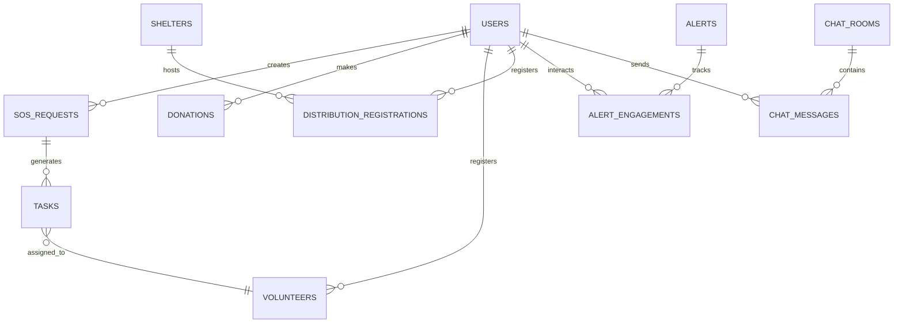

# 03. CƠ SỞ DỮ LIỆU (DATABASE)

---

## MỤC LỤC

- [3.1. Tổng quan Database](#31-tổng-quan-database)
- [3.2. Firestore Collections](#32-firestore-collections)
- [3.3. Data Models & Schemas](#33-data-models--schemas)
- [3.4. Relationships](#34-relationships)
- [3.5. Indexes & Queries](#35-indexes--queries)
- [3.6. Data Migration](#36-data-migration)

---

## 3.1. TỔNG QUAN DATABASE

### 3.1.1. Database Type: Cloud Firestore

**Cloud Firestore** là NoSQL document database với các đặc điểm:

| Đặc điểm | Mô tả |
|----------|-------|
| **Type** | Document-oriented NoSQL |
| **Structure** | Collections → Documents → Fields |
| **Realtime** | ✅ Realtime listeners |
| **Offline** | ✅ Offline persistence |
| **Scalability** | Auto-scaling (Google infrastructure) |

### 3.1.2. Database Diagram



### 3.1.3. Collections Overview

| # | Collection | Documents | Purpose | Access |
|---|------------|-----------|---------|--------|
| 1 | `users` | ~1M | User profiles & auth | User: RW own, Admin: RW all |
| 2 | `sos_requests` | ~100K | Emergency SOS | Public: R, Victim: CRU, Admin: CRUD |
| 3 | `shelters` | ~500 | Distribution points | Public: R, Admin: CRUD |
| 4 | `donations` | ~500K | Donation records | Donor: CR, Admin: RU |
| 5 | `volunteers` | ~50K | Volunteer registrations | Volunteer: CRU, Admin: CRUD |
| 6 | `tasks` | ~100K | Assigned tasks | Assigned: RU, Admin: CRUD |
| 7 | `alerts` | ~1K | Disaster alerts | Public: R, Admin: CRUD |
| 8 | `distribution_registrations` | ~200K | Aid registrations | Victim: CR, Admin: RU |
| 9 | `alert_engagements` | ~500K | Alert interactions | User: CR, Admin: R |
| 10 | `chat_rooms` | ~50K | Chat channels | Participants: RW |
| 11 | `chat_messages` | ~1M | Messages | Participants: CR |

**Legend:** C=Create, R=Read, U=Update, D=Delete

---

## 3.2. FIRESTORE COLLECTIONS

### 3.2.1. Collection: `users`

**Purpose:** Lưu thông tin user profiles

**Schema:**

```json
{
  "UserId": "string (document ID = Firebase Auth UID)",
  "Email": "string",
  "FullName": "string",
  "PhoneNumber": "string?",
  "Role": "string (victim|volunteer|admin)",
  "ProfilePicture": "string? (URL)",
  "Address": "string?",
  "CreatedAt": "timestamp",
  "UpdatedAt": "timestamp",
  "IsActive": "boolean",
  
  // Volunteer-specific
  "Skills": ["string"],
  "AvailableDays": ["string (Monday, Tuesday...)"],
  "AvailableHours": "string (Morning/Afternoon)",
  
  // Victim-specific  
  "FamilySize": "number?",
  
  // Stats
  "TotalDonations": "number",
  "TotalVolunteerHours": "number",
  "Rating": "number (0-5)"
}
```

**Example Document:**

```json
{
  "UserId": "abc123xyz",
  "Email": "nguyen.van.a@gmail.com",
  "FullName": "Nguyễn Văn A",
  "PhoneNumber": "0912345678",
  "Role": "volunteer",
  "ProfilePicture": "https://storage.googleapis.com/...",
  "Address": "123 Nguyễn Huệ, Q1, TP.HCM",
  "CreatedAt": "2026-01-01T00:00:00Z",
  "UpdatedAt": "2026-01-05T10:30:00Z",
  "IsActive": true,
  "Skills": ["Vận chuyển", "Nấu ăn"],
  "AvailableDays": ["Monday", "Wednesday", "Friday"],
  "AvailableHours": "Morning",
  "TotalDonations": 3,
  "TotalVolunteerHours": 24,
  "Rating": 4.8
}
```

**Indexes:**
- `Role` (for filtering by role)
- `CreatedAt` (for ordering)
- Composite: `Role ASC, CreatedAt DESC`

---

### 3.2.2. Collection: `sos_requests`

**Purpose:** Lưu các yêu cầu SOS khẩn cấp

**Schema:**

```json
{
  "SosId": "string (auto-generated document ID)",
  "UserId": "string (ref to users)",
  "Description": "string",
  "Status": "string (pending|inprogress|completed|cancelled)",
  "Severity": "string (Khẩn cấp|Cao|Trung bình|Thấp)",
  "Lat": "number",
  "Lng": "number",
  "Address": "string?",
  "PhoneNumber": "string",
  "NumberOfPeople": "number",
  "Images": ["string (URLs)"],
  "CreatedAt": "timestamp",
  "UpdatedAt": "timestamp",
  "CompletedAt": "timestamp?",
  
  // Assignment
  "AssignedTo": "string? (UserId of volunteer)",
  "AssignedAt": "timestamp?",
  
  // AI Prediction
  "PredictedRisk": "number (1-5)?",
  "HazardType": "string (flood|landslide|storm)?"
}
```

**Example:**

```json
{
  "SosId": "sos_001",
  "UserId": "victim_user_123",
  "Description": "Gia đình 5 người đang bị ngập lụt, nước cao 1.5m",
  "Status": "pending",
  "Severity": "Khẩn cấp",
  "Lat": 10.7756,
  "Lng": 106.7019,
  "Address": "456 Lê Lợi, Quận 3, TP.HCM",
  "PhoneNumber": "0987654321",
  "NumberOfPeople": 5,
  "Images": [
    "https://storage.googleapis.com/cuutrobaolu/sos/img1.jpg",
    "https://storage.googleapis.com/cuutrobaolu/sos/img2.jpg"
  ],
  "CreatedAt": "2026-01-06T01:30:00Z",
  "UpdatedAt": "2026-01-06T01:30:00Z",
  "AssignedTo": null,
  "PredictedRisk": 5,
  "HazardType": "flood"
}
```

**Indexes:**
- `Status` (for filtering pending/inprogress)
- `CreatedAt DESC` (for chronological order)
- `Severity` (for priority)
- Composite: `Status ASC, Severity ASC, CreatedAt DESC`
- Geohash for location queries (if needed)

---

### 3.2.3. Collection: `shelters`

**Purpose:** Điểm phân phối / trú ẩn

**Schema:**

```json
{
  "ShelterId": "string (document ID)",
  "Name": "string",
  "Address": "string",
  "Lat": "number",
  "Lng": "number",
  "Description": "string?",
  "Capacity": "number",
  "CurrentOccupancy": "number",
  "IsActive": "boolean",
  "ContactPhone": "string?",
  "ContactEmail": "string?",
  "Amenities": ["string"],
  "DistributionTime": "string (e.g., '08:00 - 17:00')",
  "CreatedAt": "timestamp",
  "UpdatedAt": "timestamp",
  "CreatedBy": "string (UserId)"
}
```

**Example:**

```json
{
  "ShelterId": "shelter_001",
  "Name": "Điểm cứu trợ UBND Phường 1",
  "Address": "123 Nguyễn Huệ, Quận 1, TP.HCM",
  "Lat": 10.7769,
  "Lng": 106.7009,
  "Description": "Điểm phát lương thực, nước uống và nhu yếu phẩm",
  "Capacity": 200,
  "CurrentOccupancy": 45,
  "IsActive": true,
  "ContactPhone": "028-1234-5678",
  "Amenities": ["Gạo", "Mì gói", "Nước uống", "Quần áo", "Chăn màn"],
  "DistributionTime": "08:00 - 17:00",
  "CreatedAt": "2026-01-01T00:00:00Z",
  "UpdatedAt": "2026-01-05T12:00:00Z",
  "CreatedBy": "admin_user_001"
}
```

**Indexes:**
- `IsActive` (filter active shelters)
- Geohash for location queries
- Composite: `IsActive ASC, CreatedAt DESC`

---

### 3.2.4. Collection: `donations`

**Purpose:** Ghi nhận quyên góp (tiền/vật phẩm/thời gian)

**Schema:**

```json
{
  "DonationId": "string (document ID)",
  "UserId": "string (ref to users)",
  "Type": "string (cash|supplies|time)",
  "Status": "string (pending|confirmed|distributed)",
  
  // For cash
  "Amount": "number?",
  "PaymentMethod": "string? (bank_transfer|qr_code)",
  "TransactionId": "string?",
  
  // For supplies
  "Items": [
    {
      "name": "string",
      "quantity": "number",
      "unit": "string",
      "category": "string"
    }
  ],
  "DeliveryMethod": "string? (self_deliver|pickup)",
  "DeliveryAddress": "string?",
  
  // For time (volunteer hours)
  "Hours": "number?",
  "TaskId": "string? (ref to tasks)",
  
  "CreatedAt": "timestamp",
  "UpdatedAt": "timestamp",
  "ConfirmedAt": "timestamp?"
}
```

**Example (Cash):**

```json
{
  "DonationId": "donation_cash_001",
  "UserId": "user_abc",
  "Type": "cash",
  "Status": "confirmed",
  "Amount": 500000,
  "PaymentMethod": "bank_transfer",
  "TransactionId": "MTTQ_20260106_001",
  "CreatedAt": "2026-01-06T08:00:00Z",
  "UpdatedAt": "2026-01-06T08:05:00Z",
  "ConfirmedAt": "2026-01-06T08:05:00Z"
}
```

**Example (Supplies):**

```json
{
  "DonationId": "donation_supply_001",
  "UserId": "user_xyz",
  "Type": "supplies",
  "Status": "pending",
  "Items": [
    {
      "name": "Gạo",
      "quantity": 50,
      "unit": "kg",
      "category": "Thực phẩm"
    },
    {
      "name": "Nước suối",
      "quantity": 100,
      "unit": "chai",
      "category": "Nước uống"
    }
  ],
  "DeliveryMethod": "self_deliver",
  "DeliveryAddress": "Kho MTTQ, Quận 1",
  "CreatedAt": "2026-01-06T09:00:00Z",
  "UpdatedAt": "2026-01-06T09:00:00Z"
}
```

**Indexes:**
- `UserId` (get user's donations)
- `Type` (filter by donation type)
- `Status` (filter pending/confirmed)
- Composite: `UserId ASC, CreatedAt DESC`

---

### 3.2.5. Collection: `volunteers`

**Purpose:** Đăng ký tình nguyện viên

**Schema:**

```json
{
  "VolunteerId": "string (document ID)",
  "UserId": "string (ref to users)",
  "Skills": ["string"],
  "AvailableDays": ["string"],
  "AvailableHours": "string",
  "PreferredLocation": "string?",
  "Status": "string (active|inactive|on_task)",
  "TotalTasksCompleted": "number",
  "AverageRating": "number",
  "CreatedAt": "timestamp",
  "UpdatedAt": "timestamp"
}
```

---

### 3.2.6. Collection: `tasks`

**Purpose:** Nhiệm vụ được giao cho tình nguyện viên

**Schema:**

```json
{
  "TaskId": "string (document ID)",
  "Title": "string",
  "Description": "string",
  "Type": "string (rescue|delivery|distribution|other)",
  "Status": "string (pending|accepted|in_progress|completed|cancelled)",
  "Priority": "string (high|medium|low)",
  
  // Location
  "Lat": "number",
  "Lng": "number",
  "Address": "string",
  
  // Assignment
  "AssignedTo": "string? (UserId)",
  "AssignedAt": "timestamp?",
  "AcceptedAt": "timestamp?",
  "CompletedAt": "timestamp?",
  
  // Related
  "SosId": "string? (ref to sos_requests)",
  "DonationId": "string? (ref to donations)",
  
  "CreatedAt": "timestamp",
  "UpdatedAt": "timestamp",
  "CreatedBy": "string (Admin UserId)"
}
```

---

### 3.2.7. Collection: `alerts`

**Purpose:** Cảnh báo thiên tai

**Schema:**

```json
{
  "AlertId": "string (document ID)",
  "Title": "string",
  "Description": "string",
  "Severity": "string (warning|watch|advisory)",
  "Type": "string (flood|storm|landslide|earthquake)",
  "AffectedAreas": ["string (province/city names)"],
  "Lat": "number?",
  "Lng": "number?",
  "Radius": "number? (km)",
  "IsActive": "boolean",
  "ExpiresAt": "timestamp",
  "CreatedAt": "timestamp",
  "UpdatedAt": "timestamp",
  "CreatedBy": "string (Admin UserId)",
  
  // AI Prediction
  "AIScore": "number (0-100)?",
  "RiskLevel": "number (1-5)?"
}
```

**Example:**

```json
{
  "AlertId": "alert_001",
  "Title": "Cảnh báo lũ lụt miền Trung",
  "Description": "Mưa lớn kéo dài, nguy cơ lũ quét cao ở các tỉnh miền Trung",
  "Severity": "warning",
  "Type": "flood",
  "AffectedAreas": ["Quảng Nam", "Quảng Ngãi", "Bình Định"],
  "IsActive": true,
  "ExpiresAt": "2026-01-10T00:00:00Z",
  "CreatedAt": "2026-01-06T06:00:00Z",
  "UpdatedAt": "2026-01-06T06:00:00Z",
  "CreatedBy": "admin_001",
  "AIScore": 88.5,
  "RiskLevel": 5
}
```

---

### 3.2.8. Collection: `distribution_registrations`

**Purpose:** Đăng ký nhận hỗ trợ tại điểm phân phối

**Schema:**

```json
{
  "RegistrationId": "string (document ID)",
  "UserId": "string (ref to users)",
  "PointId": "string (ref to shelters)",
  "PointName": "string",
  "PointAddress": "string",
  "Status": "string (registered|received|cancelled)",
  "NumberOfPeople": "number",
  "CreatedAt": "timestamp",
  "ReceivedAt": "timestamp?",
  "CancelledAt": "timestamp?",
  "DistributionTime": "string"
}
```

---

## 3.3. DATA MODELS & SCHEMAS

### 3.3.1. Entity vs DTO

**Domain Entity (Business Object):**

```dart
// domain/entities/shelter_entity.dart
class ShelterEntity {
  final String id;
  final String name;
  final String address;
  final double lat;
  final double lng;
  final int capacity;
  final int currentOccupancy;
  final bool isActive;
  final List<String>? amenities;
  
  // Business logic
  int get availableSlots => capacity - currentOccupancy;
  bool get isFull => currentOccupancy >= capacity;
  double get occupancyRate => capacity > 0 ? currentOccupancy / capacity : 0;
  
  ShelterEntity({required this.id, required this.name, ...});
}
```

**Data Transfer Object (for Firestore):**

```dart
// data/models/shelter_dto.dart
class ShelterDto {
  final String id;
  final String name;
  final String address;
  final double lat;
  final double lng;
  final int capacity;
  final int currentOccupancy;
  final bool isActive;
  final List<String>? amenities;
  
  // Method chuyển đổi
  Map<String, dynamic> toJson() {
    return {
      'Name': name,
      'Address': address,
      'Lat': lat,
      'Lng': lng,
      'Capacity': capacity,
      'CurrentOccupancy': currentOccupancy,
      'IsActive': isActive,
      'Amenities': amenities,
    };
  }
  
  factory ShelterDto.fromJson(Map<String, dynamic> json, String id) {
    return ShelterDto(
      id: id,
      name: json['Name'] ?? '',
      address: json['Address'] ?? '',
      lat: (json['Lat'] as num?)?.toDouble() ?? 0.0,
      lng: (json['Lng'] as num?)?.toDouble() ?? 0.0,
      capacity: (json['Capacity'] as num?)?.toInt() ?? 0,
      currentOccupancy: (json['CurrentOccupancy'] as num?)?.toInt() ?? 0,
      isActive: json['IsActive'] ?? true,
      amenities: json['Amenities'] != null 
          ? List<String>.from(json['Amenities']) 
          : null,
    );
  }
  
  ShelterEntity toEntity() {
    return ShelterEntity(/* map fields */);
  }
  
  factory ShelterDto.fromEntity(ShelterEntity entity) {
    return ShelterDto(/* map fields */);
  }
}
```

---

## 3.4. RELATIONSHIPS

### 3.4.1. One-to-Many Relationships

**User → SOS Requests (1:N)**

```
users/user_abc
  ├── sos_requests/sos_001 (UserId: user_abc)
  ├── sos_requests/sos_002 (UserId: user_abc)
  └── sos_requests/sos_003 (UserId: user_abc)
```

**Query:**
```dart
// Get all SOS from a user
final userSOS = await _firestore
    .collection('sos_requests')
    .where('UserId', isEqualTo: userId)
    .get();
```

**User → Donations (1:N)**

Tương tự với SOS.

### 3.4.2. Many-to-Many Relationships

**Alerts ↔ Users (M:N) qua `alert_engagements`**

```
alerts/alert_001
users/user_abc
alert_engagements/engagement_001:
  {
    "AlertId": "alert_001",
    "UserId": "user_abc",
    "Action": "viewed",
    "Timestamp": ...
  }
```

### 3.4.3. Reference vs Embed

**❌ Không nên embed (denormalization) khi:**
- Dữ liệu thay đổi thường xuyên
- Dữ liệu lớn (> 1KB)
- Cần query riêng

**✅ Nên embed khi:**
- Read nhiều hơn write
- Dữ liệu nhỏ, ít thay đổi
- Luôn cần cùng nhau

**Example:**

```json
// sos_requests - KHÔNG embed user, chỉ lưu UserId
{
  "UserId": "user_abc",  // ✅ Reference
  "Description": "...",
  ...
}

// tasks - CÓ THỂ embed một số thông tin SOS
{
  "SosId": "sos_001",
  "SosSnapshot": {  // ✅ Embed snapshot tại thời điểm giao task
    "description": "...",
    "location": "..."
  }
}
```

---

## 3.5. INDEXES & QUERIES

### 3.5.1. Composite Indexes

**Firebase Console → Firestore → Indexes** đã được tạo:

| Collection | Fields | Query Pattern |
|------------|--------|---------------|
| `sos_requests` | `Status ASC, CreatedAt DESC` | Get pending/inprogress sorted by time |
| `sos_requests` | `Status ASC, Severity ASC, CreatedAt DESC` | Get by status & severity, sorted |
| `donations` | `UserId ASC, CreatedAt DESC` | User's donations history |
| `tasks` | `AssignedTo ASC, Status ASC, CreatedAt DESC` | Volunteer's tasks |
| `alerts` | `IsActive ASC, ExpiresAt DESC` | Active alerts |

**Auto-created by Firebase khi chạy query lỗi:**

```dart
// This query requires an index
final result = await _firestore
    .collection('sos_requests')
    .where('Status', isEqualTo: 'pending')
    .orderBy('CreatedAt', descending: true)
    .limit(20)
    .get();

// Firebase Console shows error with link to create index
```

### 3.5.2. Common Query Patterns

**1. Pagination:**

```dart
// First page
final firstPage = await _firestore
    .collection('sos_requests')
    .where('Status', isEqualTo: 'pending')
    .orderBy('CreatedAt', descending: true)
    .limit(20)
    .get();

// Next page
final lastDoc = firstPage.docs.last;
final nextPage = await _firestore
    .collection('sos_requests')
    .where('Status', isEqualTo: 'pending')
    .orderBy('CreatedAt', descending: true)
    .startAfterDocument(lastDoc)
    .limit(20)
    .get();
```

**2. Realtime Listener:**

```dart
final subscription = _firestore
    .collection('sos_requests')
    .where('Status', whereIn: ['pending', 'inprogress'])
    .snapshots()
    .listen((snapshot) {
      for (var change in snapshot.docChanges) {
        if (change.type == DocumentChangeType.added) {
          // New SOS added
        } else if (change.type == DocumentChangeType.modified) {
          // SOS updated
        }
      }
    });
```

**3. Geoqueries (Nearby Shelters):**

Firebase không hỗ trợ geo queries native. Có 2 cách:

**Cách 1: Client-side filter (đơn giản, ít data)**

```dart
final allShelters = await _firestore
    .collection('shelters')
    .where('IsActive', isEqualTo: true)
    .get();

final nearbyShelters = allShelters.docs
    .map((doc) => ShelterDto.fromSnapshot(doc))
    .where((shelter) {
      final distance = _calculateDistance(
        userLat, userLng, shelter.lat, shelter.lng
      );
      return distance <= radiusKm;
    })
    .toList();
```

**Cách 2: Geohash (nâng cao, nhiều data)**

Sử dụng `geoflutterfire` package.

---

## 3.6. DATA MIGRATION

### 3.6.1. Migration Strategy

**Khi cần thay đổi schema:**

1. **Additive changes (Thêm field mới):**
   - ✅ An toàn, backward compatible
   - App cũ vẫn hoạt động (field mới null)
   
2. **Renaming field:**
   - 🟡 Cần migration script
   - Bước 1: Thêm field mới
   - Bước 2: Copy data sang field mới
   - Bước 3: Update app để dùng field mới
   - Bước 4: (Optional) Xóa field cũ

3. **Changing field type:**
   - 🔴 Phức tạp, cần planning
   - VD: `PhoneNumber` từ String → Number
   - Cần migration + rollback plan

### 3.6.2. Migration Script Example

Sử dụng Firebase Admin SDK (Node.js):

```javascript
const admin = require('firebase-admin');
admin.initializeApp();
const db = admin.firestore();

async function migrateAddAmenities() {
  const sheltersRef = db.collection('shelters');
  const snapshot = await sheltersRef.get();
  
  const batch = db.batch();
  let count = 0;
  
  snapshot.forEach(doc => {
    if (!doc.data().Amenities) {
      batch.update(doc.ref, { Amenities: [] });
      count++;
    }
  });
  
  await batch.commit();
  console.log(`Migrated ${count} shelters`);
}

migrateAddAmenities().catch(console.error);
```

### 3.6.3. Backup Before Migration

```bash
# Export Firestore to GCS bucket
gcloud firestore export gs://my-bucket/firestore-backup

# Import if needed
gcloud firestore import gs://my-bucket/firestore-backup
```

---

**[Tiếp tục ở file 04_API.md]**
