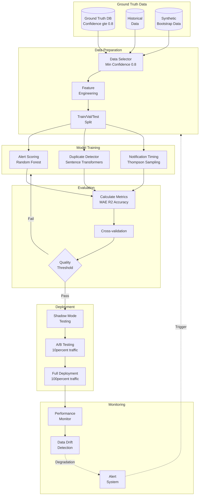
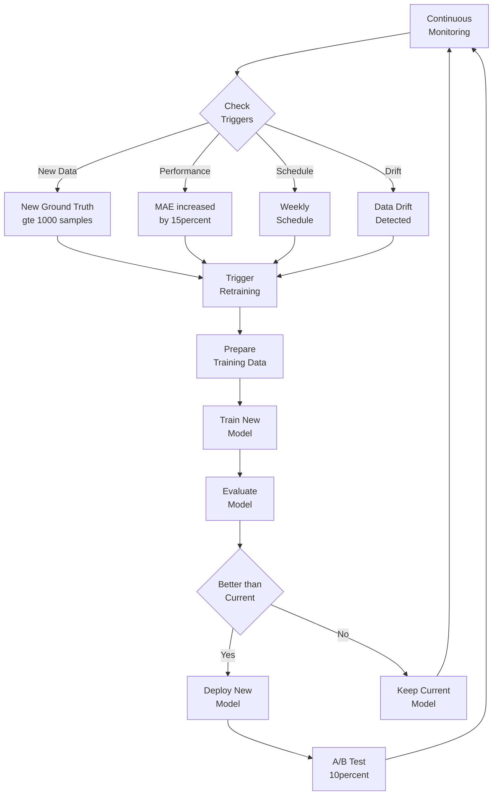

# Model Training Pipeline with Validated Data

> **Chi tiết về quy trình training và retraining AI models với ground truth data đã được xác thực**

## 📋 Mục Lục

- [Overview](#overview)
- [Training Data Selection](#training-data-selection)
- [Feature Engineering](#feature-engineering)
- [Model Training Process](#model-training-process)
- [Model Evaluation](#model-evaluation)
- [Retraining Strategy](#retraining-strategy)
- [A/B Testing](#ab-testing)
- [Rollback Procedures](#rollback-procedures)

---

## Overview

### Complete ML Pipeline



---

## Training Data Selection

### Selection Criteria

**Minimum Requirements**:
- Confidence score ≥ 0.8
- Complete feature set (no missing critical fields)
- Data age < 180 days (6 months)
- Validated by at least one reliable source

```python
# ai_service/services/data_selector.py

class TrainingDataSelector:
    """
    Select high-quality data for model training
    """
    
    MIN_CONFIDENCE = 0.8
    MAX_AGE_DAYS = 180
    MIN_SAMPLES = 1000
    
    def select_training_data(self) -> pd.DataFrame:
        """
        Select ground truth data meeting quality criteria
        """
        query = """
            SELECT 
                gt.*,
                a.title,
                a.content,
                a.severity,
                a.alert_type,
                a.province,
                a.district,
                a.lat,
                a.lng,
                a.created_at,
                a.expires_at,
                a.target_audience
            FROM ground_truth gt
            JOIN alerts a ON gt.alert_id = a.id
            WHERE 
                gt.confidence >= ?
                AND gt.ground_truth_score IS NOT NULL
                AND a.created_at >= DATE('now', '-? days')
                AND gt.data_quality IN ('high', 'medium')
            ORDER BY gt.confidence DESC, a.created_at DESC
        """
        
        df = pd.read_sql_query(
            query,
            self.db,
            params=(self.MIN_CONFIDENCE, self.MAX_AGE_DAYS)
        )
        
        # Check minimum samples
        if len(df) < self.MIN_SAMPLES:
            print(f"Warning: Only {len(df)} samples found, below minimum {self.MIN_SAMPLES}")
            # Add synthetic/historical data if needed
            df = self._augment_with_synthetic(df)
        
        print(f"Selected {len(df)} training samples")
        print(f"Avg confidence: {df['confidence'].mean():.3f}")
        print(f"Data quality distribution:\n{df['data_quality'].value_counts()}")
        
        return df
    
    def _augment_with_synthetic(self, df: pd.DataFrame) -> pd.DataFrame:
        """
        Augment with synthetic data if not enough real data
        """
        needed = self.MIN_SAMPLES - len(df)
        print(f"Generating {needed} synthetic samples...")
        
        # Generate from rule-based scoring
        synthetic_df = self._generate_synthetic_samples(needed)
        
        return pd.concat([df, synthetic_df], ignore_index=True)
```

### Data Quality Report

```python
def generate_data_quality_report(df: pd.DataFrame) -> dict:
    """
    Generate comprehensive data quality report
    """
    return {
        'total_samples': len(df),
        'confidence_stats': {
            'mean': df['confidence'].mean(),
            'std': df['confidence'].std(),
            'min': df['confidence'].min(),
            'max': df['confidence'].max(),
            'q25': df['confidence'].quantile(0.25),
            'q50': df['confidence'].quantile(0.50),
            'q75': df['confidence'].quantile(0.75),
        },
        'completeness': {
            'content': (df['content'].notna().sum() / len(df)),
            'location': (df[['lat', 'lng']].notna().all(axis=1).sum() / len(df)),
            'province': (df['province'].notna().sum() / len(df)),
            'severity': (df['severity'].notna().sum() / len(df)),
        },
        'source_distribution': df['source'].value_counts().to_dict(),
        'severity_distribution': df['severity'].value_counts().to_dict(),
        'province_distribution': df['province'].value_counts().head(10).to_dict(),
        'date_range': {
            'earliest': df['created_at'].min(),
            'latest': df['created_at'].max(),
        }
    }
```

---

## Feature Engineering

### Feature Extraction

```python
# ai_service/utils/features.py

class FeatureExtractor:
    """
    Extract features from alert data for ML models
    """
    
    @staticmethod
    def extract_features(alert: dict, user_context: dict = None) -> np.ndarray:
        """
        Extract feature vector from alert
        
        Returns 15-dimensional feature vector
        """
        features = []
        
        # 1. Severity score (0-4)
        severity_map = {'low': 1, 'medium': 2, 'high': 3, 'critical': 4}
        features.append(severity_map.get(alert['severity'], 2))
        
        # 2. Alert type score (0-4)
        type_map = {'general': 1, 'weather': 2, 'disaster': 3, 'evacuation': 4}
        features.append(type_map.get(alert['alert_type'], 1))
        
        # 3. Time since creation (hours)
        created_at = pd.to_datetime(alert['created_at'])
        hours_since = (datetime.now() - created_at).total_seconds() / 3600
        features.append(hours_since)
        
        # 4. Distance to user (km) - if available
        if user_context and 'lat' in user_context and 'lat' in alert:
            distance = FeatureExtractor._haversine_distance(
                user_context['lat'], user_context['lng'],
                alert['lat'], alert['lng']
            )
            features.append(distance)
        else:
            features.append(50.0)  # Default: 50km
        
        # 5. Target audience match (0-1)
        if user_context and 'role' in user_context:
            match = 1.0 if alert.get('target_audience') == user_context['role'] else 0.5
            features.append(match)
        else:
            features.append(0.7)  # Default moderate match
        
        # 6. Time of day (0-23)
        features.append(datetime.now().hour)
        
        # 7. Day of week (0-6)
        features.append(datetime.now().weekday())
        
        # 8. Content length
        content_length = len(alert.get('content', ''))
        features.append(min(content_length / 1000, 1.0))  # Normalized
        
        # 9. Has images (0/1)
        features.append(1.0 if alert.get('has_images') else 0.0)
        
        # 10. Has safety guide (0/1)
        features.append(1.0 if alert.get('has_safety_guide') else 0.0)
        
        # 11. Source reliability
        features.append(alert.get('source_reliability', 0.5))
        
        # 12. Provincial risk score (from historical data)
        province_risk = FeatureExtractor._get_province_risk(
            alert.get('province'),
            alert.get('alert_type'),
            datetime.now().month
        )
        features.append(province_risk)
        
        # 13. Seasonal factor
        seasonal = FeatureExtractor._get_seasonal_factor(
            alert.get('alert_type'),
            datetime.now().month
        )
        features.append(seasonal)
        
        # 14. Similar alerts count (last 24h)
        similar_count = alert.get('similar_alerts_count', 0)
        features.append(min(similar_count / 10, 1.0))  # Normalized
        
        # 15. Alert engagement rate (if available)
        engagement = alert.get('engagement_rate', 0.5)
        features.append(engagement)
        
        return np.array(features, dtype=np.float32)
```

---

## Model Training Process

### Alert Scoring Model Training

```python
# ai_service/services/model_trainer.py

class AlertScoringTrainer:
    """
    Train alert scoring model with ground truth data
    """
    
    def __init__(self):
        self.model = RandomForestRegressor(
            n_estimators=200,
            max_depth=15,
            min_samples_split=10,
            min_samples_leaf=5,
            random_state=42,
            n_jobs=-1
        )
        self.scaler = StandardScaler()
        self.feature_extractor = FeatureExtractor()
    
    def train(self, training_data: pd.DataFrame) -> dict:
        """
        Train model on ground truth data
        
        Returns training metrics
        """
        print("Preparing features...")
        X, y = self._prepare_data(training_data)
        
        # Split data
        X_train, X_test, y_train, y_test = train_test_split(
            X, y, test_size=0.2, random_state=42
        )
        
        # Scale features
        X_train_scaled = self.scaler.fit_transform(X_train)
        X_test_scaled = self.scaler.transform(X_test)
        
        # Train model
        print("Training model...")
        start_time = time.time()
        self.model.fit(X_train_scaled, y_train)
        training_time = time.time() - start_time
        
        # Evaluate
        print("Evaluating model...")
        y_pred_train = self.model.predict(X_train_scaled)
        y_pred_test = self.model.predict(X_test_scaled)
        
        metrics = {
            'training_samples': len(X_train),
            'test_samples': len(X_test),
            'training_time_seconds': training_time,
            'train_mae': mean_absolute_error(y_train, y_pred_train),
            'test_mae': mean_absolute_error(y_test, y_pred_test),
            'train_rmse': np.sqrt(mean_squared_error(y_train, y_pred_train)),
            'test_rmse': np.sqrt(mean_squared_error(y_test, y_pred_test)),
            'train_r2': r2_score(y_train, y_pred_train),
            'test_r2': r2_score(y_test, y_pred_test),
            'feature_importance': dict(zip(
                range(X.shape[1]),
                self.model.feature_importances_
            ))
        }
        
        # Cross-validation
        cv_scores = cross_val_score(
            self.model, X_train_scaled, y_train,
            cv=5, scoring='neg_mean_absolute_error'
        )
        metrics['cv_mae_mean'] = -cv_scores.mean()
        metrics['cv_mae_std'] = cv_scores.std()
        
        print(f"\nTraining Results:")
        print(f"  Train MAE: {metrics['train_mae']:.2f}")
        print(f"  Test MAE: {metrics['test_mae']:.2f}")
        print(f"  Test R²: {metrics['test_r2']:.3f}")
        print(f"  Training time: {training_time:.1f}s")
        
        return metrics
    
    def _prepare_data(self, df: pd.DataFrame) -> tuple:
        """Prepare X and y from dataframe"""
        X = []
        y = []
        
        for _, row in df.iterrows():
            alert_dict = row.to_dict()
            features = self.feature_extractor.extract_features(alert_dict)
            X.append(features)
            
            # Target: ground truth score (scaled to 0-100)
            y.append(row['ground_truth_score'] * 100)
        
        return np.array(X), np.array(y)
    
    def save_model(self, version: str):
        """Save model and scaler"""
        import joblib
        
        model_path = f"data/models/alert_scorer_v{version}.pkl"
        scaler_path = f"data/models/scaler_v{version}.pkl"
        
        joblib.dump(self.model, model_path)
        joblib.dump(self.scaler, scaler_path)
        
        print(f"Model saved to {model_path}")
```

---

## Model Evaluation

### Evaluation Metrics

```python
class ModelEvaluator:
    """
    Comprehensive model evaluation
    """
    
    def evaluate_model(
        self,
        model,
        X_test: np.ndarray,
        y_test: np.ndarray,
        model_name: str
    ) -> dict:
        """
        Evaluate model with multiple metrics
        """
        y_pred = model.predict(X_test)
        
        # Regression metrics
        metrics = {
            'model_name': model_name,
            'mae': mean_absolute_error(y_test, y_pred),
            'rmse': np.sqrt(mean_squared_error(y_test, y_pred)),
            'r2_score': r2_score(y_test, y_pred),
            'mape': self._mean_absolute_percentage_error(y_test, y_pred),
        }
        
        # Prediction distribution
        metrics['prediction_stats'] = {
            'mean': float(y_pred.mean()),
            'std': float(y_pred.std()),
            'min': float(y_pred.min()),
            'max': float(y_pred.max()),
        }
        
        # Error analysis
        errors = y_test - y_pred
        metrics['error_stats'] = {
            'mean_error': float(errors.mean()),
            'std_error': float(errors.std()),
            'max_error': float(abs(errors).max()),
        }
        
        # Severity-wise accuracy
        # Bin predictions and actuals into severity categories
        pred_severity = self._score_to_severity(y_pred)
        true_severity = self._score_to_severity(y_test)
        
        metrics['severity_accuracy'] = accuracy_score(true_severity, pred_severity)
        metrics['severity_confusion_matrix'] = confusion_matrix(
            true_severity, pred_severity
        ).tolist()
        
        return metrics
    
    @staticmethod
    def _mean_absolute_percentage_error(y_true, y_pred):
        """Calculate MAPE"""
        y_true, y_pred = np.array(y_true), np.array(y_pred)
        return np.mean(np.abs((y_true - y_pred) / np.maximum(y_true, 1))) * 100
    
    @staticmethod
    def _score_to_severity(scores):
        """Convert scores to severity categories"""
        severities = []
        for score in scores:
            if score >= 80:
                severities.append('critical')
            elif score >= 60:
                severities.append('high')
            elif score >= 40:
                severities.append('medium')
            else:
                severities.append('low')
        return severities
```

---

## Retraining Strategy

### Trigger Conditions



### Retraining Implementation

```python
class ModelRetrainer:
    """
    Manage model retraining lifecycle
    """
    
    MIN_NEW_SAMPLES = 1000
    MAX_PERFORMANCE_DROP = 0.15  # 15% increase in MAE
    RETRAIN_INTERVAL_DAYS = 7
    
    def check_retraining_needed(self) -> dict:
        """
        Check if retraining should be triggered
        """
        reasons = []
        
        # Check 1: New ground truth data
        new_samples = self._count_new_samples()
        if new_samples >= self.MIN_NEW_SAMPLES:
            reasons.append(f"new_data: {new_samples} samples")
        
        # Check 2: Performance degradation
        current_mae = self._get_current_mae()
        baseline_mae = self._get_baseline_mae()
        
        if current_mae > baseline_mae * (1 + self.MAX_PERFORMANCE_DROP):
            reasons.append(f"performance_drop: {current_mae:.2f} vs {baseline_mae:.2f}")
        
        # Check 3: Scheduled retrain
        days_since_last = self._days_since_last_training()
        if days_since_last >= self.RETRAIN_INTERVAL_DAYS:
            reasons.append(f"scheduled: {days_since_last} days since last training")
        
        # Check 4: Data drift
        drift_detected = self._check_data_drift()
        if drift_detected:
            reasons.append("data_drift: distribution shift detected")
        
        return {
            'should_retrain': len(reasons) > 0,
            'reasons': reasons,
            'new_samples': new_samples,
            'current_mae': current_mae,
            'baseline_mae': baseline_mae,
            'days_since_last_training': days_since_last
        }
    
    def retrain(self) -> dict:
        """
        Execute full retraining pipeline
        """
        print("=" * 60)
        print("STARTING MODEL RETRAINING")
        print("=" * 60)
        
        # Select data
        selector = TrainingDataSelector()
        training_data = selector.select_training_data()
        
        # Quality report
        quality_report = generate_data_quality_report(training_data)
        print(f"\nData Quality Report:")
        print(f"  Total samples: {quality_report['total_samples']}")
        print(f"  Avg confidence: {quality_report['confidence_stats']['mean']:.3f}")
        
        # Train new model
        trainer = AlertScoringTrainer()
        metrics = trainer.train(training_data)
        
        # Compare with current model
        should_deploy = self._compare_with_current(metrics)
        
        if should_deploy:
            # Save new model
            new_version = self._get_next_version()
            trainer.save_model(new_version)
            
            # Log to database
            self._log_training_run(new_version, metrics, training_data)
            
            print(f"\n✓ New model v{new_version} ready for deployment")
        else:
            print(f"\n✗ New model did not improve, keeping current model")
        
        return {
            'success': should_deploy,
            'new_version': new_version if should_deploy else None,
            'metrics': metrics,
            'quality_report': quality_report
        }
```

---

## A/B Testing

### A/B Test Configuration

```python
class ABTestManager:
    """
    Manage A/B testing of new models
    """
    
    def __init__(self):
        self.variants = {
            'control': {'model_version': 'v1.0', 'traffic': 0.9},
            'treatment': {'model_version': 'v1.1', 'traffic': 0.1}
        }
    
    def assign_variant(self, user_id: str) -> str:
        """
        Assign user to A or B variant
        """
        # Use consistent hashing for stable assignment
        hash_value = int(hashlib.md5(user_id.encode()).hexdigest(), 16)
        threshold = hash_value % 100 / 100.0
        
        cumulative = 0
        for variant_name, config in self.variants.items():
            cumulative += config['traffic']
            if threshold < cumulative:
                return variant_name
        
        return 'control'
    
    def track_variant_performance(self, variant: str, metrics: dict):
        """
        Track performance metrics per variant
        """
        db.execute("""
            INSERT INTO ab_test_metrics (
                variant,
                mae,
                user_engagement,
                click_through_rate,
                recorded_at
            ) VALUES (?, ?, ?, ?, ?)
        """, (
            variant,
            metrics.get('mae'),
            metrics.get('engagement'),
            metrics.get('ctr'),
            datetime.now()
        ))
    
    def get_test_results(self) -> dict:
        """
        Get A/B test results with statistical significance
        """
        results = db.execute("""
            SELECT 
                variant,
                COUNT(*) as sample_size,
                AVG(mae) as avg_mae,
                STDDEV(mae) as std_mae,
                AVG(user_engagement) as avg_engagement,
                AVG(click_through_rate) as avg_ctr
            FROM ab_test_metrics
            WHERE recorded_at >= NOW() - INTERVAL '7 days'
            GROUP BY variant
        """).fetchall()
        
        # Calculate statistical significance
        control = [r for r in results if r['variant'] == 'control'][0]
        treatment = [r for r in results if r['variant'] == 'treatment'][0]
        
        # T-test for MAE difference
        from scipy import stats
        t_stat, p_value = stats.ttest_ind_from_stats(
            control['avg_mae'], control['std_mae'], control['sample_size'],
            treatment['avg_mae'], treatment['std_mae'], treatment['sample_size']
        )
        
        return {
            'control': dict(control),
            'treatment': dict(treatment),
            'statistical_significance': {
                't_statistic': float(t_stat),
                'p_value': float(p_value),
                'is_significant': p_value < 0.05
            },
            'recommendation': self._get_recommendation(control, treatment, p_value)
        }
    
    def _get_recommendation(self, control, treatment, p_value):
        """Generate deployment recommendation"""
        if p_value >= 0.05:
            return "Not statistically significant. Continue testing."
        
        if treatment['avg_mae'] < control['avg_mae']:
            improvement = (control['avg_mae'] - treatment['avg_mae']) / control['avg_mae']
            return f"Deploy treatment. {improvement*100:.1f}% improvement in MAE."
        else:
            return "Rollback to control. Treatment performs worse."
```

---

## Rollback Procedures

### Rollback Strategy

```python
class ModelRollbackManager:
    """
    Manage model rollback in case of issues
    """
    
    def monitor_production_health(self):
        """
        Continuously monitor production model health
        """
        current_version = self._get_current_version()
        
        # Get recent performance
        recent_mae = self._get_recent_mae(hours=24)
        baseline_mae = self._get_baseline_mae(current_version)
        
        # Check for significant degradation
        if recent_mae > baseline_mae * 1.3:  # 30% worse
            print(f"⚠️ Model performance degraded: {recent_mae:.2f} vs {baseline_mae:.2f}")
            self.trigger_rollback("performance_degradation")
        
        # Check error rate
        error_rate = self._get_error_rate(hours=1)
        if error_rate > 0.05:  # 5% error rate
            print(f"⚠️ High error rate: {error_rate*100:.1f}%")
            self.trigger_rollback("high_error_rate")
    
    def trigger_rollback(self, reason: str):
        """
        Rollback to previous stable version
        """
        current_version = self._get_current_version()
        previous_version = self._get_previous_stable_version()
        
        print(f"🔄 Rolling back from {current_version} to {previous_version}")
        print(f"Reason: {reason}")
        
        # Switch to previous version
        self._switch_model_version(previous_version)
        
        # Log rollback
        db.execute("""
            INSERT INTO model_rollbacks (
                from_version,
                to_version,
                reason,
                rolled_back_at
            ) VALUES (?, ?, ?, ?)
        """, (current_version, previous_version, reason, datetime.now()))
        
        # Alert team
        self._send_alert(
            f"Model rollback: {current_version} → {previous_version}",
            reason
        )
        
        print(f"✓ Rollback complete")
```

---

## Best Practices

### Training

- Use cross-validation to avoid overfitting
- Monitor feature importance
- Regular retraining (weekly)
- Version all models and training data
- Log all training runs

### Evaluation

- Test on holdout set
- Calculate multiple metrics (MAE, RMSE, R²)
- Check performance across severity levels
- Validate with domain experts

### Deployment

- Always use shadow mode first
- A/B test with small traffic (10%)
- Monitor for 7 days before full rollout
- Have rollback plan ready

---

**Next**: [Production Deployment →](./production_deployment_ground_truth.md)

**Last Updated**: 2025-01-01  
**Version**: 1.0.0


