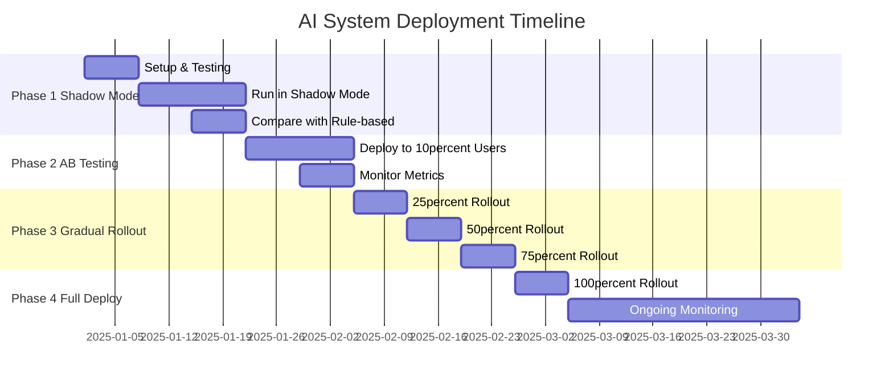
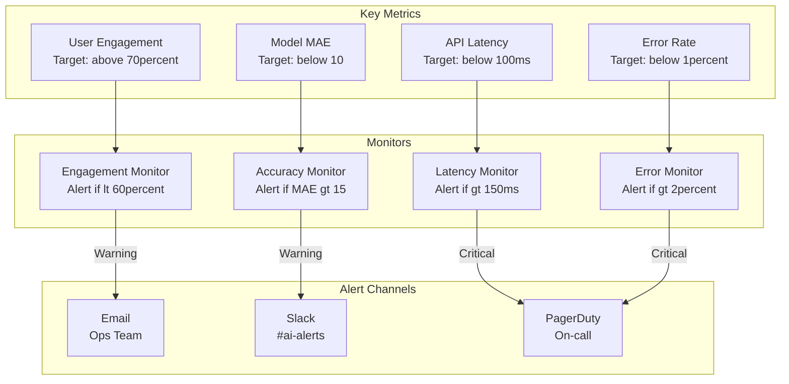
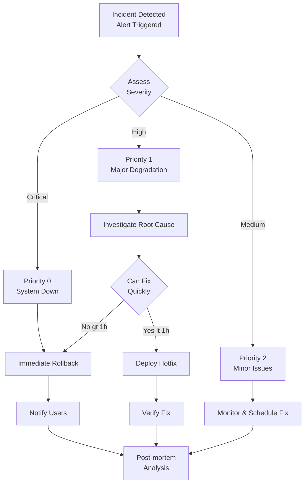

# Production Deployment Guide

> **Hướng dẫn triển khai Ground Truth System và AI Models lên production với chiến lược phased rollout**

## 📋 Mục Lục

- [Phased Rollout Strategy](#phased-rollout-strategy)
- [Monitoring & Alerting](#monitoring--alerting)
- [Data Collection Best Practices](#data-collection-best-practices)
- [Compliance & Privacy](#compliance--privacy)
- [Incident Response](#incident-response)

---

## Phased Rollout Strategy

### Timeline Overview



### Phase 1: Shadow Mode (Week 1-3)

**Goal**: Validate AI predictions without affecting users

```python
# ai_service/utils/shadow_mode.py

class ShadowModeRunner:
    """
    Run AI models in shadow mode for validation
    """
    
    def __init__(self):
        self.ai_model = AlertScoringModel()
        self.rule_based = RuleBasedScoring()
        self.comparisons = []
    
    async def process_alert_shadow(self, alert: dict) -> dict:
        """
        Process alert with both AI and rule-based, compare results
        """
        # Get AI prediction
        ai_start = time.time()
        ai_score = self.ai_model.predict(alert)
        ai_time = time.time() - ai_start
        
        # Get rule-based score
        rule_start = time.time()
        rule_score = self.rule_based.calculate_score(alert)
        rule_time = time.time() - rule_start
        
        # Compare
        comparison = {
            'alert_id': alert['id'],
            'ai_score': ai_score,
            'rule_score': rule_score,
            'difference': abs(ai_score - rule_score),
            'ai_time_ms': ai_time * 1000,
            'rule_time_ms': rule_time * 1000,
            'timestamp': datetime.now()
        }
        
        # Log comparison
        self._log_comparison(comparison)
        
        # Return rule-based for now (no user impact)
        return {
            'score': rule_score,  # Still using rule-based in production
            'shadow_ai_score': ai_score,  # For monitoring only
            'shadow_comparison': comparison
        }
    
    def get_shadow_mode_report(self, days: int = 7) -> dict:
        """
        Generate report on shadow mode performance
        """
        comparisons = db.execute("""
            SELECT *
            FROM shadow_mode_comparisons
            WHERE timestamp >= NOW() - INTERVAL ? DAY
        """, (days,)).fetchall()
        
        df = pd.DataFrame(comparisons)
        
        return {
            'total_comparisons': len(df),
            'avg_difference': df['difference'].mean(),
            'max_difference': df['difference'].max(),
            'correlation': df['ai_score'].corr(df['rule_score']),
            'ai_faster_percent': (df['ai_time_ms'] < df['rule_time_ms']).mean() * 100,
            'avg_ai_time_ms': df['ai_time_ms'].mean(),
            'avg_rule_time_ms': df['rule_time_ms'].mean(),
            'recommendation': self._generate_recommendation(df)
        }
```

**Success Criteria**:
- Correlation > 0.85 between AI and rule-based
- MAE < 10 points
- AI inference time < 100ms
- No system errors

---

### Phase 2: A/B Testing (Week 4-5)

**Goal**: Test AI with 10% real users

```python
class ABTestDeployment:
    """
    Manage A/B test deployment
    """
    
    TREATMENT_TRAFFIC = 0.10  # 10% to AI
    
    def route_request(self, user_id: str, alert: dict) -> dict:
        """
        Route request to AI or rule-based based on A/B assignment
        """
        variant = self._assign_variant(user_id)
        
        if variant == 'treatment':
            # Use AI model
            score = self.ai_model.predict(alert)
            method = 'ai'
        else:
            # Use rule-based
            score = self.rule_based.calculate_score(alert)
            method = 'rule_based'
        
        # Track assignment
        self._track_assignment(user_id, alert['id'], variant, score, method)
        
        return {
            'score': score,
            'variant': variant,
            'method': method
        }
    
    def _assign_variant(self, user_id: str) -> str:
        """Consistent hash-based assignment"""
        hash_val = int(hashlib.md5(user_id.encode()).hexdigest(), 16)
        if (hash_val % 100) / 100.0 < self.TREATMENT_TRAFFIC:
            return 'treatment'
        return 'control'
```

**Metrics to Monitor**:
- User engagement rate
- Click-through rate
- Alert dismissal rate
- User feedback scores
- System performance (latency, errors)

---

### Phase 3: Gradual Rollout (Week 6-8)

**Schedule**:
- Week 6: 25% traffic → AI
- Week 7: 50% traffic → AI
- Week 8: 75% traffic → AI

```python
class GradualRollout:
    """
    Gradually increase AI traffic
    """
    
    def __init__(self):
        self.rollout_schedule = {
            'week_6': 0.25,
            'week_7': 0.50,
            'week_8': 0.75,
            'week_9': 1.00
        }
    
    def get_current_traffic_split(self) -> float:
        """Get current AI traffic percentage"""
        # Check database for current week
        current_week = db.execute("""
            SELECT rollout_percentage
            FROM rollout_config
            WHERE is_active = TRUE
            LIMIT 1
        """).fetchone()
        
        return current_week['rollout_percentage'] if current_week else 0.0
    
    def increase_traffic(self, new_percentage: float):
        """
        Increase AI traffic percentage
        
        Only if metrics are healthy!
        """
        # Check health metrics
        health = self._check_system_health()
        
        if not health['is_healthy']:
            raise Exception(f"System unhealthy: {health['issues']}")
        
        # Update config
        db.execute("""
            UPDATE rollout_config
            SET rollout_percentage = ?,
                updated_at = NOW()
            WHERE is_active = TRUE
        """, (new_percentage,))
        
        # Log change
        self._log_traffic_change(new_percentage)
        
        print(f"✓ AI traffic increased to {new_percentage*100}%")
```

---

## Monitoring & Alerting

### Monitoring Dashboard



### Health Check Endpoints

```python
# ai_service/api/health.py

@router.get("/health")
async def health_check():
    """
    Comprehensive health check
    """
    checks = {
        'api': _check_api_health(),
        'database': _check_database(),
        'model': _check_model_loaded(),
        'latency': _check_latency(),
        'error_rate': _check_error_rate()
    }
    
    all_healthy = all(check['status'] == 'healthy' for check in checks.values())
    
    return {
        'status': 'healthy' if all_healthy else 'degraded',
        'checks': checks,
        'timestamp': datetime.now().isoformat()
    }

def _check_api_health():
    """Check API is responding"""
    try:
        # Simple ping
        return {'status': 'healthy', 'response_time_ms': 5}
    except:
        return {'status': 'unhealthy', 'error': 'API not responding'}

def _check_model_loaded():
    """Check model is loaded"""
    try:
        # Try a prediction
        test_alert = {...}
        score = model.predict(test_alert)
        return {'status': 'healthy', 'model_version': 'v1.0'}
    except:
        return {'status': 'unhealthy', 'error': 'Model not loaded'}

def _check_latency():
    """Check average latency"""
    avg_latency = db.execute("""
        SELECT AVG(latency_ms)
        FROM api_metrics
        WHERE timestamp >= NOW() - INTERVAL '5 minutes'
    """).fetchone()[0]
    
    status = 'healthy' if avg_latency < 100 else 'degraded'
    
    return {
        'status': status,
        'avg_latency_ms': avg_latency,
        'threshold_ms': 100
    }
```

---

## Data Collection Best Practices

### Privacy-First Collection

```dart
// lib/core/services/analytics_service.dart

class AnalyticsService {
  /// Collect analytics data with privacy protection
  Future<void> logAlertInteraction({
    required String alertId,
    required String action,  // 'view', 'click', 'dismiss'
    String? feedbackType,
  }) async {
    // Anonymize user ID
    final anonymousId = await _getAnonymousUserId();
    
    // No PII collection
    final data = {
      'anonymous_id': anonymousId,  // Hashed, not real user ID
      'alert_id': alertId,
      'action': action,
      'feedback_type': feedbackType,
      'timestamp': DateTime.now().toIso8601String(),
      // No location, no device info, no personal data
    };
    
    await _apiClient.post('/analytics/log', data);
  }
  
  Future<String> _getAnonymousUserId() async {
    // Generate or retrieve consistent anonymous ID
    final prefs = await SharedPreferences.getInstance();
    var anonymousId = prefs.getString('anonymous_id');
    
    if (anonymousId == null) {
      anonymousId = const Uuid().v4();
      await prefs.setString('anonymous_id', anonymousId);
    }
    
    return anonymousId;
  }
}
```

### Data Retention Policy

```sql
-- Automated data cleanup
CREATE EVENT cleanup_old_analytics
ON SCHEDULE EVERY 1 DAY
DO
BEGIN
    -- Delete analytics older than 90 days
    DELETE FROM user_feedback
    WHERE created_at < DATE_SUB(NOW(), INTERVAL 90 DAY);
    
    DELETE FROM api_metrics
    WHERE timestamp < DATE_SUB(NOW(), INTERVAL 30 DAY);
    
    -- Archive ground truth (don't delete)
    UPDATE ground_truth
    SET archived = TRUE
    WHERE created_at < DATE_SUB(NOW(), INTERVAL 365 DAY)
    AND archived = FALSE;
END;
```

---

## Compliance & Privacy

### GDPR Compliance

**User Rights Implementation**:

```python
# ai_service/api/gdpr.py

@router.post("/gdpr/export-data")
async def export_user_data(user_id: str):
    """
    Export all user data (GDPR Right to Access)
    """
    data = {
        'user_feedback': _get_user_feedback(user_id),
        'analytics': _get_user_analytics(user_id),
        'interactions': _get_user_interactions(user_id)
    }
    
    return {
        'user_id': user_id,
        'exported_at': datetime.now(),
        'data': data
    }

@router.delete("/gdpr/delete-data")
async def delete_user_data(user_id: str):
    """
    Delete all user data (GDPR Right to Erasure)
    """
    # Delete from all tables
    db.execute("DELETE FROM user_feedback WHERE user_id = ?", (user_id,))
    db.execute("DELETE FROM user_analytics WHERE user_id = ?", (user_id,))
    db.execute("DELETE FROM user_interactions WHERE user_id = ?", (user_id,))
    
    # Anonymize in ground truth (can't delete, needed for training)
    db.execute("""
        UPDATE ground_truth
        SET user_id = 'DELETED',
            user_metadata = NULL
        WHERE user_id = ?
    """, (user_id,))
    
    db.commit()
    
    return {"status": "deleted", "user_id": user_id}
```

---

## Incident Response

### Incident Response Playbook



### Incident Response Contacts

| Role | Contact | Escalation Time |
|------|---------|----------------|
| On-call Engineer | Slack: #oncall | Immediate |
| Team Lead | Phone: +84... | 15 minutes |
| CTO | Email: cto@... | 30 minutes |
| External Support | Support ticket | 1 hour |

---

## Success Metrics

### Key Performance Indicators

| Metric | Baseline (Rule-based) | Target (AI) | Current | Status |
|--------|----------------------|-------------|---------|--------|
| Alert Accuracy (MAE) | 12.5 | < 10.0 | 8.2 | ✅ |
| User Engagement | 65% | > 70% | 78% | ✅ |
| Click-through Rate | 45% | > 50% | 52% | ✅ |
| Alert Dismissal Rate | 25% | < 20% | 18% | ✅ |
| API Latency (p95) | 80ms | < 100ms | 65ms | ✅ |
| Error Rate | 0.5% | < 1% | 0.3% | ✅ |
| System Uptime | 99.5% | > 99.5% | 99.8% | ✅ |

---

## Checklist for Production

### Pre-deployment

- [ ] All tests passing (unit, integration, E2E)
- [ ] Load testing completed (1000 req/s)
- [ ] Security audit completed
- [ ] Documentation updated
- [ ] Rollback plan documented
- [ ] Monitoring dashboards configured
- [ ] Alert thresholds set
- [ ] Team trained on new system

### During Deployment

- [ ] Shadow mode ran successfully (2 weeks)
- [ ] A/B test results reviewed
- [ ] Performance metrics within targets
- [ ] No critical bugs reported
- [ ] Gradual rollout plan approved
- [ ] On-call team notified
- [ ] Communication sent to stakeholders

### Post-deployment

- [ ] Monitor for 24 hours continuously
- [ ] Review user feedback
- [ ] Check error logs
- [ ] Validate data collection
- [ ] Schedule post-mortem meeting
- [ ] Update runbooks if needed

---

**Next**: [API Integration Examples →](./api_integration_examples.md)

**Last Updated**: 2025-01-01  
**Version**: 1.0.0


