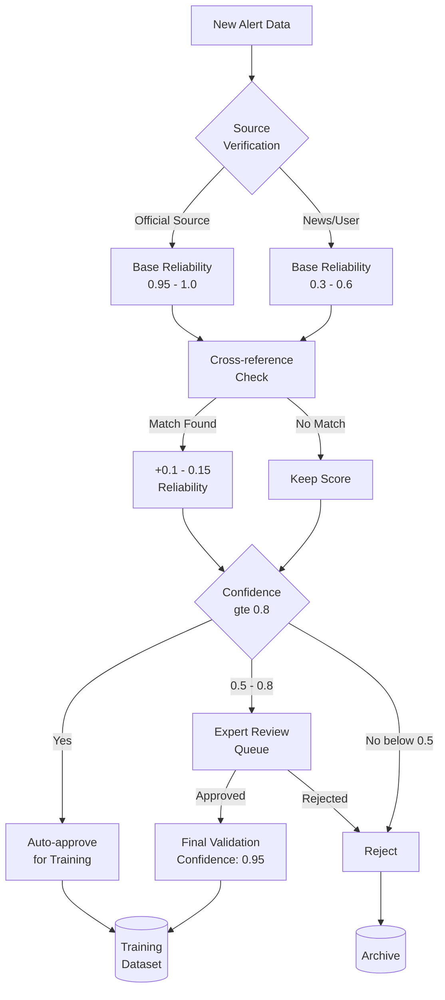
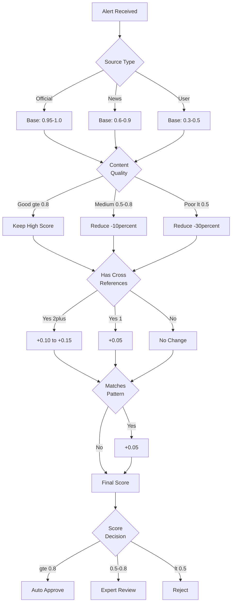

# Validation Strategy

> **Chi tiết về chiến lược xác thực dữ liệu và tính toán độ tin cậy cho Ground Truth Data**

## 📋 Mục Lục

- [Tổng Quan](#tổng-quan)
- [Multi-source Validation Pipeline](#multi-source-validation-pipeline)
- [Source Reliability Scoring](#source-reliability-scoring)
- [Cross-reference Verification](#cross-reference-verification)
- [Expert Review System](#expert-review-system)
- [Historical Pattern Matching](#historical-pattern-matching)
- [Confidence Score Calculation](#confidence-score-calculation)
- [Implementation Details](#implementation-details)

---

## Tổng Quan

**Validation Strategy** là quy trình đa tầng để đảm bảo dữ liệu được sử dụng cho AI training có độ tin cậy cao. Mục tiêu là đạt **confidence ≥ 0.8** cho training data.

### Core Principles

1. **Multi-source Verification**: Không tin một nguồn duy nhất
2. **Automated + Manual**: Kết hợp automated checks và expert review
3. **Continuous Validation**: Validation không chỉ one-time, mà liên tục
4. **Transparent Scoring**: Mọi validation step đều có confidence score rõ ràng

### Validation Pipeline Overview



---

## Multi-source Validation Pipeline

### Stage 1: Source Verification

**Purpose**: Xác định độ tin cậy ban đầu dựa trên nguồn

**Implementation**:
```python
# ai_service/services/source_validator.py

class SourceValidator:
    """
    Validate alert sources and calculate initial reliability scores
    """
    
    # Reliability matrix
    SOURCE_RELIABILITY = {
        'NCHMF': 1.0,
        'DDMFC': 1.0,
        'LOCAL_GOV': 0.95,
        'MoNRE': 1.0,
        'NEWS_VTV': 0.90,
        'NEWS_VOV': 0.85,
        'NEWS_VNA': 0.90,
        'NEWS_OTHER': 0.60,
        'CROWDSOURCED_VERIFIED': 0.70,
        'USER_REPORT': 0.40,
        'SOCIAL_MEDIA': 0.30,
        'UNKNOWN': 0.20
    }
    
    def verify_source(self, alert: dict) -> dict:
        """
        Verify alert source and assign base reliability
        
        Returns:
            {
                'is_valid': bool,
                'base_reliability': float,
                'source_type': str,
                'verification_method': str,
                'checks_passed': list
            }
        """
        source = alert.get('source', 'UNKNOWN')
        
        # Get base reliability
        base_reliability = self.SOURCE_RELIABILITY.get(source, 0.20)
        
        # Perform source-specific checks
        checks_passed = []
        
        if source.startswith('NCHMF') or source.startswith('DDMFC'):
            # Verify official ID format
            if self._verify_official_id(alert.get('official_id')):
                checks_passed.append('official_id_valid')
            else:
                base_reliability -= 0.10
        
        elif source.startswith('NEWS_'):
            # Check if news outlet is in trusted list
            if self._is_trusted_news_outlet(source):
                checks_passed.append('trusted_outlet')
            else:
                base_reliability -= 0.15
        
        elif source == 'USER_REPORT':
            # Check user reputation
            user_reputation = self._get_user_reputation(alert.get('user_id'))
            if user_reputation > 0.70:
                base_reliability += 0.10
                checks_passed.append('high_reputation_user')
        
        return {
            'is_valid': base_reliability >= 0.30,  # Minimum threshold
            'base_reliability': max(0.0, min(1.0, base_reliability)),
            'source_type': source,
            'verification_method': 'source_based',
            'checks_passed': checks_passed
        }
    
    def _verify_official_id(self, official_id: str) -> bool:
        """Verify format of official alert ID"""
        if not official_id:
            return False
        
        # Format: SOURCE_TIMESTAMP or SOURCE_SEQUENCE
        patterns = [
            r'^NCHMF_\d{10,}$',
            r'^DDMFC_\d{10,}$',
            r'^LOCAL_GOV_[A-Z]+_\d+$'
        ]
        
        import re
        return any(re.match(pattern, official_id) for pattern in patterns)
    
    def _is_trusted_news_outlet(self, source: str) -> bool:
        """Check if news source is in trusted list"""
        trusted = ['NEWS_VTV', 'NEWS_VOV', 'NEWS_VNA', 'NEWS_TUOITRE', 'NEWS_VNEXPRESS']
        return source in trusted
    
    def _get_user_reputation(self, user_id: str) -> float:
        """Get user's reputation score from history"""
        # Query user's past report accuracy
        # For now, return default
        return 0.50
```

### Stage 2: Content Validation

**Purpose**: Kiểm tra tính hợp lệ của nội dung alert

```python
class ContentValidator:
    """
    Validate alert content for completeness and quality
    """
    
    REQUIRED_FIELDS = [
        'content', 'severity', 'province', 'alert_type'
    ]
    
    OPTIONAL_FIELDS = [
        'district', 'lat', 'lng', 'expires_at'
    ]
    
    def validate_content(self, alert: dict) -> dict:
        """
        Validate alert content
        
        Returns:
            {
                'is_valid': bool,
                'completeness_score': float (0-1),
                'quality_score': float (0-1),
                'issues': list
            }
        """
        issues = []
        
        # Check required fields
        missing_required = [
            field for field in self.REQUIRED_FIELDS 
            if not alert.get(field)
        ]
        
        if missing_required:
            issues.append(f"Missing required fields: {missing_required}")
        
        # Calculate completeness (0-1)
        total_fields = len(self.REQUIRED_FIELDS) + len(self.OPTIONAL_FIELDS)
        present_fields = sum(1 for f in self.REQUIRED_FIELDS + self.OPTIONAL_FIELDS if alert.get(f))
        completeness_score = present_fields / total_fields
        
        # Check content quality
        quality_checks = []
        
        # 1. Content length check
        content = alert.get('content', '')
        if len(content) < 20:
            issues.append("Content too short (< 20 chars)")
            quality_checks.append(0.0)
        elif len(content) < 50:
            quality_checks.append(0.5)
        else:
            quality_checks.append(1.0)
        
        # 2. Severity consistency check
        severity = alert.get('severity', '').lower()
        content_lower = content.lower()
        
        severity_keywords = {
            'critical': ['nghiêm trọng', 'nguy hiểm', 'khẩn cấp', 'sơ tán ngay'],
            'high': ['cao', 'lớn', 'mạnh'],
            'medium': ['trung bình', 'vừa phải'],
            'low': ['thấp', 'nhỏ', 'yếu']
        }
        
        if severity in severity_keywords:
            keywords_found = any(
                keyword in content_lower 
                for keyword in severity_keywords[severity]
            )
            quality_checks.append(1.0 if keywords_found else 0.7)
        
        # 3. Location validity
        if alert.get('lat') and alert.get('lng'):
            lat, lng = alert['lat'], alert['lng']
            # Vietnam coordinates roughly: 8-24°N, 102-110°E
            if 8 <= lat <= 24 and 102 <= lng <= 110:
                quality_checks.append(1.0)
            else:
                issues.append("Location outside Vietnam")
                quality_checks.append(0.0)
        
        quality_score = sum(quality_checks) / len(quality_checks) if quality_checks else 0.5
        
        return {
            'is_valid': len(missing_required) == 0,
            'completeness_score': completeness_score,
            'quality_score': quality_score,
            'issues': issues
        }
```

---

## Source Reliability Scoring

### Algorithm

```python
class ReliabilityScorer:
    """
    Calculate comprehensive reliability score for alerts
    """
    
    def calculate_reliability(
        self,
        alert: dict,
        source_verification: dict,
        content_validation: dict,
        cross_references: list,
        historical_match: dict
    ) -> float:
        """
        Calculate final reliability score
        
        Formula:
        reliability = base_reliability 
                     × content_quality_multiplier
                     + cross_reference_bonus
                     + historical_bonus
                     - penalties
        """
        # Start with base reliability from source
        score = source_verification['base_reliability']
        
        # Multiply by content quality (0.7 - 1.0)
        quality_multiplier = 0.7 + (0.3 * content_validation['quality_score'])
        score *= quality_multiplier
        
        # Add cross-reference bonus
        if cross_references:
            # Each cross-ref adds bonus based on its reliability
            for ref in cross_references:
                ref_reliability = ref.get('source_reliability', 0.5)
                bonus = 0.05 * ref_reliability  # Max +0.05 per reference
                score += bonus
            
            # Cap total cross-ref bonus at +0.15
            score = min(score + 0.15, score)
        
        # Add historical pattern match bonus
        if historical_match.get('matches_pattern'):
            historical_confidence = historical_match.get('confidence', 0.5)
            score += 0.05 * historical_confidence  # Max +0.05
        
        # Apply penalties
        if content_validation.get('issues'):
            penalty = 0.02 * len(content_validation['issues'])
            score -= penalty
        
        # Ensure score is in valid range
        return max(0.0, min(1.0, score))
```

### Decision Tree



---

## Cross-reference Verification

### Semantic Similarity Matching

**Purpose**: Tìm alerts tương tự từ các nguồn khác để xác thực chéo

```python
from sentence_transformers import SentenceTransformer
from sklearn.metrics.pairwise import cosine_similarity
import numpy as np

class CrossReferenceVerifier:
    """
    Cross-reference alerts across multiple sources
    """
    
    def __init__(self):
        # Use pre-trained multilingual model
        self.model = SentenceTransformer(
            'paraphrase-multilingual-MiniLM-L12-v2'
        )
        self.similarity_threshold = 0.75
    
    def find_cross_references(
        self,
        new_alert: dict,
        existing_alerts: list,
        time_window_hours: int = 24
    ) -> list:
        """
        Find similar alerts from different sources
        
        Returns list of matching alerts with similarity scores
        """
        matches = []
        
        # Get embedding for new alert
        new_embedding = self._get_alert_embedding(new_alert)
        
        # Filter by time window and location
        candidates = self._filter_candidates(
            existing_alerts,
            new_alert,
            time_window_hours
        )
        
        for candidate in candidates:
            # Skip same source
            if candidate['source'] == new_alert['source']:
                continue
            
            # Calculate semantic similarity
            candidate_embedding = self._get_alert_embedding(candidate)
            similarity = cosine_similarity(
                new_embedding.reshape(1, -1),
                candidate_embedding.reshape(1, -1)
            )[0][0]
            
            if similarity >= self.similarity_threshold:
                matches.append({
                    'alert_id': candidate.get('id'),
                    'source': candidate.get('source'),
                    'source_reliability': candidate.get('source_reliability', 0.5),
                    'similarity': float(similarity),
                    'match_type': self._determine_match_type(similarity)
                })
        
        # Sort by similarity (highest first)
        matches.sort(key=lambda x: x['similarity'], reverse=True)
        
        return matches
    
    def _get_alert_embedding(self, alert: dict) -> np.ndarray:
        """Get semantic embedding for alert content"""
        # Combine relevant fields
        text = f"{alert.get('title', '')} {alert.get('content', '')}"
        text += f" {alert.get('province', '')} {alert.get('alert_type', '')}"
        
        return self.model.encode(text, convert_to_numpy=True)
    
    def _filter_candidates(
        self,
        alerts: list,
        reference: dict,
        time_window_hours: int
    ) -> list:
        """Filter alerts by basic criteria"""
        from datetime import datetime, timedelta
        
        ref_time = datetime.fromisoformat(reference.get('created_at', datetime.now().isoformat()))
        ref_province = reference.get('province', '')
        ref_type = reference.get('alert_type', '')
        
        filtered = []
        
        for alert in alerts:
            alert_time = datetime.fromisoformat(alert.get('created_at', datetime.now().isoformat()))
            
            # Check time window
            if abs((alert_time - ref_time).total_seconds()) > time_window_hours * 3600:
                continue
            
            # Check same province or nearby
            if alert.get('province') != ref_province:
                # Could add geographic proximity check here
                continue
            
            # Check same alert type
            if alert.get('alert_type') != ref_type:
                continue
            
            filtered.append(alert)
        
        return filtered
    
    def _determine_match_type(self, similarity: float) -> str:
        """Classify match quality"""
        if similarity >= 0.95:
            return 'exact_match'
        elif similarity >= 0.85:
            return 'strong_match'
        elif similarity >= 0.75:
            return 'moderate_match'
        else:
            return 'weak_match'
```

### Cross-reference Bonus Calculation

```python
def calculate_cross_reference_bonus(matches: list) -> float:
    """
    Calculate reliability bonus from cross-references
    
    Bonus = Σ (match_similarity × source_reliability × weight)
    
    Weights:
    - exact_match: 1.0
    - strong_match: 0.8
    - moderate_match: 0.5
    """
    if not matches:
        return 0.0
    
    match_weights = {
        'exact_match': 1.0,
        'strong_match': 0.8,
        'moderate_match': 0.5,
        'weak_match': 0.2
    }
    
    total_bonus = 0.0
    
    for match in matches[:3]:  # Consider top 3 matches only
        match_type = match.get('match_type', 'weak_match')
        weight = match_weights.get(match_type, 0.2)
        
        similarity = match.get('similarity', 0.0)
        source_reliability = match.get('source_reliability', 0.5)
        
        bonus = similarity * source_reliability * weight * 0.05
        total_bonus += bonus
    
    # Cap total bonus at 0.15
    return min(0.15, total_bonus)
```

---

## Expert Review System

### When to Trigger Expert Review

**Automatic triggers**:
- Confidence score: 0.5 - 0.8 (uncertain zone)
- Conflicting cross-references (similarity but different severity)
- High-severity alerts from unverified sources
- Unusual patterns (anomaly detection)

### Expert Review Dashboard

**Flutter Implementation**:
```dart
// lib/features/admin/presentation/pages/expert_review_page.dart

class ExpertReviewPage extends StatefulWidget {
  @override
  _ExpertReviewPageState createState() => _ExpertReviewPageState();
}

class _ExpertReviewPageState extends State<ExpertReviewPage> {
  final ReviewController _controller = Get.put(ReviewController());
  
  @override
  Widget build(BuildContext context) {
    return Scaffold(
      appBar: AppBar(
        title: const Text('Expert Review Queue'),
        actions: [
          Obx(() => Chip(
            label: Text('Pending: ${_controller.pendingCount}'),
            backgroundColor: Colors.orange,
          )),
        ],
      ),
      body: Obx(() {
        if (_controller.isLoading.value) {
          return const Center(child: CircularProgressIndicator());
        }
        
        final pendingAlerts = _controller.pendingReviews;
        
        if (pendingAlerts.isEmpty) {
          return const Center(
            child: Text('No alerts pending review'),
          );
        }
        
        return ListView.builder(
          itemCount: pendingAlerts.length,
          itemBuilder: (context, index) {
            final alert = pendingAlerts[index];
            return AlertReviewCard(
              alert: alert,
              onApprove: () => _controller.approveAlert(alert.id),
              onReject: () => _controller.rejectAlert(alert.id),
              onRequestMoreInfo: () => _controller.requestInfo(alert.id),
            );
          },
        );
      }),
    );
  }
}

class AlertReviewCard extends StatelessWidget {
  final AlertEntity alert;
  final VoidCallback onApprove;
  final VoidCallback onReject;
  final VoidCallback onRequestMoreInfo;
  
  const AlertReviewCard({
    required this.alert,
    required this.onApprove,
    required this.onReject,
    required this.onRequestMoreInfo,
  });
  
  @override
  Widget build(BuildContext context) {
    return Card(
      margin: const EdgeInsets.all(8),
      child: Padding(
        padding: const EdgeInsets.all(16),
        child: Column(
          crossAxisAlignment: CrossAxisAlignment.start,
          children: [
            // Header
            Row(
              mainAxisAlignment: MainAxisAlignment.spaceBetween,
              children: [
                Chip(
                  label: Text(alert.source ?? 'Unknown'),
                  backgroundColor: _getSourceColor(alert.sourceReliability),
                ),
                Text(
                  'Confidence: ${(alert.sourceReliability * 100).toStringAsFixed(0)}%',
                  style: const TextStyle(fontWeight: FontWeight.bold),
                ),
              ],
            ),
            const SizedBox(height: 12),
            
            // Alert Info
            Text(
              alert.title,
              style: Theme.of(context).textTheme.titleLarge,
            ),
            const SizedBox(height: 8),
            Text(alert.content),
            const SizedBox(height: 8),
            
            // Metadata
            Wrap(
              spacing: 8,
              children: [
                Chip(label: Text(alert.severity.name)),
                Chip(label: Text(alert.alertType.name)),
                if (alert.province != null)
                  Chip(label: Text(alert.province!)),
              ],
            ),
            const SizedBox(height: 12),
            
            // Cross-references
            if (alert.metadata?['cross_references'] != null)
              ExpansionTile(
                title: Text(
                  'Cross-references (${(alert.metadata!['cross_references'] as List).length})'
                ),
                children: [
                  ...(alert.metadata!['cross_references'] as List).map(
                    (ref) => ListTile(
                      leading: const Icon(Icons.link),
                      title: Text(ref['source']),
                      subtitle: Text('Similarity: ${(ref['similarity'] * 100).toStringAsFixed(0)}%'),
                    ),
                  ),
                ],
              ),
            
            const Divider(),
            
            // Action Buttons
            Row(
              mainAxisAlignment: MainAxisAlignment.spaceEvenly,
              children: [
                ElevatedButton.icon(
                  onPressed: onApprove,
                  icon: const Icon(Icons.check),
                  label: const Text('Approve'),
                  style: ElevatedButton.styleFrom(
                    backgroundColor: Colors.green,
                  ),
                ),
                ElevatedButton.icon(
                  onPressed: onReject,
                  icon: const Icon(Icons.close),
                  label: const Text('Reject'),
                  style: ElevatedButton.styleFrom(
                    backgroundColor: Colors.red,
                  ),
                ),
                OutlinedButton.icon(
                  onPressed: onRequestMoreInfo,
                  icon: const Icon(Icons.info),
                  label: const Text('More Info'),
                ),
              ],
            ),
          ],
        ),
      ),
    );
  }
  
  Color _getSourceColor(double? reliability) {
    if (reliability == null) return Colors.grey;
    if (reliability >= 0.8) return Colors.green;
    if (reliability >= 0.5) return Colors.orange;
    return Colors.red;
  }
}
```

### Backend API for Expert Review

```python
# ai_service/api/routes/expert_review.py

from fastapi import APIRouter, HTTPException, Depends
from pydantic import BaseModel
from typing import Optional

router = APIRouter(prefix="/api/v1/expert-review", tags=["expert-review"])

class ReviewDecision(BaseModel):
    alert_id: str
    decision: str  # 'approve', 'reject', 'request_info'
    reviewer_id: str
    reviewer_role: str  # 'admin', 'expert', 'moderator'
    notes: Optional[str] = None
    corrected_severity: Optional[str] = None

@router.get("/pending")
async def get_pending_reviews(
    min_confidence: float = 0.5,
    max_confidence: float = 0.8,
    limit: int = 50
):
    """
    Get alerts pending expert review
    """
    query = f"""
        SELECT * FROM alerts
        WHERE source_reliability >= {min_confidence}
        AND source_reliability < {max_confidence}
        AND expert_reviewed = FALSE
        ORDER BY created_at DESC
        LIMIT {limit}
    """
    
    # Execute query
    pending = db.execute(query).fetchall()
    
    return {
        "total": len(pending),
        "alerts": pending
    }

@router.post("/submit")
async def submit_review(decision: ReviewDecision):
    """
    Submit expert review decision
    """
    # Validate reviewer role
    if decision.reviewer_role not in ['admin', 'expert', 'moderator']:
        raise HTTPException(status_code=403, detail="Invalid reviewer role")
    
    # Process decision
    if decision.decision == 'approve':
        # Update alert with high reliability
        new_reliability = 0.95
        
        db.execute("""
            UPDATE alerts
            SET source_reliability = ?,
                expert_reviewed = TRUE,
                expert_validation = TRUE,
                reviewed_by = ?,
                review_notes = ?,
                reviewed_at = ?
            WHERE id = ?
        """, (new_reliability, decision.reviewer_id, decision.notes, 
              datetime.now(), decision.alert_id))
        
        # Add to ground truth
        ground_truth_collector.add_ground_truth(
            alert_id=decision.alert_id,
            predicted_score=None,  # Will be calculated
            expert=True,
            official=False
        )
        
    elif decision.decision == 'reject':
        # Mark as rejected
        db.execute("""
            UPDATE alerts
            SET source_reliability = 0.20,
                expert_reviewed = TRUE,
                expert_validation = FALSE,
                reviewed_by = ?,
                review_notes = ?,
                reviewed_at = ?
            WHERE id = ?
        """, (decision.reviewer_id, decision.notes, datetime.now(), decision.alert_id))
    
    db.commit()
    
    return {"status": "success", "alert_id": decision.alert_id}
```

---

## Historical Pattern Matching

### Seasonal Disaster Patterns

**Purpose**: Xác thực alerts dựa trên patterns lịch sử

```python
class HistoricalPatternMatcher:
    """
    Match alerts against historical disaster patterns
    """
    
    def __init__(self):
        self.patterns = self._load_patterns()
    
    def check_pattern(self, alert: dict) -> dict:
        """
        Check if alert matches historical patterns
        
        Returns:
            {
                'matches_pattern': bool,
                'confidence': float (0-1),
                'similar_events': list,
                'seasonal_probability': float
            }
        """
        province = alert.get('province')
        alert_type = alert.get('alert_type')
        month = datetime.now().month
        
        # Get historical probability
        seasonal_prob = self._get_seasonal_probability(
            province, alert_type, month
        )
        
        # Find similar past events
        similar_events = self._find_similar_events(alert)
        
        # Calculate confidence
        confidence = self._calculate_confidence(
            seasonal_prob, similar_events
        )
        
        return {
            'matches_pattern': confidence >= 0.60,
            'confidence': confidence,
            'similar_events': similar_events[:5],  # Top 5
            'seasonal_probability': seasonal_prob
        }
    
    def _get_seasonal_probability(
        self,
        province: str,
        alert_type: str,
        month: int
    ) -> float:
        """
        Get probability of this alert type in this province/month
        
        Example: Floods in Central Vietnam (Quang Binh, Quang Tri) 
                 are very common in Oct-Nov (monsoon season)
        """
        key = f"{province}_{alert_type}_{month}"
        
        if key in self.patterns:
            return self.patterns[key]['probability']
        
        # Default low probability for unknown patterns
        return 0.30
    
    def _find_similar_events(self, alert: dict) -> list:
        """Find similar events from historical database"""
        query = """
            SELECT *
            FROM historical_disasters
            WHERE province = ?
            AND event_type = ?
            AND MONTH(date) = ?
            ORDER BY date DESC
            LIMIT 10
        """
        
        results = db.execute(
            query,
            (alert['province'], alert['alert_type'], datetime.now().month)
        ).fetchall()
        
        return results
```

### Pattern Database Example

```json
{
  "QuangBinh_flood_10": {
    "probability": 0.85,
    "avg_severity": 4.2,
    "historical_count": 42,
    "last_occurrence": "2020-10-15",
    "typical_duration_days": 7
  },
  "HoChiMinh_flood_9": {
    "probability": 0.60,
    "avg_severity": 2.8,
    "historical_count": 28,
    "last_occurrence": "2023-09-20",
    "typical_duration_days": 2
  }
}
```

---

## Confidence Score Calculation

### Final Formula

```
FinalConfidence = (
    base_reliability × content_quality_multiplier
    + cross_reference_bonus
    + historical_pattern_bonus
    + expert_review_bonus
    - quality_penalties
)

Where:
- base_reliability: 0.3 - 1.0 (from source)
- content_quality_multiplier: 0.7 - 1.0
- cross_reference_bonus: 0 - 0.15
- historical_pattern_bonus: 0 - 0.05
- expert_review_bonus: 0 or +0.20
- quality_penalties: 0 - 0.10
```

### Complete Implementation

```python
class ConfidenceCalculator:
    """
    Calculate final confidence score for ground truth data
    """
    
    def calculate_confidence(
        self,
        alert: dict,
        source_verification: dict,
        content_validation: dict,
        cross_references: list,
        historical_match: dict,
        expert_review: Optional[dict] = None
    ) -> dict:
        """
        Calculate comprehensive confidence score
        
        Returns:
            {
                'confidence_score': float (0-1),
                'breakdown': dict,
                'decision': str ('approve', 'review', 'reject'),
                'explanation': str
            }
        """
        # Start with base reliability
        base = source_verification['base_reliability']
        
        # Content quality multiplier
        quality_mult = 0.7 + (0.3 * content_validation['quality_score'])
        score = base * quality_mult
        
        # Cross-reference bonus
        cross_ref_bonus = self._calc_cross_ref_bonus(cross_references)
        score += cross_ref_bonus
        
        # Historical pattern bonus
        historical_bonus = 0.0
        if historical_match.get('matches_pattern'):
            historical_bonus = 0.05 * historical_match['confidence']
        score += historical_bonus
        
        # Expert review bonus
        expert_bonus = 0.0
        if expert_review and expert_review.get('approved'):
            expert_bonus = 0.20
        score += expert_bonus
        
        # Quality penalties
        penalties = 0.02 * len(content_validation.get('issues', []))
        score -= penalties
        
        # Ensure valid range
        score = max(0.0, min(1.0, score))
        
        # Determine decision
        if score >= 0.80:
            decision = 'approve'  # Auto-approve for training
        elif score >= 0.50:
            decision = 'review'   # Send to expert review
        else:
            decision = 'reject'   # Reject
        
        # Generate explanation
        explanation = self._generate_explanation(
            base, quality_mult, cross_ref_bonus, 
            historical_bonus, expert_bonus, penalties
        )
        
        return {
            'confidence_score': score,
            'breakdown': {
                'base_reliability': base,
                'after_quality': base * quality_mult,
                'cross_ref_bonus': cross_ref_bonus,
                'historical_bonus': historical_bonus,
                'expert_bonus': expert_bonus,
                'penalties': penalties
            },
            'decision': decision,
            'explanation': explanation
        }
    
    def _calc_cross_ref_bonus(self, cross_refs: list) -> float:
        """Calculate bonus from cross-references"""
        if not cross_refs:
            return 0.0
        
        total = sum(
            ref['similarity'] * ref['source_reliability'] * 0.05
            for ref in cross_refs[:3]
        )
        
        return min(0.15, total)
    
    def _generate_explanation(
        self, base, quality_mult, cross_ref, hist, expert, penalties
    ) -> str:
        """Generate human-readable explanation"""
        parts = [
            f"Base reliability: {base:.2f}",
            f"After quality check: {base * quality_mult:.2f}",
        ]
        
        if cross_ref > 0:
            parts.append(f"Cross-reference bonus: +{cross_ref:.2f}")
        
        if hist > 0:
            parts.append(f"Historical pattern bonus: +{hist:.2f}")
        
        if expert > 0:
            parts.append(f"Expert approval bonus: +{expert:.2f}")
        
        if penalties > 0:
            parts.append(f"Quality penalties: -{penalties:.2f}")
        
        return " | ".join(parts)
```

---

## Implementation Details

### Complete Validation Workflow

```python
# ai_service/services/validation_pipeline.py

class ValidationPipeline:
    """
    Complete validation pipeline orchestrator
    """
    
    def __init__(self):
        self.source_validator = SourceValidator()
        self.content_validator = ContentValidator()
        self.cross_ref_verifier = CrossReferenceVerifier()
        self.historical_matcher = HistoricalPatternMatcher()
        self.confidence_calc = ConfidenceCalculator()
    
    async def validate_alert(
        self,
        alert: dict,
        existing_alerts: list
    ) -> dict:
        """
        Run complete validation pipeline
        
        Returns validated alert with confidence score
        """
        # Stage 1: Source verification
        source_verification = self.source_validator.verify_source(alert)
        
        if not source_verification['is_valid']:
            return {
                'alert_id': alert.get('id'),
                'validated': False,
                'reason': 'Invalid source',
                'confidence': 0.0
            }
        
        # Stage 2: Content validation
        content_validation = self.content_validator.validate_content(alert)
        
        if not content_validation['is_valid']:
            return {
                'alert_id': alert.get('id'),
                'validated': False,
                'reason': 'Invalid content',
                'confidence': 0.0
            }
        
        # Stage 3: Cross-reference check
        cross_references = self.cross_ref_verifier.find_cross_references(
            alert, existing_alerts
        )
        
        # Stage 4: Historical pattern matching
        historical_match = self.historical_matcher.check_pattern(alert)
        
        # Stage 5: Calculate final confidence
        confidence_result = self.confidence_calc.calculate_confidence(
            alert,
            source_verification,
            content_validation,
            cross_references,
            historical_match
        )
        
        # Return complete validation result
        return {
            'alert_id': alert.get('id'),
            'validated': True,
            'confidence': confidence_result['confidence_score'],
            'decision': confidence_result['decision'],
            'explanation': confidence_result['explanation'],
            'breakdown': confidence_result['breakdown'],
            'source_verification': source_verification,
            'content_validation': content_validation,
            'cross_references': cross_references,
            'historical_match': historical_match,
            'requires_expert_review': confidence_result['decision'] == 'review'
        }
```

---

## Best Practices

### DO ✅

1. **Always validate from multiple angles**
   - Source credibility
   - Content quality
   - Cross-references
   - Historical patterns

2. **Document validation decisions**
   - Log why an alert was approved/rejected
   - Track confidence scores over time
   - Monitor validation accuracy

3. **Continuous improvement**
   - Review false positives/negatives
   - Update reliability scores based on performance
   - Retrain validation models

### DON'T ❌

1. **Don't trust single source blindly**
   - Even official sources can have errors
   - Always look for confirmation

2. **Don't ignore low-confidence data**
   - It can still be useful for pattern detection
   - Archive for future analysis

3. **Don't skip expert review**
   - Humans catch nuances AI misses
   - Expert knowledge is valuable

---

## References

- [SBERT for Semantic Similarity](https://arxiv.org/abs/1908.10084)
- [Confidence Calibration in Neural Networks](https://arxiv.org/abs/1706.04599)
- [Cross-validation Techniques](https://scikit-learn.org/stable/modules/cross_validation.html)

---

**Next**: [Ground Truth Collection →](./ground_truth_collection.md)

**Last Updated**: 2025-01-01  
**Version**: 1.0.0


